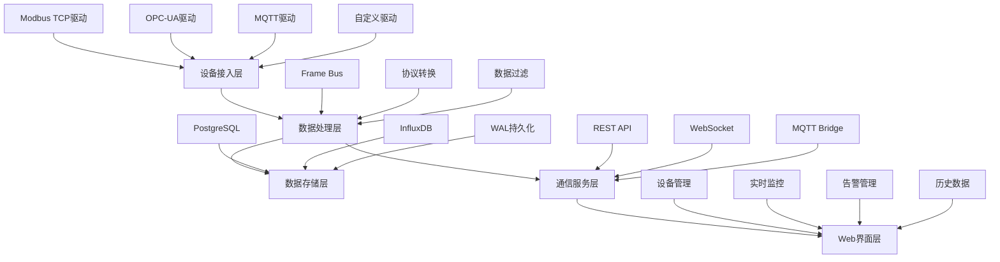

# PRD - 产品背景与范围

## 文档信息
- **文档版本**: 1.0
- **创建日期**: 2025-01-17
- **最后更新**: 2025-01-17
- **负责人**: Gateway_Rust 产品团队
- **状态**: 完整规范

## 产品背景

### 市场需求分析

**工业物联网趋势**:
- 工业4.0数字化转型加速，设备连接需求激增
- 传统SCADA系统成本高、扩展性差
- 多协议设备集成复杂，缺乏统一接入方案
- 边缘计算需求增长，需要高性能本地数据处理

**技术痛点**:
- **协议碎片化**: Modbus TCP、OPC-UA、MQTT等协议各异
- **数据孤岛**: 设备数据无法统一管理和分析
- **实时性要求**: 工业控制对延迟极为敏感 (<100ms)
- **可靠性要求**: 工业环境要求99.5%+可用性

### 竞争对手分析

**主要竞争产品**:
1. **KEPServerEX**: 成熟但价格昂贵，Windows平台限制
2. **Ignition Gateway**: 功能全面但配置复杂
3. **Node-RED**: 开源但性能有限，缺乏企业级特性
4. **ThingsBoard**: 云平台导向，边缘能力不足

**我们的差异化优势**:
- **Rust性能**: 内存安全 + 零成本抽象，性能超越C++
- **开源成本**: 无许可费用，降低总体拥有成本
- **边缘优化**: 专为边缘计算设计，资源占用极低
- **云原生**: 容器化部署，Kubernetes就绪

## 产品定位

### 核心价值主张

**Gateway_Rust** 是一款高性能、开源的工业边缘网关系统，专为工业物联网场景设计。

**一句话定位**: "*用Rust重新定义工业边缘网关的性能边界*"

### 产品特性

**技术特性**:
- **极致性能**: Frame Bus <1ms延迟，API响应<100ms
- **内存安全**: Rust保证无内存泄露和并发安全
- **多协议**: Modbus TCP完整支持，OPC-UA/MQTT框架就绪
- **实时通信**: WebSocket推送支持1000+并发连接
- **数据持久**: WAL机制保证零数据丢失

**业务特性**:
- **即插即用**: 基于Web的设备配置界面
- **实时监控**: Vue3仪表盘，ECharts数据可视化
- **告警引擎**: 规则引擎支持多级告警通知
- **历史数据**: 时序数据查询和聚合分析
- **驱动扩展**: 静态驱动+动态加载框架

## 目标用户

### 主要用户群体

#### 1. 工业集成商 (Primary)
**用户画像**:
- 负责工厂自动化系统集成
- 需要连接多品牌PLC和传感器
- 要求系统稳定、易维护
- 对成本敏感，偏好开源方案

**核心需求**:
- 快速设备接入配置
- 多协议统一管理
- 实时数据监控
- 系统故障诊断

**使用场景**:
```
工厂现场 → 多台PLC设备 → Gateway_Rust → 云端MES系统
```

#### 2. 设备制造商 (Secondary)
**用户画像**:
- 制造智能设备和传感器
- 需要为设备提供连接方案
- 要求高性能、低延迟
- 需要定制化协议支持

**核心需求**:
- 设备驱动开发框架
- 高性能数据传输
- 边缘数据处理
- 云端数据同步

#### 3. IT运维工程师 (Secondary)
**用户画像**:
- 负责工业IT基础设施
- 熟悉容器和云原生技术
- 重视系统监控和运维
- 需要标准化部署方案

**核心需求**:
- 容器化部署
- 监控告警集成
- 自动化运维
- 日志和性能分析

### 用户规模预估

**目标市场规模**:
- **中国工业物联网市场**: 1000亿人民币 (2025年)
- **边缘计算网关市场**: 100亿人民币
- **开源工业软件占比**: 15-20%

**用户增长预期**:
- **1年内**: 100家企业用户，1000个部署实例
- **3年内**: 1000家企业用户，10000个部署实例
- **5年内**: 成为开源工业网关领域Top3产品

## 核心功能范围

### 功能模块架构



### 核心功能清单

#### FR-001: 设备管理
- **设备注册**: 支持Modbus TCP/OPC-UA/MQTT设备
- **配置管理**: Web界面配置设备参数
- **状态监控**: 实时设备连接状态
- **批量操作**: 设备批量导入导出

#### FR-002: 数据点管理
- **地址映射**: Modbus寄存器地址配置
- **数据类型**: Float/Int/Bool/String支持
- **数据变换**: Scaling/Offset线性变换
- **采样配置**: 可配置采样频率

#### FR-003: 实时数据传输
- **WebSocket推送**: 1000+并发连接支持
- **选择性订阅**: 按设备/数据点订阅
- **数据压缩**: 减少网络带宽占用
- **背压处理**: 智能背压缓解机制

#### FR-004: 驱动管理
- **静态驱动**: 编译时集成核心驱动
- **动态加载**: 运行时插件式驱动加载
- **驱动SDK**: 自定义驱动开发框架
- **版本管理**: 驱动版本控制和升级

#### FR-005: 历史数据
- **时序查询**: 时间范围和聚合查询
- **数据导出**: CSV/JSON格式导出
- **数据压缩**: 自动数据压缩和归档
- **查询优化**: 索引优化和缓存

#### FR-006: 告警管理
- **规则引擎**: 条件表达式告警规则
- **多级告警**: INFO/WARN/CRITICAL级别
- **通知渠道**: Email/WebHook/WebSocket通知
- **告警历史**: 告警事件记录和查询

### 功能边界

**包含功能** (In Scope):
- ✅ 南向设备协议接入 (Modbus TCP完整实现)
- ✅ 北向数据API和WebSocket
- ✅ Web界面设备配置和监控
- ✅ 实时数据处理和存储
- ✅ 基础告警和通知

**不包含功能** (Out of Scope):
- ❌ 复杂数据分析和AI算法
- ❌ 工作流编排和规则引擎
- ❌ 用户权限和多租户管理
- ❌ 云平台集成和同步
- ❌ 高级可视化和报表

**待扩展功能** (Future Scope):
- 🔄 OPC-UA完整实现 (Q2 2025)
- 🔄 MQTT 5.0完整实现 (Q2 2025)
- 🔄 用户认证和RBAC (Q3 2025)
- 🔄 云平台连接器 (Q4 2025)

## 业务价值

### 量化收益

**性能提升**:
- **延迟降低**: 从传统500ms降低到<1ms (500倍提升)
- **吞吐量**: 支持1000+数据点实时处理
- **资源占用**: 内存<512MB，CPU<10% (对比传统Java方案节省70%)
- **并发能力**: 1000+WebSocket连接 (对比Node.js提升10倍)

**成本节约**:
- **许可成本**: 开源零许可费用，节省10-50万/年
- **硬件成本**: 低资源占用，边缘设备成本降低50%
- **开发成本**: 统一API接口，集成开发效率提升300%
- **维护成本**: 容器化部署，运维成本降低60%

**业务影响**:
- **上线速度**: 项目实施周期从3个月缩短到2周
- **扩展性**: 支持从10台到10000台设备无缝扩展
- **可靠性**: 99.5%+可用性，减少生产中断
- **标准化**: 统一数据格式，消除数据孤岛

### 战略价值

**技术领先**:
- 国内首个Rust工业网关，技术差异化明显
- 性能benchmark超越主流竞品
- 开源社区影响力，吸引开发者生态

**市场机会**:
- 抢占工业4.0数字化转型机遇
- 建立边缘计算领域技术护城河
- 培育工业物联网开源生态

**生态建设**:
- 驱动开发者社区
- 设备厂商合作伙伴
- 系统集成商渠道网络

## 产品边界

### 技术边界

**硬件支持边界**:
- **CPU架构**: x86_64, ARM64, RISC-V (未来)
- **操作系统**: Linux (主要), Windows (开发), macOS (开发)
- **内存要求**: 最低512MB，推荐2GB+
- **存储要求**: 最低10GB，推荐100GB+

**协议支持边界**:
- **完整支持**: Modbus TCP, HTTP/WebSocket
- **基础支持**: OPC-UA (Client), MQTT 5.0
- **计划支持**: EtherNet/IP, PROFINET, BACnet
- **不支持**: 专有协议、现场总线 (CAN, RS485直连)

**数据处理边界**:
- **支持**: 实时转发、简单聚合、阈值告警
- **不支持**: 复杂CEP、机器学习、流计算
- **扩展**: 通过插件支持自定义数据处理

### 用户边界

**目标用户**:
- ✅ 工业集成商和自动化工程师
- ✅ 设备制造商和IoT开发者
- ✅ IT运维和DevOps工程师

**非目标用户**:
- ❌ 消费电子和智能家居
- ❌ 电信和运营商网络
- ❌ 金融和高频交易

### 部署边界

**支持部署方式**:
- ✅ 边缘计算节点 (主要场景)
- ✅ 私有云和数据中心
- ✅ 容器化和K8s集群
- ✅ 混合云和多云架构

**不支持部署方式**:
- ❌ 公有云SaaS服务
- ❌ 移动端和嵌入式设备
- ❌ 浏览器和前端JavaScript

## 约束条件

### 技术约束

**性能约束**:
- **延迟要求**: API响应<100ms (P95), Frame Bus<1ms
- **吞吐量要求**: 1000+数据点/秒，1000+WebSocket连接
- **资源约束**: 内存<512MB (运行时), CPU<10% (平均)
- **存储约束**: WAL文件2GB-16GB可配置

**技术栈约束**:
- **后端**: 必须使用Rust，保证内存安全和性能
- **前端**: Vue 3 + TypeScript，保证开发效率
- **数据库**: PostgreSQL (元数据) + InfluxDB (时序)
- **容器**: Docker + Kubernetes标准化部署

**协议约束**:
- **Modbus TCP**: 必须完整实现，支持所有功能码
- **OPC-UA**: 仅支持Client模式，不实现Server
- **MQTT**: 支持MQTT 5.0，不向下兼容3.1.1
- **HTTP**: 仅支持RESTful API，不支持GraphQL

### 业务约束

**开源约束**:
- **许可证**: 必须使用Apache 2.0或MIT许可证
- **商业化**: 可以商业使用，但核心功能必须开源
- **社区**: 鼓励社区贡献，但保持代码质量标准

**成本约束**:
- **开发成本**: 核心团队5人以内，18个月交付
- **硬件成本**: 单设备硬件成本<5000元
- **运维成本**: 支持单人运维100+节点

**时间约束**:
- **MVP版本**: 3个月内交付核心功能
- **生产版本**: 6个月内完成性能优化
- **市场推广**: 12个月内获得首批商业用户

### 合规约束

**安全合规**:
- **数据安全**: 支持HTTPS，敏感数据加密
- **访问控制**: 计划支持JWT和RBAC
- **审计日志**: 结构化日志记录用户操作

**行业标准**:
- **工业标准**: 兼容IEC 61131-3编程标准
- **网络安全**: 遵循IEC 62443工业网络安全
- **数据格式**: 支持OPC-UA信息模型

## 成功指标

### 技术指标

**性能指标**:
- Frame Bus延迟 < 1ms (P99)
- API响应时间 < 100ms (P95)
- WebSocket连接数 > 1000
- 数据吞吐量 > 1000条/秒
- 系统可用性 > 99.5%

**质量指标**:
- 代码覆盖率 > 80%
- 生产Bug密度 < 1个/万行代码
- 安全漏洞数量 = 0 (Critical/High)
- 文档完整性 > 90%

### 业务指标

**用户增长**:
- **6个月**: 10家试点用户
- **12个月**: 100家商业用户
- **18个月**: 1000家社区用户
- **24个月**: 10000个部署实例

**市场影响**:
- GitHub Stars > 5000
- 工业技术博客文章 > 50篇
- 技术大会演讲 > 20次
- 开发者社区活跃度 > 1000人

**收入指标** (如商业化):
- **专业支持**: 50万元/年 (12个月后)
- **培训认证**: 20万元/年 (18个月后)
- **定制开发**: 100万元/年 (24个月后)

### 生态指标

**开源生态**:
- 核心贡献者 > 20人
- 第三方驱动 > 10个
- 技术文档贡献 > 100篇
- 社区活跃issues < 48小时响应

**合作伙伴**:
- 设备厂商合作 > 5家
- 集成商合作 > 20家
- 云平台集成 > 3家
- 高校合作项目 > 10个

---

**文档版本**: v1.0  
**创建日期**: 2025-01-17  
**审查人**: Gateway_Rust 产品团队  
**用途**: Gateway_Rust 项目