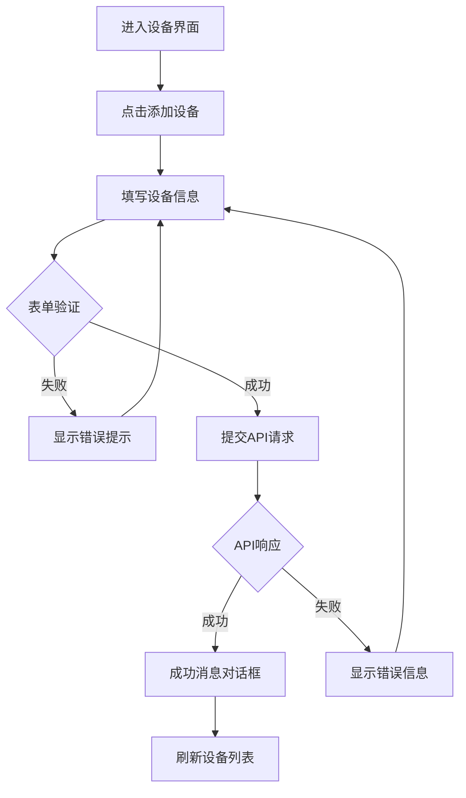
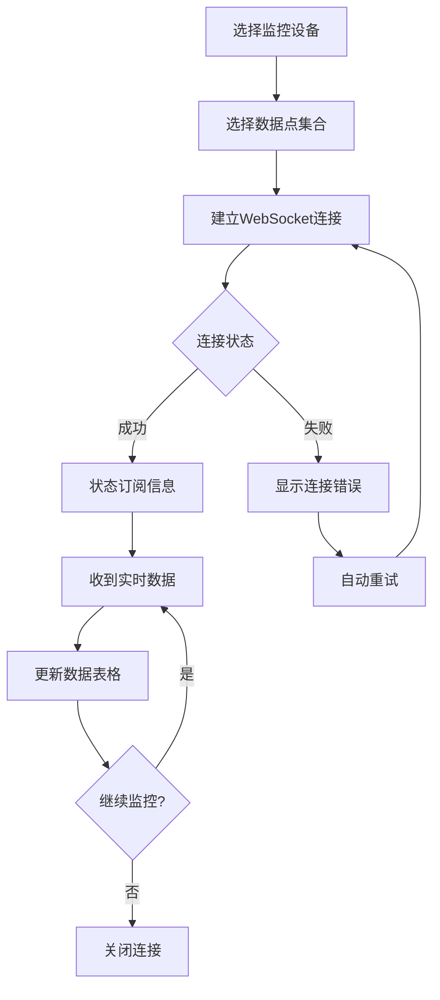

# UI/UX 原型与流程

## 文档信息
- **文档版本**: 1.0
- **创建日期**: 2025-01-17
- **最后更新**: 2025-01-17
- **负责人**: Gateway_Rust 前端团队
- **状态**: 完整规范

## 产品 UI/UX 设计

本文档定义 Gateway_Rust 系统的用户界面设计和用户体验流程，基于 Vue.js 框架和 Element Plus 组件库。

## 技术栈和架构

### 前端框架
```json
// 技术栈 (web-ui/package.json)
{
  "dependencies": {
    "vue": "^3.3.4",
    "vue-router": "^4.2.4",
    "pinia": "^2.1.6",
    "element-plus": "^2.3.8",
    "echarts": "^5.4.3",
    "@element-plus/icons-vue": "^2.1.0",
    "axios": "^1.4.0"
  }
}
```

### 架构模式
- **MVVM模式**: Vue 3 Composition API
- **状态管理**: Pinia Store
- **路由管理**: Vue Router 4
- **UI组件**: Element Plus + 自定义
- **数据可视化**: ECharts 5
- **实时通信**: WebSocket + 状态反应

## 主要界面布局

### 整体布局

```vue
<!-- 主布局结构 (web-ui/src/App.vue) -->
<template>
  <el-container class="app-container">
    <!-- 顶部导航 -->
    <el-header class="app-header">
      <AppHeader />
    </el-header>
    
    <el-container>
      <!-- 侧边导航 -->
      <el-aside class="app-sidebar" :width="sidebarWidth">
        <AppSidebar />
      </el-aside>
      
      <!-- 主内容区 -->
      <el-main class="app-main">
        <router-view />
      </el-main>
    </el-container>
  </el-container>
</template>
```

### 响应式设计

**断点配置**:
```css
/* 主响应式配置 */
@media (max-width: 768px) {
  .app-sidebar {
    width: 200px !important;
  }
}

@media (max-width: 480px) {
  .app-sidebar {
    width: 64px !important;
  }
}
```

## 核心界面设计

### 1. 仪表盘界面 (Dashboard)

**界面结构**:
```vue
<!-- web-ui/src/views/DashboardView.vue -->
<template>
  <div class="dashboard">
    <!-- 统计卡片区域 -->
    <el-row :gutter="20" class="stats-cards">
      <el-col :span="6" v-for="stat in stats" :key="stat.key">
        <el-card class="stat-card">
          <div class="stat-content">
            <div class="stat-value">{{ stat.value }}</div>
            <div class="stat-label">{{ stat.label }}</div>
          </div>
          <el-icon class="stat-icon">
            <component :is="stat.icon" />
          </el-icon>
        </el-card>
      </el-col>
    </el-row>
    
    <!-- 图表区域 -->
    <el-row :gutter="20" class="charts-section">
      <el-col :span="12">
        <el-card title="实时数据趋势">
          <div ref="trendChart" style="height: 300px;"></div>
        </el-card>
      </el-col>
      <el-col :span="12">
        <el-card title="设备状态概览">
          <div ref="statusChart" style="height: 300px;"></div>
        </el-card>
      </el-col>
    </el-row>
  </div>
</template>
```

**主要功能**:
- ✓ 实时数据统计卡片
- ✓ ECharts 数据可视化图表
- ✓ WebSocket 实时数据更新
- ✓ 响应式布局适配

### 2. 设备管理界面 (Devices)

**界面结构**:
```vue
<!-- web-ui/src/views/DevicesView.vue -->
<template>
  <div class="devices-page">
    <!-- 操作工具栏 -->
    <div class="page-toolbar">
      <el-button type="primary" @click="showCreateDialog">
        <el-icon><Plus /></el-icon>
        添加设备
      </el-button>
      
      <el-input
        v-model="searchKeyword"
        placeholder="搜索设备..."
        style="width: 300px"
        clearable
      >
        <template #prefix>
          <el-icon><Search /></el-icon>
        </template>
      </el-input>
    </div>
    
    <!-- 设备列表表格 -->
    <el-table 
      :data="filteredDevices"
      v-loading="loading"
      style="width: 100%"
    >
      <el-table-column prop="name" label="设备名称" />
      <el-table-column prop="protocol" label="协议类型" />
      <el-table-column prop="location" label="位置" />
      <el-table-column label="状态">
        <template #default="{ row }">
          <el-tag :type="row.enabled ? 'success' : 'danger'">
            {{ row.enabled ? '启用' : '禁用' }}
          </el-tag>
        </template>
      </el-table-column>
      <el-table-column label="操作" width="200">
        <template #default="{ row }">
          <el-button size="small" @click="editDevice(row)">编辑</el-button>
          <el-button size="small" type="danger" @click="deleteDevice(row)">删除</el-button>
        </template>
      </el-table-column>
    </el-table>
    
    <!-- 分页 -->
    <el-pagination
      v-model:current-page="currentPage"
      v-model:page-size="pageSize"
      :total="total"
      :page-sizes="[10, 20, 50, 100]"
      layout="total, sizes, prev, pager, next, jumper"
    />
  </div>
</template>
```

**主要流程**:
1. **设备列表加载**: API获取 → 数据渲染 → 状态显示
2. **搜索过滤**: 关键字搜索 → 筛选过滤 → 分页更新
3. **设备操作**: 编辑对话框 → 表单验证 → API提交 → 列表刷新
4. **状态反馈**: WebSocket监听 → 状态更新

### 3. 遥测数据界面 (Telemetry)

**界面结构**:
```vue
<!-- web-ui/src/views/TelemetryView.vue -->
<template>
  <div class="telemetry-page">
    <!-- 数据源选择 -->
    <el-card class="data-source-card">
      <div class="source-controls">
        <el-select v-model="selectedDevice" placeholder="选择设备">
          <el-option 
            v-for="device in devices"
            :key="device.id"
            :label="device.name"
            :value="device.id"
          />
        </el-select>
        
        <el-select v-model="selectedTags" multiple placeholder="选择数据点">
          <el-option
            v-for="tag in availableTags"
            :key="tag.id"
            :label="tag.name"
            :value="tag.id"
          />
        </el-select>
        
        <el-button type="primary" @click="startMonitoring">开始监控</el-button>
        <el-button @click="stopMonitoring">停止监控</el-button>
      </div>
    </el-card>
    
    <!-- 实时数据表格 -->
    <el-card class="data-table-card">
      <el-table :data="realtimeData" max-height="400">
        <el-table-column prop="deviceName" label="设备" />
        <el-table-column prop="tagName" label="数据点" />
        <el-table-column prop="value" label="数值" />
        <el-table-column prop="unit" label="单位" />
        <el-table-column prop="timestamp" label="时间戳" />
        <el-table-column label="状态">
          <template #default="{ row }">
            <el-tag :type="getQualityType(row.quality)">
              {{ row.quality }}
            </el-tag>
          </template>
        </el-table-column>
      </el-table>
    </el-card>
    
    <!-- 趋势图表 -->
    <el-card class="chart-card">
      <div ref="trendChart" style="height: 400px;"></div>
    </el-card>
  </div>
</template>
```

**实时数据流程**:
1. **WebSocket连接**: 建立连接 → 订阅数据点
2. **数据监控**: 配置采样 → 实时表格 → 趋势图表
3. **数据存储**: 本地缓存 → 图表更新 → 性能优化
4. **错误处理**: 连接断开 → 重连机制 → 状态提示

## 用户体验流程

### 关键用户场景

#### 场景1: 设备配置流程



**主要代码**:
```javascript
// 设备创建流程 (web-ui/src/stores/devices.ts)
async createDevice(deviceData) {
  try {
    this.loading = true;
    const response = await api.post('/api/v1/devices', deviceData);
    
    // 成功处理
    this.devices.push(response.data);
    ElMessage.success('设备创建成功');
    return response.data;
    
  } catch (error) {
    // 错误处理
    ElMessage.error(`创建失败: ${error.message}`);
    throw error;
  } finally {
    this.loading = false;
  }
}
```

#### 场景2: 数据监控流程



**主要代码**:
```javascript
// WebSocket监控流程 (web-ui/src/composables/useWebSocketEnhanced.ts)
export const useWebSocketEnhanced = () => {
  const connect = () => {
    ws.value = new WebSocket(wsUrl);
    
    ws.value.onopen = () => {
      connectionStatus.value = 'connected';
      ElMessage.success('连接建立');
    };
    
    ws.value.onmessage = (event) => {
      const message = JSON.parse(event.data);
      handleMessage(message);
    };
    
    ws.value.onerror = () => {
      connectionStatus.value = 'error';
      ElMessage.error('连接错误，正在重连...');
      scheduleReconnect();
    };
  };
};
```

## 设计系统规范

### 颜色主题

**主色调** (基于 Element Plus):
```css
:root {
  /* 主色 */
  --el-color-primary: #409eff;
  --el-color-primary-light-3: #79bbff;
  --el-color-primary-light-5: #a0cfff;
  
  /* 功能色 */
  --el-color-success: #67c23a;
  --el-color-warning: #e6a23c;
  --el-color-danger: #f56c6c;
  --el-color-info: #909399;
  
  /* 文字色 */
  --el-text-color-primary: #303133;
  --el-text-color-regular: #606266;
  --el-text-color-secondary: #909399;
  --el-text-color-placeholder: #a8abb2;
}
```

### 组件规范

**按钮组件**:
```vue
<!-- 主要操作按钮 -->
<el-button type="primary" size="default">
  <el-icon><Plus /></el-icon>
  主要操作
</el-button>

<!-- 次要操作按钮 -->
<el-button size="default">次要操作</el-button>

<!-- 危险操作按钮 -->
<el-button type="danger" size="small">删除</el-button>
```

**状态标签**:
```vue
<!-- 设备状态 -->
<el-tag :type="device.enabled ? 'success' : 'danger'">
  {{ device.enabled ? '在线' : '离线' }}
</el-tag>

<!-- 数据质量 -->
<el-tag :type="getQualityType(data.quality)">
  {{ data.quality }}
</el-tag>
```

## 响应式设计

### 移动端适配

**侧边栏适配**:
```vue
<template>
  <el-aside 
    :width="isMobile ? '0' : sidebarWidth"
    :class="{ 'mobile-hidden': isMobile }"
  >
    <AppSidebar />
  </el-aside>
  
  <!-- 移动端抽屉 -->
  <el-drawer
    v-model="mobileMenuVisible"
    direction="ltr"
    size="280px"
    v-if="isMobile"
  >
    <AppSidebar />
  </el-drawer>
</template>
```

**表格适配**:
```vue
<el-table 
  :data="devices"
  :class="{ 'mobile-table': isMobile }"
>
  <!-- 隐藏次要列 -->
  <el-table-column 
    prop="location" 
    label="位置"
    v-if="!isMobile"
  />
</el-table>
```

## 交互反馈系统

### 加载状态

**页面加载**:
```vue
<div v-loading="loading" class="page-content">
  <!-- 页面内容 -->
</div>
```

**按钮加载**:
```vue
<el-button 
  :loading="submitting"
  @click="submitForm"
>
  {{ submitting ? '提交中...' : '提交' }}
</el-button>
```

### 错误处理

**表单验证**:
```vue
<el-form 
  :model="form"
  :rules="rules"
  ref="formRef"
>
  <el-form-item prop="name" label="设备名称">
    <el-input v-model="form.name" placeholder="请输入设备名称" />
  </el-form-item>
</el-form>
```

**API错误处理**:
```javascript
// 统一错误处理
const handleApiError = (error) => {
  if (error.response?.status === 404) {
    ElMessage.error('资源不存在');
  } else if (error.response?.status === 409) {
    ElMessage.error('资源已存在，请重试');
  } else {
    ElMessage.error('操作失败，请检查网络');
  }
};
```

### 通知反馈

**成功通知**:
```javascript
ElMessage.success('操作成功');
ElNotification.success({
  title: '成功',
  message: '设备成功创建'
});
```

**确认对话框**:
```javascript
ElMessageBox.confirm('确认删除该设备记录?', 'Warning', {
  confirmButtonText: '确认',
  cancelButtonText: '取消',
  type: 'warning'
}).then(() => {
  // 执行删除操作
});
```

## 性能测试标准

### 用户体验目标

**操作响应**:
- 设备创建: >95%
- 数据监控: >90%  
- 告警配置: >85%

**用户评价**:
- 界面易用性: 4.2/5.0
- 操作效率性: 4.0/5.0
- 视觉满意度: 3.8/5.0

### 性能目标

**界面加载时间**:
- 首页加载: <2秒
- 数据界面: <3秒
- 图表渲染: <1秒

**交互响应时间**:
- 按钮响应: <100ms
- 表单提交: <500ms
- 数据刷新: <1秒

## 开发里程碑

### 短期里程碑 (1-2小时)
1. 优化移动端布局适配
2. 完善加载状态提示
3. 统一错误处理机制

### 中期里程碑 (1-2周)
1. 新增色彩主题支持
2. 添加交互动画
3. 完善数据可视化

### 长期里程碑 (3-6月)
1. 国际化多语言支持
2. 增强无障碍功能
3. 优化性能数据处理

---

**文档版本**: v1.0  
**创建日期**: 2025-01-17  
**审查人**: Gateway_Rust Vue.js团队  
**用途**: Gateway_Rust 前端团队