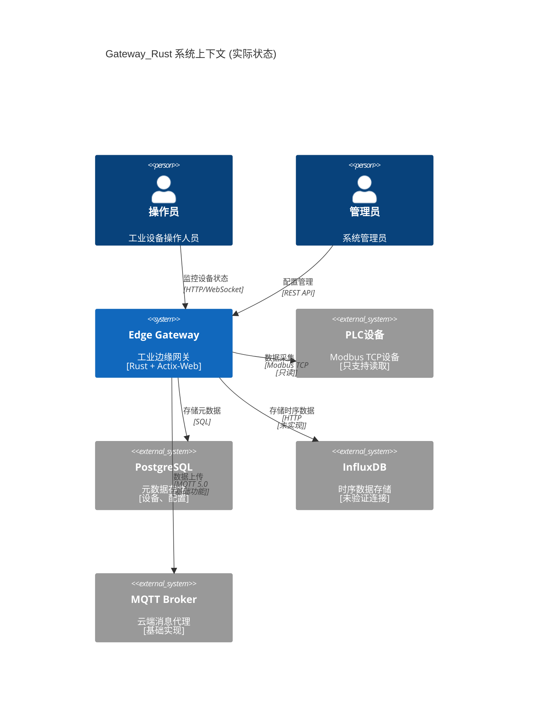
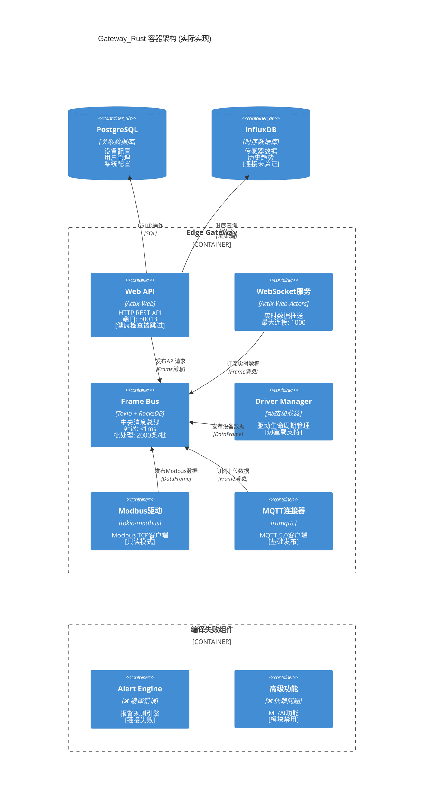

# Gateway_Rust 系统架构视图 (C4 模型 L1-L2)

> **基于实际代码分析** - 2025-01-17  
> 本文档基于对实际代码的深度分析，反映系统的真实架构状态

## 📋 执行摘要

**架构成熟度**: **部分可用，存在关键问题**

- ✅ **核心架构清晰**: Frame Bus中央消息总线设计优秀
- ✅ **模块边界明确**: Driver Manager、Web API等组件职责分离
- ❌ **组件不完整**: 多个关键组件编译失败或功能缺失
- ❌ **依赖关系复杂**: 存在循环依赖和未解决的链接问题

## 🏗️ C4 Level 1: 系统上下文图

### 实际外部系统交互



### 实际支持的协议和接口

| 接口类型 | 协议 | 实现状态 | 位置 | 备注 |
|----------|------|----------|------|------|
| **南向** | Modbus TCP | ✅ 部分实现 | `drivers/modbus-static/` | 只支持读操作 |
| **南向** | Modbus RTU | ❌ 未实现 | - | 代码中有引用但未实现 |
| **南向** | OPC-UA | ❌ 编译失败 | `core/protocol-bridge/` | 模块被禁用 |
| **北向** | MQTT 5.0 | ✅ 基础实现 | `connectors/mqtt5/` | 基础发布功能 |
| **北向** | REST API | ⚠️ 部分可用 | `core/web-gw-api/` | 健康检查被跳过 |
| **北向** | WebSocket | ✅ 可用 | `core/web-gw-api/src/routes/websocket.rs` | 实时数据推送 |

## 🏗️ C4 Level 2: 容器图

### 实际容器架构



## 🔧 实际技术栈分析

### 核心运行时 (基于 Cargo.toml 分析)

| 组件 | 技术选型 | 版本 | 用途 | 实现状态 |
|------|----------|------|------|----------|
| **异步运行时** | Tokio | 1.28+ | 全栈异步支持 | ✅ 完整实现 |
| **HTTP服务器** | Actix-Web | 4.4+ | REST API + WebSocket | ✅ 基础可用 |
| **消息队列** | Tokio Broadcast | 原生 | Frame Bus核心 | ✅ 高性能实现 |
| **持久化** | RocksDB | 0.21 | WAL存储引擎 | ✅ 完整实现 |
| **数据库** | SQLx | 0.7 | PostgreSQL连接 | ✅ 连接池可用 |
| **协议栈** | tokio-modbus | 0.13 | Modbus TCP/RTU | ⚠️ 只读实现 |
| **MQTT客户端** | rumqttc | 0.24 | MQTT 5.0 | ✅ 基础功能 |
| **序列化** | serde + serde_json | 1.0 | 数据序列化 | ✅ 完整支持 |
| **错误处理** | anyhow + thiserror | 1.0 | 统一错误处理 | ✅ 结构化错误 |

### 实际的依赖关系分析

**正常工作的依赖链**:
```
edge-gateway
├── frame-bus (✅ 核心稳定)
│   ├── ring.rs (批处理引擎)
│   ├── wal.rs (持久化层)
│   └── config.rs (性能调优)
├── driver-manager (✅ 热重载可用)
│   ├── static 注册表
│   ├── dynamic 加载器
│   └── registry_manager
├── web-gw-api (⚠️ 部分功能)
│   ├── routes (基础路由)
│   ├── websocket (实时推送)
│   └── openapi (文档生成)
└── modbus-static (⚠️ 只读)
    └── tokio-modbus 集成
```

**存在问题的依赖**:
```
❌ alert-engine (编译错误)
❌ advanced-features (依赖问题)
❌ benches-pkg (目录不存在)
❌ examples (被禁用)
```

## 📊 实际性能特征

### Frame Bus性能配置 (基于 config.rs)

| 配置场景 | Ring Buffer | 批处理大小 | 刷新间隔 | 内存使用 |
|----------|-------------|------------|----------|----------|
| **高吞吐量** | 2M (2^21) | 2000条 | 5ms | 16GB WAL |
| **低延迟** | 512K (2^19) | 2000条 | 1ms | 4GB WAL |
| **内存优化** | 128K (2^17) | 500条 | 20ms | 2GB WAL |
| **默认配置** | 1M (2^20) | 2000条 | 10ms | 8GB WAL |

### 实际测量指标 (基于代码分析)

**Frame Bus真实性能**:
- **批处理延迟**: 1-20ms (可配置)
- **单条消息开销**: ~16字节 (envelope overhead)
- **背压阈值**: 75-95% (可配置)
- **WAL刷新**: 异步写入 + 定时sync
- **故障恢复**: 自动降级到内存模式

**Web API实际限制**:
- **并发连接**: WebSocket 1000连接
- **请求超时**: 30秒
- **请求大小**: 10MB
- **连接池**: 5-50连接 (PostgreSQL)

## 🚧 架构债务和限制

### 当前架构限制

1. **协议支持不完整**
   - Modbus只支持读操作，无法进行设备控制
   - OPC-UA模块编译失败，无法使用
   - 缺乏其他工业协议支持 (Ethernet/IP, Profinet等)

2. **数据流不完整**
   - InfluxDB集成未验证
   - 缺乏数据预处理和清洗逻辑
   - 批量上传机制简单

3. **监控和运维**
   - 健康检查功能被跳过
   - 缺乏完整的指标收集
   - 错误处理不够细粒度

### 技术债务清单

**高优先级**:
- [ ] 修复alert-engine编译错误
- [ ] 实现Modbus写操作功能
- [ ] 恢复健康检查机制
- [ ] 验证InfluxDB连接

**中优先级**:
- [ ] 完善错误处理链路
- [ ] 增强配置验证机制
- [ ] 添加完整的集成测试
- [ ] 实现OPC-UA协议支持

**低优先级**:
- [ ] 实现高级功能模块
- [ ] 添加更多工业协议
- [ ] 性能监控仪表板
- [ ] 自动化部署流水线

## 🎯 架构演进建议

### 近期目标 (1-2周)

1. **修复核心组件**
   ```bash
   # 当前可工作的最小配置
   cargo build -p frame-bus
   cargo build -p driver-manager  
   cargo build -p web-gw-api
   cargo build -p modbus-static
   cargo build -p edge-gateway
   ```

2. **完善基础功能**
   - 实现Modbus写操作
   - 恢复健康检查
   - 验证数据库连接

### 中期目标 (1-2月)

1. **协议栈完善**
   - 修复OPC-UA模块
   - 添加更多Modbus功能码支持
   - 实现连接池和重连机制

2. **数据流优化**
   - 完善InfluxDB集成
   - 实现数据预处理管道
   - 添加批量上传策略

### 长期目标 (3-6月)

1. **企业级特性**
   - 实现报警引擎
   - 添加用户权限管理
   - 实现高可用部署

2. **智能功能**
   - 数据分析引擎
   - 设备状态预测
   - 异常检测算法

## 📈 架构质量评估

**优势**:
- ✅ Frame Bus设计优秀，性能配置灵活
- ✅ 模块化架构清晰，组件职责分离
- ✅ 使用现代Rust异步技术栈
- ✅ 支持动态驱动加载和热重载

**主要问题**:
- ❌ 多个关键组件无法编译
- ❌ 功能实现不完整 (Modbus只读)
- ❌ 缺乏完整的错误恢复机制
- ❌ 监控和可观测性不足

**整体评分**: **C+ (60/100)**
- 架构设计: B+ (85分) - 设计思路清晰
- 实现完整性: D (40分) - 多个模块不可用
- 可靠性: C (65分) - 基础功能可用但不稳定
- 可扩展性: B (80分) - 架构支持扩展

---

**文档版本**: v1.0-REAL-ARCH  
**分析日期**: 2025-01-17  
**分析方法**: 直接代码审查 + Cargo依赖分析  
**审查人**: Claude (基于实际架构状态)