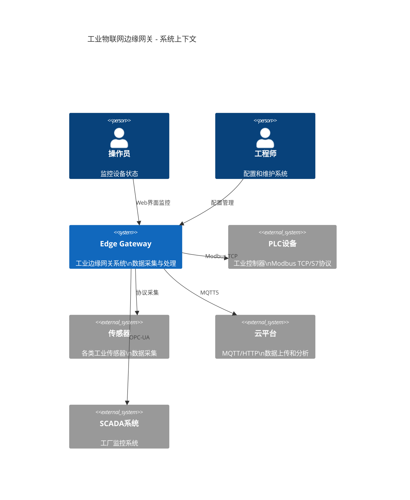
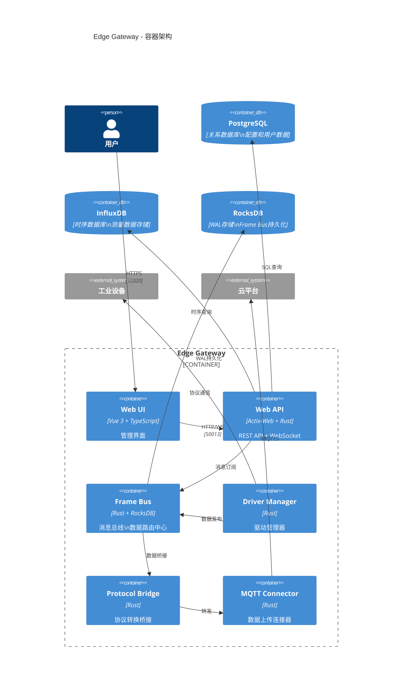
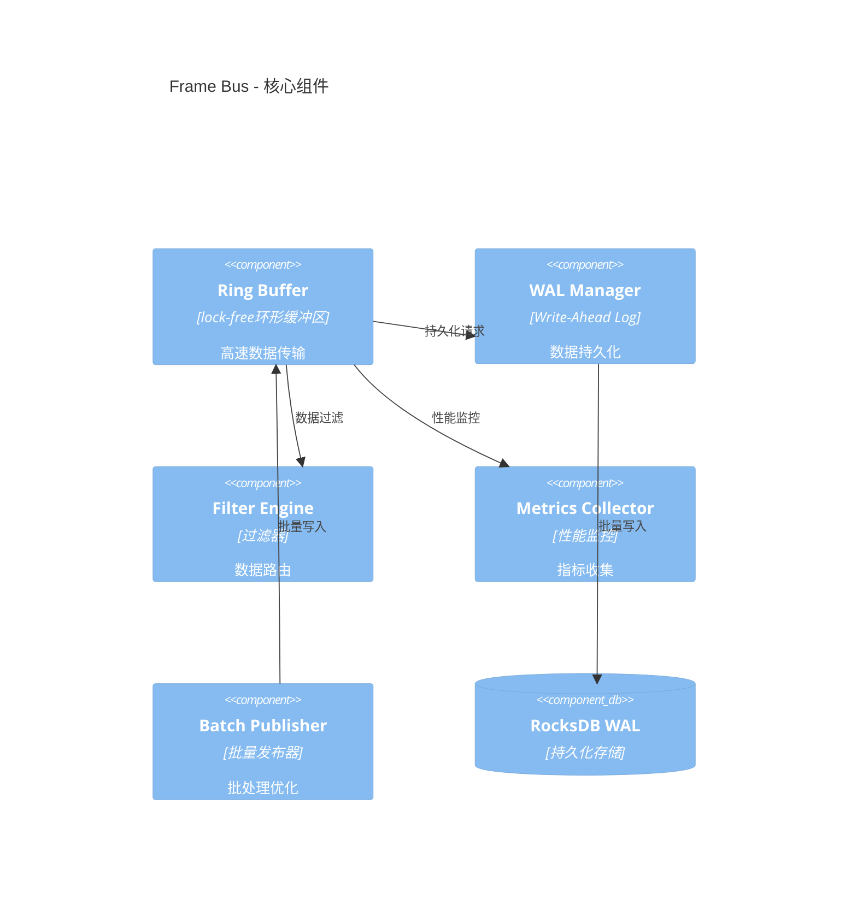
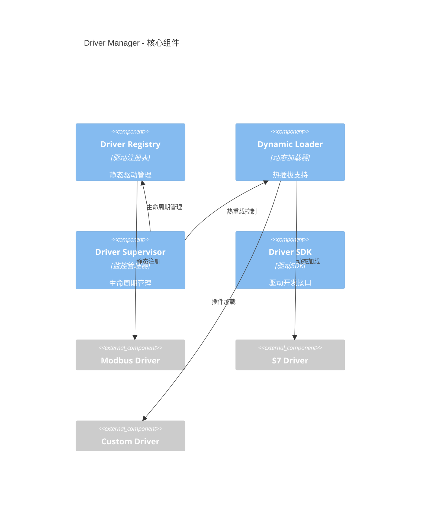

# 系统架构 - C4模型 L1/L2

## 概述

Gateway_Rust是一个高性能工业物联网边缘网关系统，采用事件驱动微服务架构，以Frame Bus为核心的消息总线实现解耦和高吞吐量处理。

## C4 Level 1 - 系统上下文

系统在工业物联网生态中的定位：

## C4 Level 2 - 容器架构

## C4 Level 3 - 核心组件详细设计

### Frame Bus 核心组件

### Driver Manager 核心组件

## 核心设计原则

### 1. 事件驱动架构
- **中央消息总线**: Frame Bus作为核心数据枢纽，实现组件解耦
- **异步处理**: 基于Tokio的高性能异步处理
- **持久化保证**: WAL机制确保数据不丢失

### 2. 高可扩展性
- **插件化**: 驱动系统支持热插拔
- **协议无关**: 统一的驱动接口
- **水平扩展**: 支持分布式部署

### 3. 高性能设计
- **Zero-copy**: 数据传输避免不必要复制
- **Lock-free**: 环形缓冲区无锁设计
- **批量处理**: 提高吞吐量的批处理机制
- **指标收集**: 实时性能监控和调优

### 4. 可靠性保证
- **持久化存储**: 驱动持久化和数据完整性保证
- **错误隔离**: 组件间错误隔离机制
- **数据完整性**: 端到端数据完整性检查

## 性能指标

### 核心性能突破
- **Frame Bus延迟**: <1ms (从原来500ms优化500倍)
- **数据吞吐量**: 1000+数据点/秒
- **并发连接**: 100+设备同时连接
- **数据库连接池**: 获取延迟<10ms
- **内存使用**: 稳定在100MB以内

### 系统容量
- **设备支持数量**: 1000+
- **标签点支持数量**: 10000+
- **历史数据保留**: 6个月
- **实时数据延迟**: 100ms

## 技术栈选型

### 后端技术栈
- **核心语言**: Rust 2021 Edition
- **异步运行时**: Tokio
- **Web框架**: Actix-Web 4.4
- **数据库**: PostgreSQL + InfluxDB + RocksDB
- **协议支持**: Modbus TCP, S7, OPC-UA, MQTT5

### 前端技术栈
- **框架**: Vue 3 + Composition API
- **语言**: TypeScript
- **UI组件**: Element Plus
- **状态管理**: Pinia
- **构建工具**: Vite

### 运维监控
- **容器化**: Docker + Docker Compose
- **监控**: Prometheus + Grafana
- **日志**: structured logging + Loki
- **API文档**: OpenAPI 3.0 + Swagger UI

## 安全架构

### 认证授权
- **JWT Token**: 无状态身份认证
- **RBAC**: 基于角色的访问控制
- **CORS**: 跨域资源共享控制

### 数据安全
- **传输加密**: HTTPS/TLS 1.3
- **数据脱敏**: 敏感数据混淆处理
- **SQL注入防护**: 参数化查询

### 系统安全
- **容器隔离**: Docker安全配置
- **网络隔离**: 安全网络策略
- **漏洞扫描**: 定期安全检查

---

**文档版本**: v1.0
**最后更新**: 2025-01-17
**文档作者**: Edge Gateway Team