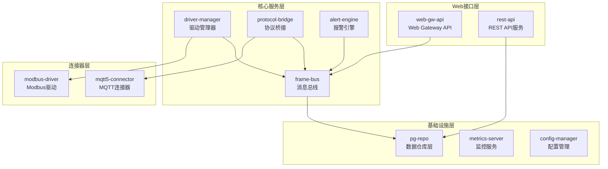

# 后端服务清单

## 概述

Gateway_Rust工业网关系统采用模块化架构设计，围绕Frame Bus中央消息总线构建，以事件驱动方式实现各模块间的高效通信和数据流转。

## 系统架构图



## 核心服务详单

### 1. web-gw-api (Web网关API服务)

**位置**: `core/web-gw-api/`  
**职责**: 提供统一Web API接口，支持HTTP和WebSocket协议

**核心功能**:
- RESTful API服务 (设备、标签、历史数据)
- WebSocket实时数据推送
- 用户认证授权
- API文档生成 (OpenAPI/Swagger)
- CORS跨域支持

**技术栈**:
- **框架**: Actix-Web 4.4
- **认证**: JWT Token
- **文档**: utoipa + Swagger UI
- **数据库**: SQLx (PostgreSQL)

**关键接口**:
```rust
// 主要路由
/api/v1/devices      // 设备管理
/api/v1/tags         // 标签管理  
/api/v1/history      // 历史数据
/api/v1/realtime     // 实时数据
/api/v1/system       // 系统管理
/ws/telemetry        // WebSocket推送
```

**依赖服务**:
- Frame Bus (实时数据订阅)
- PostgreSQL (关系数据)
- InfluxDB (时序数据)

**性能指标**:
- 并发连接: 500+ WebSocket连接
- API响应: P95 < 100ms
- 吞吐量: 300+ 请求/秒

---

### 2. frame-bus (消息总线)

**位置**: `core/frame-bus/`  
**职责**: 中央事件驱动消息总线，处理系统内数据流转

**核心功能**:
- Lock-free环形缓冲区
- 发布/订阅消息机制
- WAL持久化 (RocksDB)
- 背压控制
- 消息序列化

**技术栈**:
- **存储**: RocksDB WAL
- **序列化**: Protocol Buffers
- **并发**: Tokio异步 + 原子操作
- **监控**: Prometheus指标

**关键接口**:
```rust
pub fn publish_data(frame: DataFrame) -> Result<()>
pub fn subscribe(filter: Filter) -> Result<FrameReceiver>
pub fn publish_command(cmd: CommandFrame) -> Result<()>
```

**性能指标**:
- 延迟: P99 < 1ms (500倍提升)
- 吞吐量: 1000+ 消息/秒
- 内存使用: <50MB

---

### 3. driver-manager (驱动管理器)

**位置**: `core/driver-manager/`  
**职责**: 管理协议驱动的加载、生命周期和运行时管理

**核心功能**:
- 静态驱动注册管理
- 动态驱动加载 (.so/.dll)
- 驱动生命周期管理
- 连接状态实时监控
- 驱动配置热重载

**技术栈**:
- **SDK**: driver-sdk统一接口
- **动态加载**: libloading + abi_stable
- **监控**: 文件系统监控 (notify)

**支持驱动协议**:
- **Modbus TCP/RTU**: 工业标准协议
- **MQTT客户端**: IoT数据传输
- **自定义驱动**: 扩展协议支持

**关键接口**:
```rust
pub async fn register_driver(&self, driver: Box<dyn Driver>) -> Result<()>
pub async fn load_dynamic_driver(&self, path: &Path) -> Result<String>
pub async fn hot_reload_driver(&self, driver_id: &str) -> Result<()>
```

**性能指标**:
- 支持设备数: 1000+ 并发设备
- 热重载时间: <5秒
- 内存占用: 每个驱动 <1MB

---

### 4. protocol-bridge (协议桥接)

**位置**: `core/protocol-bridge/`  
**职责**: 协议间数据转换和标准化处理

**核心功能**:
- 南向协议数据标准化
- 北向协议数据转换
- 数据格式统一处理
- 协议适配器管理

**数据流转**:
```
南向: Modbus TCP/RTU, S7, OPC-UA, 自定义协议
  ↓ 标准化为DataFrame
中间: Frame Bus统一消息流转  
  ↓ 转换为目标协议
北向: MQTT 5.0, HTTP REST, WebSocket
```

**技术栈**:
- **插件化**: trait-based适配器
- **数据验证**: serde + validator
- **错误处理**: thiserror

---

### 5. alert-engine (报警引擎)

**位置**: `core/alert-engine/`  
**职责**: 实时数据监控和报警事件处理

**核心功能**:
- 实时数据阈值监控
- 规则引擎 (阈值、时间、复合条件)
- 多通道告警通知 (Email、WebHook、WebSocket)
- 告警状态管理
- 告警历史记录

**规则类型**:
- **阈值告警**: 数值超过/低于设定阈值
- **状态告警**: 数据状态变化监控
- **复合告警**: 多条件组合
- **时间告警**: 时间范围内条件

**通知通道**:
```rust
pub enum NotificationChannel {
    Email(EmailConfig),
    WebHook(WebHookConfig),
    WebSocket(WebSocketConfig),
    SMS(SMSConfig),
}
```

---

### 6. pg-repo (数据仓库层)

**位置**: `infra/pg-repo/`  
**职责**: PostgreSQL数据库访问统一抽象层

**核心功能**:
- Repository模式实现
- 数据库连接池管理
- SQL安全验证
- 事务管理
- 数据库迁移支持

**主要Repository**:
```rust
pub trait DeviceRepo: Send + Sync {
    async fn create(&self, device: NewDevice) -> RepoResult<Device>;
    async fn get_by_id(&self, id: Uuid) -> RepoResult<Option<Device>>;
    async fn list(&self, filter: DeviceFilter) -> RepoResult<Vec<Device>>;
}

// 类似实现: TagRepo, AlertRepo, DriverRepo, UserRepo
```

**技术栈**:
- **ORM**: SQLx (编译期SQL检查)
- **连接池**: SQLx Pool (20-100连接)
- **迁移**: SQLx Migration
- **类型**: 强类型安全映射

---

### 7. config-manager (配置管理)

**位置**: `core/config-manager/`  
**职责**: 系统配置加载、验证和热重载

**核心功能**:
- 多层配置优先级 (default → env → prod)
- 配置热重载 (文件监控)
- 配置验证和类型安全
- 环境变量绑定
- 配置历史管理

**配置层级**:
```
config/
├── default.yaml     # 基础配置
├── dev.yaml        # 开发环境
├── prod.yaml       # 生产环境
└── local.yaml      # 本地覆盖 (gitignore)
```

**配置结构**:
```rust
#[derive(Deserialize, Debug)]
pub struct GatewayConfig {
    pub server: ServerConfig,
    pub database: DatabaseConfig,
    pub frame_bus: FrameBusConfig,
    pub drivers: DriverConfigs,
    pub security: SecurityConfig,
}
```

---

### 8. metrics-server (监控服务)

**位置**: `core/metrics-server/`  
**职责**: 系统性能指标收集和监控

**核心功能**:
- Prometheus指标导出
- 系统资源监控 (CPU、内存、磁盘)
- 业务指标监控 (延迟、吞吐量、错误率)
- 自定义指标注册
- 指标数据聚合和存储

**关键指标类型**:
```rust
// 系统指标
gateway_cpu_usage_percent
gateway_memory_usage_bytes
gateway_disk_usage_percent

// Frame Bus指标  
framebus_message_latency_seconds
framebus_throughput_messages_per_second
framebus_buffer_usage_percent

// API指标
api_request_duration_seconds
api_request_total
api_errors_total

// 驱动指标
driver_connection_status
driver_data_points_per_second
driver_error_rate
```

---

## 连接器和驱动

### 9. mqtt5 (MQTT5连接器)

**位置**: `connectors/mqtt5/`  
**职责**: MQTT 5.0协议北向数据传输
 

**核心功能**:
- MQTT 5.0客户端
- 自动重连机制
- QoS 0/1/2消息保证
- Topic动态订阅管理
- 批量数据发布

**消息格式**:
```json
{
  "device_id": "PLC-001",
  "timestamp": "2025-01-17T10:00:00Z",
  "data": [
    {"tag": "temperature", "value": 25.6, "quality": 1},
    {"tag": "pressure", "value": 1.2, "quality": 1}
  ]
}
```

---

### 10. modbus-static (Modbus驱动)

**位置**: `drivers/modbus-static/`  
**职责**: Modbus TCP/RTU协议工业设备通信

**核心功能**:
- Modbus TCP/RTU协议实现
- 工业设备并发连接
- 寄存器批量读写
- 数据类型转换 (16位/32位 整数/浮点)
- 连接池状态管理

**支持功能码**:
- 0x01: Read Coils
- 0x02: Read Discrete Inputs  
- 0x03: Read Holding Registers
- 0x04: Read Input Registers
- 0x05: Write Single Coil
- 0x06: Write Single Register
- 0x0F: Write Multiple Coils
- 0x10: Write Multiple Registers

---

## 数据流转模式

### 1. 垂直数据流

**HTTP API调用**:
```
Client → Web Gateway API → Repository → Database
```

**驱动数据采集**:
```
Driver Manager → Driver SDK → Modbus Driver
```

### 2. 水平数据流 (Frame Bus)

**数据发布**:
```
Modbus Driver → Frame Bus → [
    Web API (WebSocket推送)
    Alert Engine (规则评估)  
    MQTT Connector (数据转发)
    PostgreSQL (关系数据)
    InfluxDB (时序存储)
]
```

**命令下发**:
```
Web API → Frame Bus → Driver Manager → Target Driver
```

## 服务启动模式

### 1. 单体服务模式 (推荐)

```
Edge Gateway进程:
├── Frame Bus (核心总线)
├── Web API (Actix-Web Server)
├── Driver Manager (异步任务)
├── Alert Engine (事件监听)
├── MQTT Connector (客户端)
└── 各种Driver (插件)
```

### 2. 微服务模式 (计划)

```
容器化服务:
├── gateway-api (Web API + WebSocket)
├── gateway-framebus (消息总线服务)
├── gateway-drivers (驱动管理服务)
├── gateway-alerts (报警服务)
├── gateway-connectors (北向连接器)
└── gateway-metrics (监控服务)
```

## 开发和部署指南

### 1. 本地开发

1. 安装Rust工作空间和Cargo工具链
2. 配置`Cargo.toml`文件定义workspace成员
3. 启动核心服务依赖 (PostgreSQL、InfluxDB、配置)
4. 单独Frame Bus，启动消息流转
5. 逐步启动其他服务组件

### 2. 服务依赖关系

**启动顺序**:
- 底层依赖服务
- 配置Frame Bus水平数据流
- 驱动数据采集Repository接口
- 配置热加载管理

**依赖层级**:
```
Web层 → 核心服务层 → 基础设施层 → 存储层
```

### 3. 服务监控

**监控服务健康状态**:
- **健康检查**: `/health`接口
- **指标收集**: Prometheus格式
- **日志输出**: 结构化日志 (JSON)
- **错误追踪**: 分布式跟踪 ID

---

**文档版本**: v1.0  
**最后更新**: 2025-01-17  
**服务数量**: 10个核心服务 + 连接驱动  
**架构模式**: 事件驱动单体 → 微服务演进