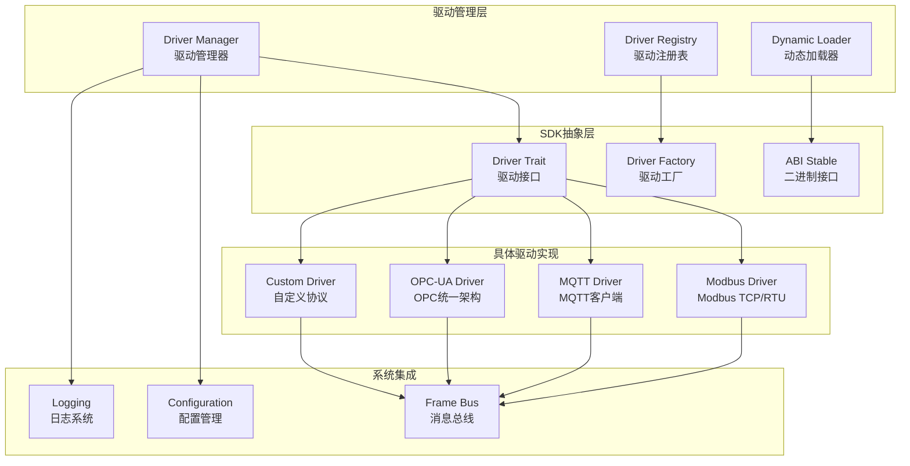

# 驱动SDK开发指南

## 概述

Gateway_Rust驱动SDK提供了统一的插件化接口，支持工业协议驱动的开发、集成和部署。SDK遵循trait-based设计，确保驱动之间的一致性和可互换性，同时支持静态链接和动态加载两种模式。

## 驱动SDK架构



## 核心API接口

### 1. Driver Trait 主接口

```rust
use async_trait::async_trait;
use serde::{Deserialize, Serialize};
use uuid::Uuid;

#[async_trait]
pub trait Driver: Send + Sync {
    /// 获取驱动协议类型
    fn protocol(&self) -> ProtocolKind;
    
    /// 获取驱动版本信息
    fn version(&self) -> DriverVersion;
    
    /// 获取驱动元数据
    fn metadata(&self) -> DriverMetadata;
    
    /// 初始化驱动，传入配置参数
    async fn initialize(&self, config: Value) -> DriverResult<()>;
    
    /// 连接到指定设备
    async fn connect(&self, device_config: DeviceConfig) -> DriverResult<ConnectionHandle>;
    
    /// 断开设备连接
    async fn disconnect(&self, handle: ConnectionHandle) -> DriverResult<()>;
    
    /// 读取单个标签数据
    async fn read_tag(
        &self, 
        handle: ConnectionHandle,
        address: &str
    ) -> DriverResult<TagValue>;
    
    /// 批量读取多个标签
    async fn read_tags(
        &self,
        handle: ConnectionHandle, 
        addresses: &[String]
    ) -> DriverResult<Vec<TagValue>>;
    
    /// 写入单个标签数据
    async fn write_tag(
        &self,
        handle: ConnectionHandle,
        address: &str,
        value: TagValue
    ) -> DriverResult<()>;
    
    /// 批量写入多个标签
    async fn write_tags(
        &self,
        handle: ConnectionHandle,
        writes: &[(String, TagValue)]
    ) -> DriverResult<Vec<WriteResult>>;
    
    /// 启动连续数据采集
    async fn start_subscription(
        &self,
        handle: ConnectionHandle,
        subscription: SubscriptionConfig
    ) -> DriverResult<SubscriptionHandle>;
    
    /// 停止数据采集
    async fn stop_subscription(
        &self,
        subscription_handle: SubscriptionHandle
    ) -> DriverResult<()>;
    
    /// 获取设备健康状态
    async fn get_health(&self, handle: ConnectionHandle) -> DriverResult<DeviceHealth>;
    
    /// 诊断设备连接
    async fn diagnose(&self, handle: ConnectionHandle) -> DriverResult<DiagnosticInfo>;
    
    /// 优雅关闭驱动
    async fn shutdown(&self) -> DriverResult<()>;
}
```

### 2. 数据类型定义

```rust
/// 协议类型枚举
#[derive(Debug, Clone, PartialEq, Eq, Serialize, Deserialize)]
pub enum ProtocolKind {
    ModbusTcp,
    ModbusRtu,
    OpcUa,
    Mqtt,
    Custom(String),
}

/// 驱动版本信息
#[derive(Debug, Clone, Serialize, Deserialize)]
pub struct DriverVersion {
    pub major: u32,
    pub minor: u32,
    pub patch: u32,
    pub build: Option<String>,
    pub git_hash: Option<String>,
}

/// 驱动元数据
#[derive(Debug, Clone, Serialize, Deserialize)]
pub struct DriverMetadata {
    pub name: String,
    pub description: String,
    pub author: String,
    pub license: String,
    pub homepage: Option<String>,
    pub repository: Option<String>,
    pub supported_features: Vec<DriverFeature>,
    pub config_schema: Value, // JSON Schema
}

/// 驱动功能特性
#[derive(Debug, Clone, Serialize, Deserialize)]
pub enum DriverFeature {
    Read,
    Write,
    Subscribe,
    BulkOperations,
    Diagnostics,
    HistoryRead,
    Alarms,
    Events,
    Security,
}

/// 设备配置
#[derive(Debug, Clone, Serialize, Deserialize)]
pub struct DeviceConfig {
    pub device_id: Uuid,
    pub name: String,
    pub endpoint: String,
    pub protocol_config: Value, // 协议特定配置
    pub connection_timeout: Option<u64>,
    pub retry_policy: RetryPolicy,
    pub security: Option<SecurityConfig>,
}

/// 重试策略
#[derive(Debug, Clone, Serialize, Deserialize)]
pub struct RetryPolicy {
    pub max_retries: u32,
    pub initial_delay: u64, // 毫秒
    pub max_delay: u64,     // 毫秒
    pub exponential_base: f64,
    pub jitter: bool,
}

/// 安全配置
#[derive(Debug, Clone, Serialize, Deserialize)]
pub struct SecurityConfig {
    pub tls_enabled: bool,
    pub certificate_path: Option<String>,
    pub private_key_path: Option<String>,
    pub ca_certificate_path: Option<String>,
    pub verify_certificate: bool,
    pub username: Option<String>,
    pub password: Option<String>,
}

/// 标签值类型
#[derive(Debug, Clone, Serialize, Deserialize)]
pub struct TagValue {
    pub value: Value,
    pub data_type: DataType,
    pub quality: DataQuality,
    pub timestamp: chrono::DateTime<chrono::Utc>,
    pub source_timestamp: Option<chrono::DateTime<chrono::Utc>>,
}

/// 数据类型
#[derive(Debug, Clone, PartialEq, Eq, Serialize, Deserialize)]
pub enum DataType {
    Boolean,
    Int8,
    UInt8, 
    Int16,
    UInt16,
    Int32,
    UInt32,
    Int64,
    UInt64,
    Float,
    Double,
    String,
    ByteArray,
    DateTime,
}

/// 数据质量
#[derive(Debug, Clone, PartialEq, Eq, Serialize, Deserialize)]
pub enum DataQuality {
    Good,
    Uncertain,
    Bad,
}

/// 连接句柄
#[derive(Debug, Clone, Copy, PartialEq, Eq, Hash)]
pub struct ConnectionHandle(pub u64);

/// 订阅句柄  
#[derive(Debug, Clone, Copy, PartialEq, Eq, Hash)]
pub struct SubscriptionHandle(pub u64);
```

### 3. 订阅和事件处理

```rust
/// 订阅配置
#[derive(Debug, Clone, Serialize, Deserialize)]
pub struct SubscriptionConfig {
    pub tags: Vec<String>,
    pub sampling_interval: u64, // 毫秒
    pub publish_interval: u64,  // 毫秒
    pub max_notifications_per_publish: u32,
    pub priority: SubscriptionPriority,
    pub deadband: Option<DeadbandConfig>,
}

/// 订阅优先级
#[derive(Debug, Clone, PartialEq, Eq, Serialize, Deserialize)]
pub enum SubscriptionPriority {
    Low = 1,
    Medium = 2,
    High = 3,
    Critical = 4,
}

/// 死区配置
#[derive(Debug, Clone, Serialize, Deserialize)]
pub struct DeadbandConfig {
    pub deadband_type: DeadbandType,
    pub value: f64,
}

#[derive(Debug, Clone, Serialize, Deserialize)]
pub enum DeadbandType {
    None,
    Absolute(f64),
    Percent(f64),
}

/// 设备健康状态
#[derive(Debug, Clone, Serialize, Deserialize)]
pub struct DeviceHealth {
    pub status: HealthStatus,
    pub last_communication: Option<chrono::DateTime<chrono::Utc>>,
    pub error_rate: f64,
    pub response_time: Option<u64>, // 毫秒
    pub additional_info: Value,
}

#[derive(Debug, Clone, Serialize, Deserialize)]
pub enum HealthStatus {
    Healthy,
    Warning,
    Error,
    Disconnected,
    Unknown,
}

/// 诊断信息
#[derive(Debug, Clone, Serialize, Deserialize)]
pub struct DiagnosticInfo {
    pub connection_status: ConnectionStatus,
    pub protocol_info: Value,
    pub performance_metrics: PerformanceMetrics,
    pub last_errors: Vec<ErrorInfo>,
    pub capabilities: Vec<String>,
}

#[derive(Debug, Clone, Serialize, Deserialize)]
pub enum ConnectionStatus {
    Connected,
    Connecting,
    Disconnected,
    Failed,
    Retrying,
}

#[derive(Debug, Clone, Serialize, Deserialize)]
pub struct PerformanceMetrics {
    pub requests_per_second: f64,
    pub average_response_time: f64,
    pub success_rate: f64,
    pub bytes_sent: u64,
    pub bytes_received: u64,
}

#[derive(Debug, Clone, Serialize, Deserialize)]
pub struct ErrorInfo {
    pub timestamp: chrono::DateTime<chrono::Utc>,
    pub error_code: String,
    pub error_message: String,
    pub severity: ErrorSeverity,
}

#[derive(Debug, Clone, Serialize, Deserialize)]
pub enum ErrorSeverity {
    Info,
    Warning,
    Error,
    Critical,
}
```

### 4. 错误处理

```rust
use thiserror::Error;

/// 驱动操作结果类型
pub type DriverResult<T> = Result<T, DriverError>;

/// 驱动错误枚举
#[derive(Error, Debug)]
pub enum DriverError {
    #[error("Connection error: {message}")]
    Connection { message: String },
    
    #[error("Configuration error: {message}")]
    Configuration { message: String },
    
    #[error("Protocol error: {message}")]
    Protocol { message: String },
    
    #[error("Timeout error: operation took longer than {timeout}ms")]
    Timeout { timeout: u64 },
    
    #[error("Authentication error: {message}")]
    Authentication { message: String },
    
    #[error("Permission denied: {message}")]
    Permission { message: String },
    
    #[error("Invalid address: {address}")]
    InvalidAddress { address: String },
    
    #[error("Data type mismatch: expected {expected}, got {actual}")]
    DataTypeMismatch { expected: String, actual: String },
    
    #[error("Device not found: {device_id}")]
    DeviceNotFound { device_id: String },
    
    #[error("Tag not found: {tag_address}")]
    TagNotFound { tag_address: String },
    
    #[error("Operation not supported: {operation}")]
    NotSupported { operation: String },
    
    #[error("Internal error: {message}")]
    Internal { message: String },
    
    #[error("IO error: {0}")]
    Io(#[from] std::io::Error),
    
    #[error("Serialization error: {0}")]
    Serialization(#[from] serde_json::Error),
}
```

## 驱动开发示例

### 1. 简单Modbus TCP驱动实现

```rust
use async_trait::async_trait;
use std::collections::HashMap;
use std::sync::{Arc, Mutex};
use tokio::net::TcpStream;

pub struct ModbusTcpDriver {
    connections: Arc<Mutex<HashMap<ConnectionHandle, ModbusConnection>>>,
    next_handle: Arc<Mutex<u64>>,
}

struct ModbusConnection {
    stream: TcpStream,
    slave_id: u8,
    config: DeviceConfig,
}

impl ModbusTcpDriver {
    pub fn new() -> Self {
        Self {
            connections: Arc::new(Mutex::new(HashMap::new())),
            next_handle: Arc::new(Mutex::new(1)),
        }
    }
    
    fn next_connection_handle(&self) -> ConnectionHandle {
        let mut counter = self.next_handle.lock().unwrap();
        let handle = ConnectionHandle(*counter);
        *counter += 1;
        handle
    }
}

#[async_trait]
impl Driver for ModbusTcpDriver {
    fn protocol(&self) -> ProtocolKind {
        ProtocolKind::ModbusTcp
    }
    
    fn version(&self) -> DriverVersion {
        DriverVersion {
            major: 1,
            minor: 0,
            patch: 0,
            build: Some("release".to_string()),
            git_hash: Some("abc123".to_string()),
        }
    }
    
    fn metadata(&self) -> DriverMetadata {
        DriverMetadata {
            name: "Modbus TCP Driver".to_string(),
            description: "Industrial standard Modbus TCP protocol driver".to_string(),
            author: "Gateway Team".to_string(),
            license: "MIT".to_string(),
            homepage: Some("https://github.com/gateway/modbus-driver".to_string()),
            repository: Some("https://github.com/gateway/modbus-driver.git".to_string()),
            supported_features: vec![
                DriverFeature::Read,
                DriverFeature::Write,
                DriverFeature::BulkOperations,
                DriverFeature::Diagnostics,
            ],
            config_schema: serde_json::json!({
                "type": "object",
                "properties": {
                    "slave_id": {
                        "type": "integer",
                        "minimum": 1,
                        "maximum": 255,
                        "default": 1
                    },
                    "port": {
                        "type": "integer",
                        "minimum": 1,
                        "maximum": 65535,
                        "default": 502
                    }
                },
                "required": ["slave_id"]
            }),
        }
    }
    
    async fn initialize(&self, config: Value) -> DriverResult<()> {
        // 验证配置
        let _slave_id: u8 = config["slave_id"]
            .as_u64()
            .ok_or_else(|| DriverError::Configuration {
                message: "slave_id is required".to_string(),
            })?
            .try_into()
            .map_err(|_| DriverError::Configuration {
                message: "slave_id must be between 1-255".to_string(),
            })?;
        
        log::info!("Modbus TCP Driver initialized");
        Ok(())
    }
    
    async fn connect(&self, device_config: DeviceConfig) -> DriverResult<ConnectionHandle> {
        let endpoint = &device_config.endpoint;
        let stream = TcpStream::connect(endpoint)
            .await
            .map_err(|e| DriverError::Connection {
                message: format!("Failed to connect to {}: {}", endpoint, e),
            })?;
        
        let slave_id = device_config.protocol_config["slave_id"]
            .as_u64()
            .unwrap_or(1) as u8;
        
        let connection = ModbusConnection {
            stream,
            slave_id,
            config: device_config,
        };
        
        let handle = self.next_connection_handle();
        
        {
            let mut connections = self.connections.lock().unwrap();
            connections.insert(handle, connection);
        }
        
        log::info!("Connected to Modbus device: {:?}", handle);
        Ok(handle)
    }
    
    async fn disconnect(&self, handle: ConnectionHandle) -> DriverResult<()> {
        let mut connections = self.connections.lock().unwrap();
        connections.remove(&handle)
            .ok_or_else(|| DriverError::DeviceNotFound {
                device_id: format!("{:?}", handle),
            })?;
        
        log::info!("Disconnected from Modbus device: {:?}", handle);
        Ok(())
    }
    
    async fn read_tag(
        &self, 
        handle: ConnectionHandle,
        address: &str
    ) -> DriverResult<TagValue> {
        // 解析Modbus地址 (例如: "40001" = Holding Register 1)
        let register_address = self.parse_modbus_address(address)?;
        
        // 实现Modbus TCP读取协议
        let raw_value = self.read_holding_register(handle, register_address).await?;
        
        // 转换为TagValue
        Ok(TagValue {
            value: serde_json::Value::Number(raw_value.into()),
            data_type: DataType::UInt16,
            quality: DataQuality::Good,
            timestamp: chrono::Utc::now(),
            source_timestamp: Some(chrono::Utc::now()),
        })
    }
    
    async fn read_tags(
        &self,
        handle: ConnectionHandle,
        addresses: &[String]
    ) -> DriverResult<Vec<TagValue>> {
        let mut results = Vec::new();
        
        // 优化：批量读取连续地址
        for address in addresses {
            let tag_value = self.read_tag(handle, address).await?;
            results.push(tag_value);
        }
        
        Ok(results)
    }
    
    async fn write_tag(
        &self,
        handle: ConnectionHandle,
        address: &str,
        value: TagValue
    ) -> DriverResult<()> {
        let register_address = self.parse_modbus_address(address)?;
        let raw_value = self.convert_to_register_value(value)?;
        
        self.write_holding_register(handle, register_address, raw_value).await?;
        
        Ok(())
    }
    
    async fn write_tags(
        &self,
        handle: ConnectionHandle,
        writes: &[(String, TagValue)]
    ) -> DriverResult<Vec<WriteResult>> {
        let mut results = Vec::new();
        
        for (address, value) in writes {
            let result = match self.write_tag(handle, address, value.clone()).await {
                Ok(()) => WriteResult::Success,
                Err(e) => WriteResult::Error(e.to_string()),
            };
            results.push(result);
        }
        
        Ok(results)
    }
    
    async fn start_subscription(
        &self,
        _handle: ConnectionHandle,
        _subscription: SubscriptionConfig
    ) -> DriverResult<SubscriptionHandle> {
        // Modbus TCP通常不支持主动推送，需要轮询实现
        Err(DriverError::NotSupported {
            operation: "subscription".to_string(),
        })
    }
    
    async fn stop_subscription(
        &self,
        _subscription_handle: SubscriptionHandle
    ) -> DriverResult<()> {
        Err(DriverError::NotSupported {
            operation: "subscription".to_string(),
        })
    }
    
    async fn get_health(&self, handle: ConnectionHandle) -> DriverResult<DeviceHealth> {
        // 简单健康检查：尝试读取一个寄存器
        let test_result = self.read_tag(handle, "40001").await;
        
        let status = match test_result {
            Ok(_) => HealthStatus::Healthy,
            Err(_) => HealthStatus::Error,
        };
        
        Ok(DeviceHealth {
            status,
            last_communication: Some(chrono::Utc::now()),
            error_rate: 0.0,
            response_time: Some(10), // 模拟响应时间
            additional_info: serde_json::json!({
                "protocol": "Modbus TCP",
                "connection_handle": format!("{:?}", handle)
            }),
        })
    }
    
    async fn diagnose(&self, handle: ConnectionHandle) -> DriverResult<DiagnosticInfo> {
        Ok(DiagnosticInfo {
            connection_status: ConnectionStatus::Connected,
            protocol_info: serde_json::json!({
                "protocol": "Modbus TCP",
                "version": "1.0",
                "max_pdu_size": 253
            }),
            performance_metrics: PerformanceMetrics {
                requests_per_second: 100.0,
                average_response_time: 10.0,
                success_rate: 0.99,
                bytes_sent: 1024,
                bytes_received: 2048,
            },
            last_errors: vec![],
            capabilities: vec![
                "Read Holding Registers".to_string(),
                "Write Holding Registers".to_string(),
                "Read Input Registers".to_string(),
                "Read Coils".to_string(),
                "Write Coils".to_string(),
            ],
        })
    }
    
    async fn shutdown(&self) -> DriverResult<()> {
        let mut connections = self.connections.lock().unwrap();
        connections.clear();
        log::info!("Modbus TCP Driver shutdown");
        Ok(())
    }
}

impl ModbusTcpDriver {
    fn parse_modbus_address(&self, address: &str) -> DriverResult<u16> {
        address.parse::<u16>()
            .map_err(|_| DriverError::InvalidAddress {
                address: address.to_string(),
            })
    }
    
    async fn read_holding_register(
        &self,
        _handle: ConnectionHandle,
        _address: u16
    ) -> DriverResult<u16> {
        // 这里应该实现实际的Modbus TCP协议读取
        // 为演示目的，返回模拟值
        Ok(42)
    }
    
    async fn write_holding_register(
        &self,
        _handle: ConnectionHandle,
        _address: u16,
        _value: u16
    ) -> DriverResult<()> {
        // 这里应该实现实际的Modbus TCP协议写入
        Ok(())
    }
    
    fn convert_to_register_value(&self, tag_value: TagValue) -> DriverResult<u16> {
        match tag_value.value {
            serde_json::Value::Number(n) => {
                n.as_u64()
                    .and_then(|v| u16::try_from(v).ok())
                    .ok_or_else(|| DriverError::DataTypeMismatch {
                        expected: "u16".to_string(),
                        actual: "number out of range".to_string(),
                    })
            }
            _ => Err(DriverError::DataTypeMismatch {
                expected: "number".to_string(),
                actual: format!("{:?}", tag_value.data_type),
            }),
        }
    }
}

#[derive(Debug, Clone)]
pub enum WriteResult {
    Success,
    Error(String),
}
```

### 2. 驱动工厂模式

```rust
/// 驱动工厂trait
pub trait DriverFactory: Send + Sync {
    fn create_driver(&self) -> Box<dyn Driver>;
    fn protocol(&self) -> ProtocolKind;
    fn metadata(&self) -> DriverMetadata;
}

/// Modbus TCP驱动工厂
pub struct ModbusTcpDriverFactory;

impl DriverFactory for ModbusTcpDriverFactory {
    fn create_driver(&self) -> Box<dyn Driver> {
        Box::new(ModbusTcpDriver::new())
    }
    
    fn protocol(&self) -> ProtocolKind {
        ProtocolKind::ModbusTcp
    }
    
    fn metadata(&self) -> DriverMetadata {
        ModbusTcpDriver::new().metadata()
    }
}

/// 静态驱动注册
pub fn register_builtin_drivers(registry: &mut StaticDriverRegistry) {
    registry.register("modbus_tcp", || Box::new(ModbusTcpDriver::new()));
}
```

## 动态驱动加载

### 1. 动态库接口

```rust
// 动态库必须导出的符号
#[no_mangle]
pub extern "C" fn driver_abi_version() -> u32 {
    1
}

#[no_mangle]
pub extern "C" fn create_driver() -> *mut dyn Driver {
    let driver = Box::new(ModbusTcpDriver::new());
    Box::into_raw(driver)
}

#[no_mangle] 
pub extern "C" fn destroy_driver(driver: *mut dyn Driver) {
    if !driver.is_null() {
        unsafe {
            let _ = Box::from_raw(driver);
        }
    }
}

#[no_mangle]
pub extern "C" fn get_metadata() -> *const u8 {
    let metadata = ModbusTcpDriver::new().metadata();
    let json = serde_json::to_string(&metadata).unwrap();
    let bytes = json.into_bytes();
    let ptr = bytes.as_ptr();
    std::mem::forget(bytes);
    ptr
}
```

### 2. 驱动配置Schema

```json
{
  "type": "object",
  "title": "Modbus TCP Driver Configuration",
  "properties": {
    "slave_id": {
      "type": "integer",
      "minimum": 1,
      "maximum": 255,
      "default": 1,
      "description": "Modbus slave ID"
    },
    "port": {
      "type": "integer", 
      "minimum": 1,
      "maximum": 65535,
      "default": 502,
      "description": "TCP port number"
    },
    "timeout": {
      "type": "integer",
      "minimum": 100,
      "maximum": 30000,
      "default": 5000,
      "description": "Connection timeout in milliseconds"
    },
    "retries": {
      "type": "integer",
      "minimum": 0,
      "maximum": 10,
      "default": 3,
      "description": "Number of retry attempts"
    },
    "byte_order": {
      "type": "string",
      "enum": ["big_endian", "little_endian"],
      "default": "big_endian",
      "description": "Byte order for multi-byte values"
    },
    "word_order": {
      "type": "string",
      "enum": ["high_word_first", "low_word_first"],
      "default": "high_word_first", 
      "description": "Word order for 32-bit values"
    }
  },
  "required": ["slave_id"]
}
```

## 最佳实践

### 1. 错误处理

```rust
// 良好的错误处理示例
impl ModbusTcpDriver {
    async fn robust_read(&self, handle: ConnectionHandle, address: &str) -> DriverResult<TagValue> {
        let max_retries = 3;
        let mut last_error = None;
        
        for attempt in 1..=max_retries {
            match self.read_tag(handle, address).await {
                Ok(value) => return Ok(value),
                Err(e) => {
                    last_error = Some(e);
                    if attempt < max_retries {
                        let delay = Duration::from_millis(100 * attempt as u64);
                        tokio::time::sleep(delay).await;
                        log::warn!("Read attempt {} failed, retrying in {:?}", attempt, delay);
                    }
                }
            }
        }
        
        Err(last_error.unwrap())
    }
}
```

### 2. 配置验证

```rust
impl ModbusTcpDriver {
    fn validate_config(&self, config: &Value) -> DriverResult<()> {
        // 验证必需字段
        if !config.is_object() {
            return Err(DriverError::Configuration {
                message: "Configuration must be an object".to_string(),
            });
        }
        
        // 验证slave_id
        let slave_id = config["slave_id"].as_u64()
            .ok_or_else(|| DriverError::Configuration {
                message: "slave_id is required".to_string(),
            })?;
            
        if slave_id < 1 || slave_id > 255 {
            return Err(DriverError::Configuration {
                message: "slave_id must be between 1 and 255".to_string(),
            });
        }
        
        // 验证端口
        if let Some(port) = config["port"].as_u64() {
            if port < 1 || port > 65535 {
                return Err(DriverError::Configuration {
                    message: "port must be between 1 and 65535".to_string(),
                });
            }
        }
        
        Ok(())
    }
}
```

### 3. 性能优化

```rust
impl ModbusTcpDriver {
    // 批量读取优化
    async fn optimized_bulk_read(
        &self,
        handle: ConnectionHandle,
        addresses: &[String]
    ) -> DriverResult<Vec<TagValue>> {
        // 将地址按连续性分组
        let address_groups = self.group_consecutive_addresses(addresses)?;
        let mut results = Vec::new();
        
        for group in address_groups {
            // 使用单个Modbus请求读取连续地址
            let values = self.read_register_range(handle, group.start, group.length).await?;
            results.extend(values);
        }
        
        Ok(results)
    }
    
    // 连接池管理
    async fn get_or_create_connection(&self, device_config: &DeviceConfig) -> DriverResult<ConnectionHandle> {
        // 检查现有连接
        if let Some(handle) = self.find_existing_connection(device_config) {
            return Ok(handle);
        }
        
        // 创建新连接
        self.connect(device_config.clone()).await
    }
}
```

### 4. 日志和监控

```rust
impl ModbusTcpDriver {
    async fn instrumented_read(&self, handle: ConnectionHandle, address: &str) -> DriverResult<TagValue> {
        let start_time = std::time::Instant::now();
        
        log::debug!("Reading tag {} from device {:?}", address, handle);
        
        let result = self.read_tag(handle, address).await;
        
        let duration = start_time.elapsed();
        
        match &result {
            Ok(_) => {
                log::debug!("Successfully read tag {} in {:?}", address, duration);
                // 记录性能指标
                metrics::histogram!("driver_read_duration", duration.as_millis() as f64);
                metrics::counter!("driver_read_total").increment(1);
            }
            Err(e) => {
                log::error!("Failed to read tag {}: {}", address, e);
                metrics::counter!("driver_read_errors").increment(1);
            }
        }
        
        result
    }
}
```

## 测试框架

### 1. 单元测试

```rust
#[cfg(test)]
mod tests {
    use super::*;
    use tokio_test;
    
    #[tokio::test]
    async fn test_driver_initialization() {
        let driver = ModbusTcpDriver::new();
        let config = serde_json::json!({
            "slave_id": 1,
            "port": 502
        });
        
        let result = driver.initialize(config).await;
        assert!(result.is_ok());
    }
    
    #[tokio::test] 
    async fn test_address_parsing() {
        let driver = ModbusTcpDriver::new();
        
        assert_eq!(driver.parse_modbus_address("40001").unwrap(), 40001);
        assert!(driver.parse_modbus_address("invalid").is_err());
    }
    
    #[tokio::test]
    async fn test_error_handling() {
        let driver = ModbusTcpDriver::new();
        let invalid_handle = ConnectionHandle(999);
        
        let result = driver.read_tag(invalid_handle, "40001").await;
        assert!(matches!(result, Err(DriverError::DeviceNotFound { .. })));
    }
}
```

### 2. 集成测试

```rust
#[cfg(test)]
mod integration_tests {
    use super::*;
    
    #[tokio::test]
    async fn test_full_driver_lifecycle() {
        let driver = ModbusTcpDriver::new();
        
        // 初始化
        let config = serde_json::json!({"slave_id": 1});
        driver.initialize(config).await.unwrap();
        
        // 连接 (需要真实的Modbus服务器或模拟器)
        let device_config = DeviceConfig {
            device_id: Uuid::new_v4(),
            name: "Test Device".to_string(),
            endpoint: "127.0.0.1:502".to_string(),
            protocol_config: serde_json::json!({"slave_id": 1}),
            connection_timeout: Some(5000),
            retry_policy: RetryPolicy {
                max_retries: 3,
                initial_delay: 100,
                max_delay: 5000,
                exponential_base: 2.0,
                jitter: false,
            },
            security: None,
        };
        
        if let Ok(handle) = driver.connect(device_config).await {
            // 读取测试
            let result = driver.read_tag(handle, "40001").await;
            assert!(result.is_ok());
            
            // 健康检查
            let health = driver.get_health(handle).await.unwrap();
            assert_eq!(health.status, HealthStatus::Healthy);
            
            // 断开连接
            driver.disconnect(handle).await.unwrap();
        }
        
        // 关闭
        driver.shutdown().await.unwrap();
    }
}
```

---

**文档版本**: v1.0  
**最后更新**: 2025-01-17  
**SDK版本**: 1.0.0  
**支持协议**: Modbus TCP/RTU, MQTT, OPC-UA (规划中)  
**兼容性**: ABI稳定, 向后兼容