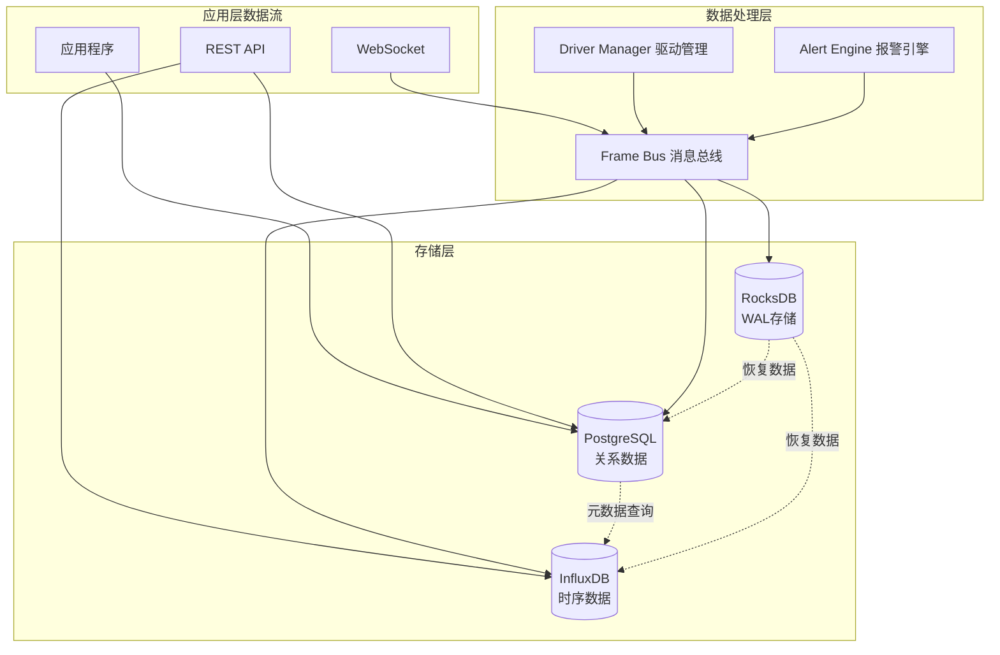

# 数据库模式设计文档

## 概述

Gateway_Rust工业网关系统采用多层存储架构设计，结合PostgreSQL关系数据库、InfluxDB时序数据库和RocksDB键值存储，实现高性能、高可用的数据管理方案。本文档详细描述了各数据库的模式设计、数据关系和性能优化策略。

## 存储架构概览



| 存储层 | 用途 | 数据类型 | 保留策略 | 性能特点 |
|--------|------|----------|----------|----------|
| **PostgreSQL** | 关系数据、配置管理 | 设备信息、用户权限、报警规则 | 长期保存 | ACID事务、复杂查询 |
| **InfluxDB** | 时序数据存储 | 实时测量数据、系统监控指标 | 6个月自动轮转 | 高写入性能、时序查询 |
| **RocksDB** | WAL消息缓冲 | Frame Bus消息持久化 | 24小时滚动 | 极高写入性能、快速恢复 |

## PostgreSQL 关系数据库设计

### 1. 数据库创建和配置

```sql
-- 创建数据库
CREATE DATABASE gateway_rust 
    WITH ENCODING 'UTF8' 
    LC_COLLATE 'en_US.UTF-8' 
    LC_CTYPE 'en_US.UTF-8';

-- 创建扩展
CREATE EXTENSION IF NOT EXISTS "uuid-ossp";
CREATE EXTENSION IF NOT EXISTS "pg_stat_statements";
CREATE EXTENSION IF NOT EXISTS "btree_gin";

-- 设置时区
SET timezone = 'UTC';
```

### 2. 核心表结构设计

#### 2.1 设备管理表

```sql
-- 协议类型枚举
CREATE TYPE protocol_kind AS ENUM (
    'ModbusTcp',
    'ModbusRtu', 
    'OpcUa',
    'Mqtt',
    'Custom'
);

-- 设备状态枚举
CREATE TYPE device_status AS ENUM (
    'Online',
    'Offline',
    'Error',
    'Maintenance',
    'Unknown'
);

-- 设备表
CREATE TABLE devices (
    id UUID PRIMARY KEY DEFAULT gen_random_uuid(),
    name VARCHAR(255) NOT NULL UNIQUE,
    description TEXT,
    protocol protocol_kind NOT NULL,
    location VARCHAR(255),
    endpoint VARCHAR(255) NOT NULL,
    config JSONB NOT NULL DEFAULT '{}',
    enabled BOOLEAN NOT NULL DEFAULT true,
    status device_status NOT NULL DEFAULT 'Unknown',
    last_seen TIMESTAMPTZ,
    created_at TIMESTAMPTZ NOT NULL DEFAULT NOW(),
    updated_at TIMESTAMPTZ NOT NULL DEFAULT NOW(),
    created_by VARCHAR(255),
    updated_by VARCHAR(255),
    
    -- 约束
    CONSTRAINT devices_name_not_empty CHECK (LENGTH(TRIM(name)) > 0),
    CONSTRAINT devices_endpoint_not_empty CHECK (LENGTH(TRIM(endpoint)) > 0)
);

-- 索引
CREATE INDEX idx_devices_protocol ON devices(protocol);
CREATE INDEX idx_devices_status ON devices(status);
CREATE INDEX idx_devices_enabled ON devices(enabled);
CREATE INDEX idx_devices_created_at ON devices(created_at);
CREATE INDEX idx_devices_location ON devices(location) WHERE location IS NOT NULL;
CREATE INDEX idx_devices_config_gin ON devices USING gin(config);
```

#### 2.2 标签管理表

```sql
-- 数据类型枚举
CREATE TYPE tag_data_type AS ENUM (
    'Boolean',
    'Int8',
    'UInt8',
    'Int16', 
    'UInt16',
    'Int32',
    'UInt32',
    'Int64',
    'UInt64',
    'Float',
    'Double',
    'String',
    'DateTime',
    'ByteArray'
);

-- 访问权限枚举
CREATE TYPE tag_access AS ENUM (
    'Read',
    'Write',
    'ReadWrite'
);

-- 标签表
CREATE TABLE tags (
    id UUID PRIMARY KEY DEFAULT gen_random_uuid(),
    device_id UUID NOT NULL REFERENCES devices(id) ON DELETE CASCADE,
    name VARCHAR(255) NOT NULL,
    description TEXT,
    address VARCHAR(255) NOT NULL,
    data_type tag_data_type NOT NULL,
    access_type tag_access NOT NULL DEFAULT 'Read',
    unit VARCHAR(50),
    scaling DOUBLE PRECISION DEFAULT 1.0,
    tag_offset DOUBLE PRECISION DEFAULT 0.0,
    min_value DOUBLE PRECISION,
    max_value DOUBLE PRECISION,
    deadband DOUBLE PRECISION,
    scan_rate INTEGER, -- 毫秒
    enabled BOOLEAN NOT NULL DEFAULT true,
    created_at TIMESTAMPTZ NOT NULL DEFAULT NOW(),
    updated_at TIMESTAMPTZ NOT NULL DEFAULT NOW(),
    
    -- 约束
    CONSTRAINT tags_device_name_unique UNIQUE(device_id, name),
    CONSTRAINT tags_name_not_empty CHECK (LENGTH(TRIM(name)) > 0),
    CONSTRAINT tags_address_not_empty CHECK (LENGTH(TRIM(address)) > 0),
    CONSTRAINT tags_scaling_positive CHECK (scaling > 0),
    CONSTRAINT tags_scan_rate_positive CHECK (scan_rate IS NULL OR scan_rate > 0),
    CONSTRAINT tags_min_max_order CHECK (min_value IS NULL OR max_value IS NULL OR min_value <= max_value)
);

-- 索引
CREATE INDEX idx_tags_device_id ON tags(device_id);
CREATE INDEX idx_tags_data_type ON tags(data_type);
CREATE INDEX idx_tags_enabled ON tags(enabled);
CREATE INDEX idx_tags_address ON tags(device_id, address);
CREATE INDEX idx_tags_scan_rate ON tags(scan_rate) WHERE scan_rate IS NOT NULL;
```

#### 2.3 报警管理表

```sql
-- 比较操作符枚举
CREATE TYPE compare_op AS ENUM (
    'GT',   -- Greater Than
    'LT',   -- Less Than  
    'GTE',  -- Greater Than or Equal
    'LTE',  -- Less Than or Equal
    'EQ',   -- Equal
    'NE',   -- Not Equal
    'BETWEEN',
    'NOT_BETWEEN'
);

-- 报警级别枚举
CREATE TYPE alert_level AS ENUM (
    'INFO',
    'WARNING', 
    'CRITICAL',
    'FATAL'
);

-- 报警状态枚举
CREATE TYPE alert_status AS ENUM (
    'ACTIVE',
    'ACKNOWLEDGED',
    'RESOLVED',
    'SUPPRESSED'
);

-- 报警规则表
CREATE TABLE alert_rules (
    id UUID PRIMARY KEY DEFAULT gen_random_uuid(),
    name VARCHAR(255) NOT NULL UNIQUE,
    description TEXT,
    device_id UUID REFERENCES devices(id) ON DELETE CASCADE,
    tag_id UUID REFERENCES tags(id) ON DELETE CASCADE,
    condition_expression TEXT NOT NULL, -- 支持复杂表达式
    op compare_op NOT NULL,
    threshold_value DOUBLE PRECISION,
    threshold_high DOUBLE PRECISION, -- 用于BETWEEN操作
    threshold_low DOUBLE PRECISION,  -- 用于BETWEEN操作
    level alert_level NOT NULL,
    eval_interval INTERVAL NOT NULL DEFAULT '1 minute',
    eval_duration INTERVAL, -- 持续时间要求
    cooldown_duration INTERVAL DEFAULT '5 minutes',
    enabled BOOLEAN NOT NULL DEFAULT true,
    created_at TIMESTAMPTZ NOT NULL DEFAULT NOW(),
    updated_at TIMESTAMPTZ NOT NULL DEFAULT NOW(),
    created_by VARCHAR(255),
    
    -- 约束
    CONSTRAINT alert_rules_name_not_empty CHECK (LENGTH(TRIM(name)) > 0),
    CONSTRAINT alert_rules_threshold_check CHECK (
        (op IN ('BETWEEN', 'NOT_BETWEEN') AND threshold_high IS NOT NULL AND threshold_low IS NOT NULL) OR
        (op NOT IN ('BETWEEN', 'NOT_BETWEEN') AND threshold_value IS NOT NULL)
    )
);

-- 报警历史表
CREATE TABLE alert_history (
    id UUID PRIMARY KEY DEFAULT gen_random_uuid(),
    rule_id UUID NOT NULL REFERENCES alert_rules(id) ON DELETE CASCADE,
    device_id UUID REFERENCES devices(id),
    tag_id UUID REFERENCES tags(id),
    fired_at TIMESTAMPTZ NOT NULL DEFAULT NOW(),
    resolved_at TIMESTAMPTZ,
    acknowledged_at TIMESTAMPTZ,
    acknowledged_by VARCHAR(255),
    triggered_value DOUBLE PRECISION,
    threshold_value DOUBLE PRECISION,
    level alert_level NOT NULL,
    status alert_status NOT NULL DEFAULT 'ACTIVE',
    message TEXT NOT NULL,
    details JSONB DEFAULT '{}',
    duration INTERVAL,
    
    -- 约束
    CONSTRAINT alert_history_resolved_after_fired CHECK (resolved_at IS NULL OR resolved_at >= fired_at),
    CONSTRAINT alert_history_ack_after_fired CHECK (acknowledged_at IS NULL OR acknowledged_at >= fired_at)
);

-- 索引
CREATE INDEX idx_alert_rules_device_tag ON alert_rules(device_id, tag_id);
CREATE INDEX idx_alert_rules_enabled ON alert_rules(enabled);
CREATE INDEX idx_alert_rules_level ON alert_rules(level);
CREATE INDEX idx_alert_history_rule_id ON alert_history(rule_id);
CREATE INDEX idx_alert_history_fired_at ON alert_history(fired_at);
CREATE INDEX idx_alert_history_status ON alert_history(status);
CREATE INDEX idx_alert_history_level ON alert_history(level);
CREATE INDEX idx_alert_history_device_time ON alert_history(device_id, fired_at);
```

#### 2.4 驱动管理表

```sql
-- 驱动状态枚举
CREATE TYPE driver_status AS ENUM (
    'LOADED',
    'RUNNING',
    'STOPPED', 
    'ERROR',
    'UNLOADED'
);

-- 驱动注册表
CREATE TABLE driver_registry (
    protocol protocol_kind PRIMARY KEY,
    name VARCHAR(255) NOT NULL,
    version VARCHAR(50) NOT NULL,
    description TEXT,
    file_path TEXT,
    file_hash VARCHAR(128),
    api_version INTEGER NOT NULL DEFAULT 1,
    metadata JSONB DEFAULT '{}',
    capabilities JSONB DEFAULT '[]',
    status driver_status NOT NULL DEFAULT 'LOADED',
    loaded_at TIMESTAMPTZ NOT NULL DEFAULT NOW(),
    error_message TEXT,
    
    CONSTRAINT driver_registry_name_not_empty CHECK (LENGTH(TRIM(name)) > 0),
    CONSTRAINT driver_registry_version_not_empty CHECK (LENGTH(TRIM(version)) > 0)
);

-- 驱动配置表
CREATE TABLE driver_configs (
    id UUID PRIMARY KEY DEFAULT gen_random_uuid(),
    name VARCHAR(255) NOT NULL UNIQUE,
    description TEXT,
    protocol VARCHAR(50) NOT NULL,
    connection_type VARCHAR(50) NOT NULL,
    enabled BOOLEAN NOT NULL DEFAULT true,
    config JSONB NOT NULL DEFAULT '{}',
    
    -- 性能参数
    scan_interval INTEGER NOT NULL DEFAULT 1000, -- 毫秒
    timeout INTEGER NOT NULL DEFAULT 5000, -- 毫秒
    max_concurrent INTEGER NOT NULL DEFAULT 10,
    batch_size INTEGER NOT NULL DEFAULT 100,
    
    -- 重试策略
    max_retries INTEGER NOT NULL DEFAULT 3,
    retry_interval INTEGER NOT NULL DEFAULT 1000, -- 毫秒
    exponential_backoff BOOLEAN NOT NULL DEFAULT true,
    max_retry_interval INTEGER NOT NULL DEFAULT 30000, -- 毫秒
    
    -- 日志配置
    log_level VARCHAR(20) NOT NULL DEFAULT 'INFO',
    enable_request_log BOOLEAN NOT NULL DEFAULT false,
    enable_response_log BOOLEAN NOT NULL DEFAULT false,
    max_log_size INTEGER NOT NULL DEFAULT 1000000, -- 字节
    
    -- SSL/TLS配置
    enable_ssl BOOLEAN NOT NULL DEFAULT false,
    verify_certificate BOOLEAN NOT NULL DEFAULT true,
    client_cert_path TEXT,
    client_key_path TEXT,
    ca_cert_path TEXT,
    
    created_at TIMESTAMPTZ NOT NULL DEFAULT NOW(),
    updated_at TIMESTAMPTZ NOT NULL DEFAULT NOW(),
    
    -- 约束
    CONSTRAINT driver_configs_name_not_empty CHECK (LENGTH(TRIM(name)) > 0),
    CONSTRAINT driver_configs_scan_interval_positive CHECK (scan_interval > 0),
    CONSTRAINT driver_configs_timeout_positive CHECK (timeout > 0),
    CONSTRAINT driver_configs_max_concurrent_positive CHECK (max_concurrent > 0),
    CONSTRAINT driver_configs_batch_size_positive CHECK (batch_size > 0)
);

-- 索引
CREATE INDEX idx_driver_configs_protocol ON driver_configs(protocol);
CREATE INDEX idx_driver_configs_enabled ON driver_configs(enabled);
CREATE INDEX idx_driver_configs_connection_type ON driver_configs(connection_type);
```

#### 2.5 用户和权限管理表

```sql
-- 用户角色枚举
CREATE TYPE user_role AS ENUM (
    'ADMIN',
    'OPERATOR',
    'VIEWER',
    'MAINTENANCE'
);

-- 用户状态枚举
CREATE TYPE user_status AS ENUM (
    'ACTIVE',
    'INACTIVE',
    'LOCKED',
    'EXPIRED'
);

-- 用户表
CREATE TABLE users (
    id UUID PRIMARY KEY DEFAULT gen_random_uuid(),
    username VARCHAR(255) NOT NULL UNIQUE,
    email VARCHAR(255) UNIQUE,
    password_hash VARCHAR(255) NOT NULL,
    salt VARCHAR(255),
    full_name VARCHAR(255),
    role user_role NOT NULL DEFAULT 'VIEWER',
    status user_status NOT NULL DEFAULT 'ACTIVE',
    last_login TIMESTAMPTZ,
    failed_login_attempts INTEGER NOT NULL DEFAULT 0,
    locked_until TIMESTAMPTZ,
    password_expires_at TIMESTAMPTZ,
    must_change_password BOOLEAN NOT NULL DEFAULT false,
    created_at TIMESTAMPTZ NOT NULL DEFAULT NOW(),
    updated_at TIMESTAMPTZ NOT NULL DEFAULT NOW(),
    created_by UUID REFERENCES users(id),
    
    -- 约束
    CONSTRAINT users_username_not_empty CHECK (LENGTH(TRIM(username)) > 0),
    CONSTRAINT users_email_format CHECK (email IS NULL OR email ~* '^[A-Za-z0-9._%+-]+@[A-Za-z0-9.-]+\.[A-Za-z]{2,}$'),
    CONSTRAINT users_failed_attempts_non_negative CHECK (failed_login_attempts >= 0)
);

-- 用户会话表
CREATE TABLE user_sessions (
    id UUID PRIMARY KEY DEFAULT gen_random_uuid(),
    user_id UUID NOT NULL REFERENCES users(id) ON DELETE CASCADE,
    token_hash VARCHAR(255) NOT NULL UNIQUE,
    refresh_token_hash VARCHAR(255),
    ip_address INET,
    user_agent TEXT,
    created_at TIMESTAMPTZ NOT NULL DEFAULT NOW(),
    expires_at TIMESTAMPTZ NOT NULL,
    last_activity TIMESTAMPTZ NOT NULL DEFAULT NOW(),
    is_active BOOLEAN NOT NULL DEFAULT true,
    
    -- 约束
    CONSTRAINT user_sessions_expires_after_created CHECK (expires_at > created_at)
);

-- 操作日志表
CREATE TABLE audit_logs (
    id UUID PRIMARY KEY DEFAULT gen_random_uuid(),
    user_id UUID REFERENCES users(id),
    action VARCHAR(100) NOT NULL,
    resource_type VARCHAR(100),
    resource_id UUID,
    details JSONB DEFAULT '{}',
    ip_address INET,
    user_agent TEXT,
    success BOOLEAN NOT NULL,
    error_message TEXT,
    created_at TIMESTAMPTZ NOT NULL DEFAULT NOW(),
    
    -- 约束
    CONSTRAINT audit_logs_action_not_empty CHECK (LENGTH(TRIM(action)) > 0)
);

-- 索引
CREATE INDEX idx_users_username ON users(username);
CREATE INDEX idx_users_email ON users(email) WHERE email IS NOT NULL;
CREATE INDEX idx_users_role ON users(role);
CREATE INDEX idx_users_status ON users(status);
CREATE INDEX idx_user_sessions_user_id ON user_sessions(user_id);
CREATE INDEX idx_user_sessions_token ON user_sessions(token_hash);
CREATE INDEX idx_user_sessions_active ON user_sessions(is_active, expires_at);
CREATE INDEX idx_audit_logs_user_action ON audit_logs(user_id, action);
CREATE INDEX idx_audit_logs_created_at ON audit_logs(created_at);
CREATE INDEX idx_audit_logs_resource ON audit_logs(resource_type, resource_id);
```

### 3. 数据库函数和触发器

#### 3.1 自动更新时间戳

```sql
-- 创建更新时间戳函数
CREATE OR REPLACE FUNCTION update_updated_at_column()
RETURNS TRIGGER AS $$
BEGIN
    NEW.updated_at = NOW();
    RETURN NEW;
END;
$$ language 'plpgsql';

-- 为所有需要的表添加触发器
CREATE TRIGGER update_devices_updated_at 
    BEFORE UPDATE ON devices 
    FOR EACH ROW EXECUTE FUNCTION update_updated_at_column();

CREATE TRIGGER update_tags_updated_at 
    BEFORE UPDATE ON tags 
    FOR EACH ROW EXECUTE FUNCTION update_updated_at_column();

CREATE TRIGGER update_alert_rules_updated_at 
    BEFORE UPDATE ON alert_rules 
    FOR EACH ROW EXECUTE FUNCTION update_updated_at_column();

CREATE TRIGGER update_driver_configs_updated_at 
    BEFORE UPDATE ON driver_configs 
    FOR EACH ROW EXECUTE FUNCTION update_updated_at_column();

CREATE TRIGGER update_users_updated_at 
    BEFORE UPDATE ON users 
    FOR EACH ROW EXECUTE FUNCTION update_updated_at_column();
```

#### 3.2 设备状态更新函数

```sql
-- 更新设备最后在线时间和状态
CREATE OR REPLACE FUNCTION update_device_status(
    device_uuid UUID,
    new_status device_status,
    last_seen_time TIMESTAMPTZ DEFAULT NOW()
)
RETURNS VOID AS $$
BEGIN
    UPDATE devices 
    SET 
        status = new_status,
        last_seen = last_seen_time,
        updated_at = NOW()
    WHERE id = device_uuid;
    
    IF NOT FOUND THEN
        RAISE EXCEPTION 'Device with ID % not found', device_uuid;
    END IF;
END;
$$ LANGUAGE plpgsql;
```

#### 3.3 报警自动解决函数

```sql
-- 自动解决过期报警
CREATE OR REPLACE FUNCTION auto_resolve_expired_alerts()
RETURNS INTEGER AS $$
DECLARE
    resolved_count INTEGER;
BEGIN
    UPDATE alert_history 
    SET 
        status = 'RESOLVED',
        resolved_at = NOW(),
        duration = NOW() - fired_at
    WHERE 
        status = 'ACTIVE' 
        AND fired_at < NOW() - INTERVAL '24 hours';
    
    GET DIAGNOSTICS resolved_count = ROW_COUNT;
    
    RETURN resolved_count;
END;
$$ LANGUAGE plpgsql;
```

### 4. 视图定义

#### 4.1 设备概览视图

```sql
CREATE VIEW device_overview AS
SELECT 
    d.id,
    d.name,
    d.description,
    d.protocol,
    d.location,
    d.status,
    d.last_seen,
    d.enabled,
    COUNT(t.id) as tag_count,
    COUNT(CASE WHEN t.enabled THEN 1 END) as enabled_tag_count,
    COUNT(ah.id) as active_alert_count
FROM devices d
LEFT JOIN tags t ON d.id = t.device_id
LEFT JOIN alert_history ah ON d.id = ah.device_id AND ah.status = 'ACTIVE'
GROUP BY d.id, d.name, d.description, d.protocol, d.location, d.status, d.last_seen, d.enabled;
```

#### 4.2 报警统计视图

```sql
CREATE VIEW alert_statistics AS
SELECT 
    DATE_TRUNC('hour', fired_at) as hour,
    level,
    COUNT(*) as alert_count,
    COUNT(CASE WHEN status = 'ACTIVE' THEN 1 END) as active_count,
    COUNT(CASE WHEN status = 'RESOLVED' THEN 1 END) as resolved_count,
    AVG(EXTRACT(EPOCH FROM duration)) as avg_duration_seconds
FROM alert_history
WHERE fired_at >= NOW() - INTERVAL '24 hours'
GROUP BY DATE_TRUNC('hour', fired_at), level
ORDER BY hour DESC, level;
```

## InfluxDB 时序数据库设计

### 1. 数据库配置

```toml
# influxdb.conf
[http]
  enabled = true
  bind-address = ":8086"
  max-concurrent-queries = 100
  max-enqueued-queries = 100

[coordinator]
  write-timeout = "30s"
  max-concurrent-queries = 100

[retention]
  enabled = true
  check-interval = "30m0s"

[continuous_queries]
  enabled = true
  run-interval = "1s"
```

### 2. 数据模型设计

#### 2.1 设备测量数据

```
# Measurement: device_data
# Tags (indexed):
device_id,device_name,tag_name,protocol,location,unit

# Fields (values):
value=25.6,raw_value=256,quality=1i,error_code=0i

# Timestamp: 纳秒精度
1642780800000000000
```

**完整Line Protocol示例**:
```
device_data,device_id=550e8400-e29b-41d4-a716-446655440000,device_name=PLC-001,tag_name=temperature_1,protocol=ModbusTcp,location=Workshop-A,unit=°C value=25.6,raw_value=256,quality=1i,error_code=0i 1642780800000000000
```

#### 2.2 系统性能指标

```
# Measurement: system_metrics
# Tags:
component,instance,host,metric_type

# Fields:
cpu_usage=15.2,memory_usage=89534464i,throughput=1200.5,latency_p99=0.8,error_rate=0.01

# 示例:
system_metrics,component=frame_bus,instance=primary,host=gateway-001,metric_type=performance cpu_usage=15.2,memory_usage=89534464i,throughput=1200.5,latency_p99=0.8 1642780800000000000
```

#### 2.3 报警事件记录

```
# Measurement: alert_events
# Tags:
rule_id,device_id,tag_id,level,status

# Fields:
triggered_value=85.6,threshold_value=80.0,duration=300i,message="Temperature too high"

# 示例:
alert_events,rule_id=660e8400-e29b-41d4-a716-446655440001,device_id=550e8400-e29b-41d4-a716-446655440000,tag_id=770e8400-e29b-41d4-a716-446655440002,level=WARNING,status=ACTIVE triggered_value=85.6,threshold_value=80.0,duration=300i,message="Temperature too high" 1642780800000000000
```

### 3. 保留策略设置

```sql
-- 创建数据库
CREATE DATABASE gateway_timeseries

-- 设置保留策略
-- 原始数据：6个月
CREATE RETENTION POLICY "raw_data" ON "gateway_timeseries" 
    DURATION 6MONTHS 
    REPLICATION 1 
    DEFAULT

-- 1小时聚合数据：2年  
CREATE RETENTION POLICY "hourly_data" ON "gateway_timeseries" 
    DURATION 2YEARS 
    REPLICATION 1

-- 1天聚合数据：5年
CREATE RETENTION POLICY "daily_data" ON "gateway_timeseries" 
    DURATION 5YEARS 
    REPLICATION 1
```

### 4. 连续查询设置

```sql
-- 创建1小时聚合连续查询
CREATE CONTINUOUS QUERY "cq_hourly_device_data" ON "gateway_timeseries"
BEGIN
  SELECT 
    mean("value") AS "mean_value",
    min("value") AS "min_value", 
    max("value") AS "max_value",
    count("value") AS "sample_count",
    stddev("value") AS "stddev_value"
  INTO "gateway_timeseries"."hourly_data"."device_data_hourly"
  FROM "gateway_timeseries"."raw_data"."device_data"
  GROUP BY time(1h), "device_id", "tag_name", "unit"
END

-- 创建1天聚合连续查询
CREATE CONTINUOUS QUERY "cq_daily_device_data" ON "gateway_timeseries"  
BEGIN
  SELECT
    mean("mean_value") AS "mean_value",
    min("min_value") AS "min_value",
    max("max_value") AS "max_value", 
    sum("sample_count") AS "total_samples"
  INTO "gateway_timeseries"."daily_data"."device_data_daily"
  FROM "gateway_timeseries"."hourly_data"."device_data_hourly"
  GROUP BY time(1d), "device_id", "tag_name", "unit"
END

-- 系统指标聚合
CREATE CONTINUOUS QUERY "cq_hourly_system_metrics" ON "gateway_timeseries"
BEGIN
  SELECT
    mean("cpu_usage") AS "avg_cpu_usage",
    max("cpu_usage") AS "max_cpu_usage",
    mean("memory_usage") AS "avg_memory_usage", 
    max("memory_usage") AS "max_memory_usage",
    mean("throughput") AS "avg_throughput",
    max("throughput") AS "max_throughput",
    mean("latency_p99") AS "avg_latency_p99",
    max("latency_p99") AS "max_latency_p99"
  INTO "gateway_timeseries"."hourly_data"."system_metrics_hourly"
  FROM "gateway_timeseries"."raw_data"."system_metrics"
  GROUP BY time(1h), "component", "host"
END
```

## RocksDB WAL存储设计

### 1. 数据结构定义

```rust
// Key格式：frame:{sequence_number:020}  
// 例如：frame:000000000000001234

#[derive(Debug, Clone)]
pub struct FrameKey {
    pub sequence: u64,
}

impl FrameKey {
    pub fn encode(&self) -> Vec<u8> {
        format!("frame:{:020}", self.sequence).into_bytes()
    }
    
    pub fn decode(key: &[u8]) -> Option<Self> {
        let key_str = std::str::from_utf8(key).ok()?;
        if let Some(seq_str) = key_str.strip_prefix("frame:") {
            let sequence = seq_str.parse().ok()?;
            Some(FrameKey { sequence })
        } else {
            None
        }
    }
}

// Value格式：Protobuf序列化的FrameEnvelope
#[derive(Debug, Clone)]
pub struct FrameEnvelope {
    pub sequence_id: u64,
    pub timestamp: u64, // 纳秒时间戳
    pub frame_type: FrameType,
    pub data: Vec<u8>, // 序列化的DataFrame
    pub checksum: u32,
}

#[derive(Debug, Clone)]
pub enum FrameType {
    Data = 1,
    Command = 2,
    Event = 3,
    Heartbeat = 4,
}
```

### 2. RocksDB配置

```rust
use rocksdb::{DB, Options, WriteOptions, ReadOptions, ColumnFamily};

pub fn configure_rocksdb() -> Options {
    let mut opts = Options::default();
    
    // 基础配置
    opts.create_if_missing(true);
    opts.create_missing_column_families(true);
    
    // 性能优化
    opts.set_max_open_files(1000);
    opts.set_use_fsync(false);
    opts.set_bytes_per_sync(1048576); // 1MB
    opts.set_disable_auto_compactions(false);
    
    // 内存配置  
    opts.set_write_buffer_size(64 * 1024 * 1024); // 64MB
    opts.set_max_write_buffer_number(3);
    opts.set_target_file_size_base(64 * 1024 * 1024); // 64MB
    
    // WAL配置
    opts.set_wal_ttl_seconds(86400); // 24小时
    opts.set_wal_size_limit_mb(1024); // 1GB
    
    // 压缩配置
    opts.set_compression_type(rocksdb::DBCompressionType::Lz4);
    
    opts
}

pub fn configure_write_options() -> WriteOptions {
    let mut write_opts = WriteOptions::default();
    write_opts.set_sync(false); // 异步写入提升性能
    write_opts.disable_wal(false); // 启用WAL
    write_opts
}
```

### 3. 数据生命周期管理

```rust
pub struct WalManager {
    db: Arc<DB>,
    cleanup_interval: Duration,
    retention_duration: Duration,
}

impl WalManager {
    pub async fn start_cleanup_task(&self) {
        let db = self.db.clone();
        let retention = self.retention_duration;
        let interval = self.cleanup_interval;
        
        tokio::spawn(async move {
            let mut interval_timer = tokio::time::interval(interval);
            
            loop {
                interval_timer.tick().await;
                
                if let Err(e) = Self::cleanup_expired_entries(&db, retention).await {
                    log::error!("WAL cleanup failed: {}", e);
                }
            }
        });
    }
    
    async fn cleanup_expired_entries(db: &DB, retention: Duration) -> Result<()> {
        let cutoff_time = SystemTime::now()
            .duration_since(UNIX_EPOCH)?
            .as_nanos() as u64 - retention.as_nanos() as u64;
        
        let mut cleanup_count = 0;
        let iter = db.iterator(rocksdb::IteratorMode::Start);
        
        for (key, value) in iter {
            if let Some(frame_key) = FrameKey::decode(&key) {
                if let Ok(envelope) = Self::deserialize_envelope(&value) {
                    if envelope.timestamp < cutoff_time {
                        db.delete(&key)?;
                        cleanup_count += 1;
                    } else {
                        break; // 由于按时间顺序存储，后续记录都是新的
                    }
                }
            }
        }
        
        log::info!("Cleaned up {} expired WAL entries", cleanup_count);
        Ok(())
    }
}
```

## 数据库性能优化

### 1. PostgreSQL优化

#### 1.1 配置优化

```sql
-- postgresql.conf 关键配置
shared_buffers = '2GB'                    -- 总内存的25%
effective_cache_size = '6GB'              -- 总内存的75%
work_mem = '64MB'                         -- 排序/哈希操作内存
maintenance_work_mem = '512MB'            -- 维护操作内存
wal_buffers = '16MB'                      -- WAL缓冲区
checkpoint_completion_target = 0.9        -- 检查点完成目标
random_page_cost = 1.1                    -- SSD优化
effective_io_concurrency = 200            -- 并发IO

-- 连接池配置
max_connections = 200
shared_preload_libraries = 'pg_stat_statements'

-- 日志配置
log_statement = 'ddl'
log_min_duration_statement = 1000         -- 记录慢查询
log_checkpoints = on
log_lock_waits = on
```

#### 1.2 索引优化策略

```sql
-- 复合索引优化
CREATE INDEX CONCURRENTLY idx_tags_device_enabled_type 
    ON tags(device_id, enabled, data_type) 
    WHERE enabled = true;

-- 部分索引优化
CREATE INDEX CONCURRENTLY idx_devices_online_last_seen 
    ON devices(last_seen) 
    WHERE status = 'Online';

-- 表达式索引
CREATE INDEX CONCURRENTLY idx_users_lower_username 
    ON users(lower(username));

-- JSONB索引优化
CREATE INDEX CONCURRENTLY idx_devices_config_modbus 
    ON devices USING gin((config->'modbus')); 

-- 分区表索引（历史数据）
CREATE INDEX CONCURRENTLY idx_alert_history_2025_01 
    ON alert_history_2025_01(device_id, fired_at);
```

#### 1.3 查询优化

```sql
-- 使用CTE优化复杂查询
WITH device_stats AS (
    SELECT 
        device_id,
        COUNT(*) as total_alerts,
        COUNT(CASE WHEN status = 'ACTIVE' THEN 1 END) as active_alerts
    FROM alert_history 
    WHERE fired_at >= NOW() - INTERVAL '24 hours'
    GROUP BY device_id
)
SELECT d.name, d.status, COALESCE(ds.total_alerts, 0) as alerts
FROM devices d
LEFT JOIN device_stats ds ON d.id = ds.device_id
WHERE d.enabled = true;

-- 使用EXPLAIN ANALYZE分析查询计划
EXPLAIN (ANALYZE, BUFFERS, FORMAT JSON) 
SELECT * FROM devices d 
JOIN tags t ON d.id = t.device_id 
WHERE d.protocol = 'ModbusTcp' AND t.enabled = true;
```

### 2. InfluxDB优化

#### 2.1 Shard和Series设计

```toml
# influxdb.conf
[data]
  # Shard持续时间配置
  retention-autocreate = true
  
[tsm1]
  # TSM文件压缩配置
  cache-max-memory-size = "1g"
  cache-snapshot-memory-size = "25m"
  cache-snapshot-write-cold-duration = "10m"
  compact-full-write-cold-duration = "4h"
  max-concurrent-compactions = 3
```

#### 2.2 查询优化

```sql
-- 使用时间范围限制
SELECT mean("value") 
FROM "device_data" 
WHERE time >= now() - 1h 
  AND "device_id" = '550e8400-e29b-41d4-a716-446655440000'
GROUP BY time(1m)

-- 使用LIMIT优化大结果集
SELECT "value", "quality" 
FROM "device_data" 
WHERE "device_id" = '550e8400-e29b-41d4-a716-446655440000'
  AND time >= now() - 24h
ORDER BY time DESC 
LIMIT 1000

-- 避免高基数标签
-- 不好的设计：
device_data,device_id=xxx,timestamp=1642780800 value=25.6

-- 好的设计：
device_data,device_id=xxx value=25.6,timestamp=1642780800i
```

### 3. 数据库监控

#### 3.1 PostgreSQL监控查询

```sql
-- 连接池状态监控
SELECT 
    count(*) as total_connections,
    count(*) FILTER (WHERE state = 'active') as active_connections,
    count(*) FILTER (WHERE state = 'idle') as idle_connections,
    count(*) FILTER (WHERE state = 'idle in transaction') as idle_in_transaction
FROM pg_stat_activity;

-- 慢查询监控
SELECT 
    query,
    calls,
    total_time,
    mean_time,
    rows
FROM pg_stat_statements 
ORDER BY mean_time DESC 
LIMIT 10;

-- 表大小监控
SELECT 
    schemaname,
    tablename,
    pg_size_pretty(pg_total_relation_size(schemaname||'.'||tablename)) as size
FROM pg_tables 
WHERE schemaname = 'public'
ORDER BY pg_total_relation_size(schemaname||'.'||tablename) DESC;
```

#### 3.2 InfluxDB监控

```sql
-- 数据库大小监控
SHOW STATS

-- Series基数监控  
SHOW SERIES CARDINALITY

-- Shard信息
SHOW SHARDS
```

### 4. 备份和恢复策略

#### 4.1 PostgreSQL备份

```bash
#!/bin/bash
# 每日增量备份脚本

BACKUP_DIR="/var/backups/postgresql"
DB_NAME="gateway_rust" 
DATE=$(date +%Y%m%d_%H%M%S)

# 全量备份（每周日）
if [ $(date +%u) -eq 7 ]; then
    pg_dump -h localhost -U postgres -d $DB_NAME \
        --compress=9 --format=custom \
        --file="$BACKUP_DIR/full_backup_$DATE.sql.gz"
fi

# 增量备份（WAL归档）
pg_receivewal -h localhost -U postgres \
    --directory="$BACKUP_DIR/wal" --compress=gzip

# 清理7天前的备份
find $BACKUP_DIR -name "*.gz" -mtime +7 -delete
```

#### 4.2 InfluxDB备份

```bash
#!/bin/bash
# InfluxDB备份脚本

BACKUP_DIR="/var/backups/influxdb"
DATE=$(date +%Y%m%d_%H%M%S)

# 数据备份
influxd backup -portable -database gateway_timeseries \
    "$BACKUP_DIR/influx_backup_$DATE"

# 压缩备份
tar -czf "$BACKUP_DIR/influx_backup_$DATE.tar.gz" \
    "$BACKUP_DIR/influx_backup_$DATE"

# 清理备份目录
rm -rf "$BACKUP_DIR/influx_backup_$DATE"
find $BACKUP_DIR -name "*.tar.gz" -mtime +7 -delete
```

---

**文档版本**: v1.0  
**最后更新**: 2025-01-17  
**数据库版本**: PostgreSQL 15+, InfluxDB 2.x, RocksDB 7.x  
**性能目标**: 1000+ TPS, <100ms 查询延迟, 99.9% 可用性