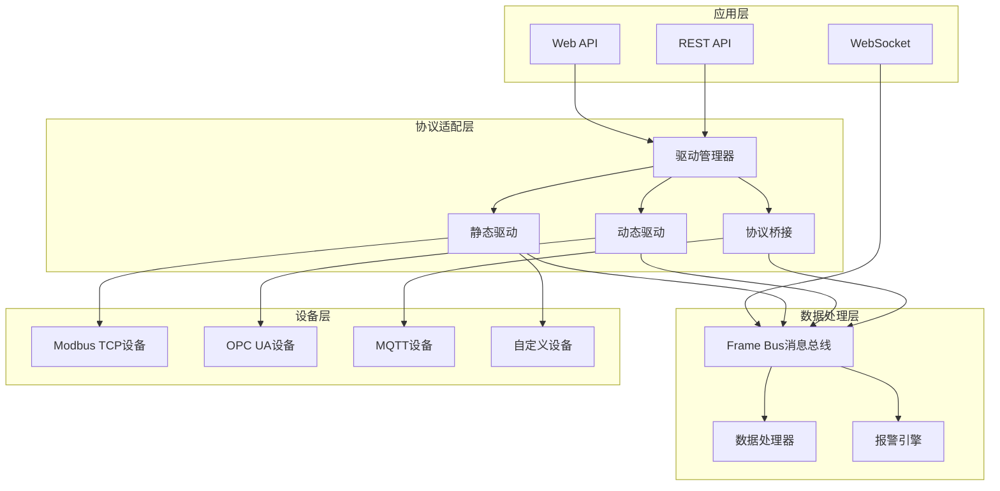

# 协议适配架构设计文档

## 📋 概述

Gateway_Rust 采用插件化的协议适配架构，支持多种工业协议的接入和数据转换。系统通过统一的驱动接口和协议桥接层，实现了工业设备数据的无缝集成和标准化输出。

**核心特性**：
- **插件化架构**：静态和动态驱动加载机制
- **多协议支持**：Modbus TCP、OPC UA、MQTT等工业协议
- **热插拔能力**：运行时动态加载/卸载驱动
- **高性能设计**：批量优化和异步处理
- **企业级可靠性**：错误处理、重试机制、监控指标

## 🏗️ 整体架构

### 分层设计



### 核心组件关系

| 组件 | 职责 | 关键特性 | 实现状态 |
|------|------|----------|----------|
| **DriverManager** | 驱动生命周期管理 | 热插拔、监控、故障恢复 | ✅ 已实现 |
| **Driver SDK** | 驱动开发接口 | 标准化API、ABI兼容 | ✅ 已实现 |
| **Protocol Bridge** | 协议桥接服务 | 协议转换、数据映射 | ✅ 已实现 |
| **Frame Bus** | 数据消息总线 | 高性能、持久化、路由 | ✅ 已实现 |
| **Static Registry** | 静态驱动注册表 | 编译时集成、高性能 | ✅ 已实现 |
| **Dynamic Loader** | 动态驱动加载器 | 运行时加载、文件监控 | ✅ 已实现 |

## 🔌 驱动系统架构

### 1. 驱动接口定义

**核心Trait**：`/core/driver-sdk/src/driver.rs`

```rust
#[async_trait]
pub trait Driver: Send + Sync {
    /// 获取驱动支持的协议类型
    fn protocol(&self) -> ProtocolKind;
    
    /// 获取驱动版本和元信息
    fn version(&self) -> &'static str;
    fn name(&self) -> &'static str;
    fn description(&self) -> &'static str;
    
    /// 驱动生命周期管理
    async fn initialize(&self, config: serde_json::Value) -> DriverResult<()>;
    async fn start(&self) -> DriverResult<()>;
    async fn stop(&self) -> DriverResult<()>;
    async fn cleanup(&self) -> DriverResult<()>;
    
    /// 设备关联管理
    async fn attach_device(&self, device_id: Uuid, config: serde_json::Value) -> DriverResult<()>;
    async fn detach_device(&self, device_id: Uuid) -> DriverResult<()>;
    
    /// 数据点操作
    async fn read_tag(&self, device_id: Uuid, address: &str) -> DriverResult<serde_json::Value>;
    async fn write_tag(&self, device_id: Uuid, address: &str, value: serde_json::Value) -> DriverResult<()>;
}
```

### 2. 协议类型支持

```rust
#[derive(Debug, Clone, Serialize, Deserialize, PartialEq)]
pub enum ProtocolKind {
    ModbusTcp,  // ✅ 已实现 - 完整的读写支持
    OpcUa,      // 🚧 规划中 - 基础架构已就绪
    Mqtt,       // 🚧 规划中 - 基础架构已就绪
}
```

**实现状态详情**：
- **Modbus TCP**: 完整实现，包括批量优化、错误处理、性能监控
- **OPC UA**: 协议桥接架构已实现，具体协议逻辑待开发
- **MQTT**: 基础框架已就绪，协议适配层待完善

### 3. 静态驱动vs动态驱动

#### 静态驱动特性

**优势**：
- **编译时集成**：零运行时开销
- **类型安全**：完整的Rust类型检查
- **高性能**：直接函数调用，无FFI开销
- **简单部署**：单一可执行文件

**实现示例**：`/drivers/modbus-static/`

```rust
pub struct ModbusDriver {
    cfg: ModbusCfg,
    endpoint: Option<Arc<EndpointHandle>>,
    points: Vec<RegPoint>,
    batches: Vec<PollBatch>,
    tag_map: HashMap<String, RegPoint>,
}

#[async_trait]
impl Driver for ModbusDriver {
    fn meta(&self) -> DriverMeta {
        DriverMeta {
            name: "modbus-tcp".to_string(),
            kind: DriverKind::Static,
            version: "0.1.0".to_string(),
            api_version: 1,
            description: "Static Modbus-TCP driver".to_string(),
            features: vec!["read".to_string()],
        }
    }
    
    // 高性能批量读取实现
    async fn read_loop(&mut self, tx: FrameSender) -> anyhow::Result<()> {
        for batch in &self.batches {
            match self.read_batch(batch).await {
                Ok(regs) => {
                    self.decode_and_publish(regs, batch, &tx).await?;
                }
                Err(e) => {
                    tracing::error!("Batch read failed: {}", e);
                    METRICS.exception_total.inc();
                }
            }
        }
        Ok(())
    }
}
```

#### 动态驱动特性

**优势**：
- **热插拔能力**：运行时加载/卸载
- **独立开发**：第三方驱动开发
- **模块化部署**：按需安装协议支持
- **版本隔离**：不同版本驱动并存

**加载机制**：

```rust
pub struct DynamicDriverLoader {
    drivers_dir: PathBuf,
    loaded_drivers: Arc<RwLock<HashMap<String, LoadedDriver>>>,
    file_watcher: Option<RecommendedWatcher>,
    event_sender: broadcast::Sender<DynamicDriverEvent>,
}

impl DynamicDriverLoader {
    /// 扫描并加载所有动态驱动
    pub async fn scan_and_load_all(&self) -> Result<Vec<String>> {
        let mut loaded_drivers = Vec::new();
        
        // 扫描.so和.dll文件
        for extension in &["so", "dll"] {
            let pattern = format!("{}/*.{}", self.drivers_dir.display(), extension);
            for entry in glob(&pattern)? {
                let file_path = entry?;
                match self.load_driver(&file_path).await {
                    Ok(driver_id) => {
                        loaded_drivers.push(driver_id);
                        tracing::info!("Loaded dynamic driver: {:?}", file_path);
                    }
                    Err(e) => {
                        tracing::warn!("Failed to load driver {:?}: {}", file_path, e);
                    }
                }
            }
        }
        
        Ok(loaded_drivers)
    }
}
```

## 🌐 协议桥接架构

### 1. 桥接抽象层

**核心接口**：`/core/protocol-bridge/src/bridge.rs`

```rust
#[async_trait]
pub trait ProtocolBridge {
    /// 基础管理操作
    fn config(&self) -> &BridgeConfig;
    async fn state(&self) -> BridgeState;
    async fn stats(&self) -> BridgeStats;
    async fn start(&self) -> Result<()>;
    async fn stop(&self) -> Result<()>;
    
    /// 数据点管理
    async fn add_data_point(&self, data_point: DataPoint) -> Result<()>;
    async fn remove_data_point(&self, data_point_id: &str) -> Result<()>;
    async fn list_data_points(&self) -> Result<Vec<DataPoint>>;
    
    /// 数据读写操作
    async fn read_value(&self, data_point_id: &str) -> Result<Option<DataValue>>;
    async fn write_value(&self, data_point_id: &str, value: DataValue) -> Result<()>;
    async fn read_multiple(&self, data_point_ids: &[String]) -> Result<HashMap<String, Option<DataValue>>>;
    async fn write_multiple(&self, values: HashMap<String, DataValue>) -> Result<()>;
    
    /// 订阅机制
    async fn subscribe(&self, data_point_ids: &[String]) -> Result<String>;
    async fn unsubscribe(&self, subscription_id: &str) -> Result<()>;
}
```

### 2. 支持的桥接类型

```rust
#[derive(Debug, Clone, PartialEq, Eq, Hash, Serialize, Deserialize)]
pub enum BridgeType {
    /// OPC-UA Server桥接 - 提供OPC UA服务
    OpcUaServer,
    /// Modbus Slave桥接 - 提供Modbus TCP从站服务  
    ModbusSlave,
    /// 自定义桥接协议
    Custom(String),
}
```

### 3. 数据类型系统

```rust
/// 统一数据类型定义
#[derive(Debug, Clone, PartialEq, Eq, Serialize, Deserialize)]
pub enum DataType {
    Boolean, Int16, Int32, Int64,
    UInt16, UInt32, UInt64,
    Float, Double, String,
    ByteArray, DateTime,
}

/// 数据值枚举
#[derive(Debug, Clone, Serialize, Deserialize)]
pub enum DataValue {
    Boolean(bool), Int16(i16), Int32(i32), Int64(i64),
    UInt16(u16), UInt32(u32), UInt64(u64),
    Float(f32), Double(f64), String(String),
    ByteArray(Vec<u8>), DateTime(SystemTime),
}

/// 访问权限控制
#[derive(Debug, Clone, PartialEq, Eq, Serialize, Deserialize)]
pub enum AccessLevel {
    ReadOnly,    // 只读
    WriteOnly,   // 只写  
    ReadWrite,   // 读写
}
```

## ⚡ Modbus TCP 协议实现

### 1. 配置系统

**配置结构**：`/drivers/modbus-static/src/config.rs`

```rust
#[derive(Debug, Clone, Deserialize, Serialize)]
pub struct ModbusCfg {
    /// Modbus单元ID (1-247)
    pub unit_id: u8,
    /// 轮询间隔
    #[serde(with = "humantime_serde")]
    pub polling: Duration,
    /// 每次请求最大寄存器数量 (默认120，安全余量)
    pub max_regs_per_req: u16,
    /// 重试次数
    pub retry: u8,
    /// 字节序 (Big/Little)
    pub endian: Endian,
    /// 是否启用写入操作
    pub enable_write: bool,
}

/// 寄存器点位定义
#[derive(Debug, Clone)]
pub struct RegPoint {
    pub tag: String,                           // 点位标签
    pub func: tokio_modbus::FunctionCode,      // 功能码 (3/4)
    pub addr: u16,                             // 寄存器地址
    pub len: u16,                              // 数据长度
    pub datatype: DataType,                    // 数据类型
    pub scale: Option<String>,                 // 缩放表达式
    pub access: Access,                        // 访问权限
}
```

### 2. 批量优化算法

**智能分组策略**：

```rust
impl ModbusDriver {
    /// 将点位智能分组为批次，优化网络传输
    fn group_points_to_batches(&self) -> Vec<PollBatch> {
        let mut batches = Vec::new();
        
        // 按功能码分组 (ReadHoldingRegisters=3, ReadInputRegisters=4)
        let mut grouped: HashMap<u8, Vec<&RegPoint>> = HashMap::new();
        for point in &self.points {
            let func_code = match point.func {
                tokio_modbus::FunctionCode::ReadHoldingRegisters => 3,
                tokio_modbus::FunctionCode::ReadInputRegisters => 4,
                _ => continue,
            };
            grouped.entry(func_code).or_default().push(point);
        }

        for (func_code, mut points) in grouped {
            // 按地址排序
            points.sort_by_key(|p| p.addr);

            let mut current_batch = Vec::new();
            let mut current_start = 0u16;
            let mut current_end = 0u16;

            for point in points {
                let point_start = point.addr;
                let point_end = point.addr + point.len - 1;

                if current_batch.is_empty() {
                    // 第一个点
                    current_batch.push(point.clone());
                    current_start = point_start;
                    current_end = point_end;
                } else if point_start <= current_end + 1 && 
                         point_end - current_start + 1 <= self.cfg.max_regs_per_req {
                    // 可以合并到当前批次
                    current_batch.push(point.clone());
                    current_end = current_end.max(point_end);
                } else {
                    // 需要新的批次
                    batches.push(PollBatch { /* ... */ });
                    current_batch = vec![point.clone()];
                    current_start = point_start;
                    current_end = point_end;
                }
            }
        }
        
        batches
    }
}
```

### 3. 高性能数据处理

**批量发布优化**：

```rust
/// 解码并批量发布数据帧
async fn decode_and_publish(
    &self,
    regs: Vec<u16>,
    batch: &PollBatch,
    _tx: &FrameSender,
) -> anyhow::Result<()> {
    let mut frames = Vec::with_capacity(batch.points.len());
    
    // 批量解码所有点位
    for point in &batch.points {
        let frame = match decode_registers(&regs, point, batch.start, &self.cfg.endian) {
            Ok(value) => {
                // 应用缩放
                let scaled_value = apply_scale(value, point.scale.as_deref())?;
                
                // 创建高质量数据帧
                DataFrame::new(&point.tag, scaled_value)
                    .with_qos(2) // Good quality
                    .with_meta("driver", "modbus-tcp")
                    .with_meta("unit_id", self.cfg.unit_id.to_string())
                    .with_meta("batch_id", format!("{:?}_{}", batch.func, batch.start))
            }
            Err(e) => {
                // 创建错误质量帧
                DataFrame::new(&point.tag, frame_bus::Value::int(0))
                    .with_qos(0) // Bad quality
                    .with_meta("error", e.to_string())
            }
        };
        frames.push(frame);
    }

    // 批量发布所有帧（高性能API）
    if !frames.is_empty() {
        frame_bus::publish_data_batch(frames)?;
        METRICS.point_total.inc_by(batch.points.len() as f64);
    }
    
    Ok(())
}
```

### 4. 数据类型和编解码

**支持的数据类型**：

```rust
#[derive(Debug, Clone)]
pub enum DataType {
    Bool,       // 1位布尔值
    Uint16,     // 16位无符号整数  
    Int16,      // 16位有符号整数
    Uint32,     // 32位无符号整数 (2个寄存器)
    Int32,      // 32位有符号整数 (2个寄存器)
    Float32,    // 32位浮点数 (2个寄存器)
    Float64,    // 64位浮点数 (4个寄存器)
}

/// 字节序处理
#[derive(Debug, Clone, Default, Deserialize, Serialize)]
#[serde(rename_all = "lowercase")]
pub enum Endian {
    #[default]
    Big,     // 大端序 (Modbus标准)
    Little,  // 小端序
}
```

**缩放和变换**：

```rust
/// 应用数据缩放变换
pub fn apply_scale(value: frame_bus::Value, scale_expr: Option<&str>) -> anyhow::Result<frame_bus::Value> {
    if let Some(expr) = scale_expr {
        match value {
            frame_bus::Value::Float(v) => {
                // 简化的表达式解析，支持基本数学运算
                let result = if expr.contains("/ 10.0") {
                    v / 10.0
                } else if expr.contains("/ 100.0") {
                    v / 100.0
                } else if expr.contains("* 0.1") {
                    v * 0.1
                } else {
                    v  // 默认不变换
                };
                Ok(frame_bus::Value::Float(result))
            }
            _ => Ok(value), // 非浮点数不进行缩放
        }
    } else {
        Ok(value)
    }
}
```

## 🔧 驱动管理器

### 1. 生命周期管理

**核心管理器**：`/core/driver-manager/src/manager.rs`

```rust
pub struct DriverManager {
    drivers: Arc<RwLock<HashMap<String, DriverInstance>>>,
    static_registry: StaticDriverRegistry,
    dynamic_loader: DynamicDriverLoader,
    registry_manager: RegistryManager,
}

pub struct DriverInstance {
    pub meta: DriverMeta,
    pub state: DriverState,
    pub supervisor: DriverSupervisor,
    pub task_handle: Option<JoinHandle<()>>,
}
```

**状态管理**：

```rust
#[derive(Debug, Clone, PartialEq)]
pub enum DriverState {
    Init,       // 初始化状态
    Active,     // 活跃运行
    Stopped,    // 已停止
    Error,      // 错误状态
    Shutdown,   // 关闭状态
}
```

### 2. 热插拔机制

**动态加载流程**：

```rust
impl DriverManager {
    /// 加载动态驱动
    pub async fn load_dynamic_driver<P: AsRef<std::path::Path>>(
        &self,
        file_path: P,
        driver_id: String,
        config: serde_json::Value,
    ) -> Result<()> {
        // 1. 加载到动态加载器
        let sdk_driver_id = self.dynamic_loader.load_driver(file_path).await?;
        
        // 2. 创建包装器
        let driver_wrapper = self.dynamic_loader.create_driver_wrapper(&sdk_driver_id).await?;
        let meta = driver_wrapper.meta();
        
        // 3. 创建监督者和实例
        let supervisor = DriverSupervisor::new(driver_id.clone(), driver_wrapper);
        let instance = DriverInstance {
            meta,
            state: DriverState::Init,
            supervisor,
            task_handle: None,
        };

        // 4. 注册到管理器
        let mut drivers = self.drivers.write().await;
        drivers.insert(driver_id.clone(), instance);

        tracing::info!("Loaded dynamic driver: {}", driver_id);
        Ok(())
    }

    /// 热重载驱动
    pub async fn reload_dynamic_driver(&self, driver_id: &str) -> Result<String> {
        // 1. 停止当前实例
        self.stop_driver(driver_id).await?;

        // 2. 找到对应SDK驱动
        let sdk_driver_id = if driver_id.starts_with("dyn_") {
            driver_id.strip_prefix("dyn_").unwrap()
        } else {
            driver_id
        };

        // 3. 在动态加载器中热重载
        let new_sdk_driver_id = self.dynamic_loader.reload_driver(sdk_driver_id).await?;

        // 4. 创建新实例
        let new_manager_driver_id = format!("dyn_{}", new_sdk_driver_id);
        self.load_dynamic_driver_from_sdk(&new_sdk_driver_id, new_manager_driver_id.clone()).await?;

        // 5. 清理旧实例
        {
            let mut drivers = self.drivers.write().await;
            drivers.remove(driver_id);
        }

        Ok(new_manager_driver_id)
    }
}
```

### 3. 文件监控与自动重载

```rust
impl DynamicDriverLoader {
    /// 启动文件监控
    pub fn start_file_watcher(&mut self) -> Result<()> {
        let (tx, rx) = channel();
        let mut watcher = notify::recommended_watcher(tx)?;
        
        // 监控驱动目录
        watcher.watch(&self.drivers_dir, RecursiveMode::NonRecursive)?;
        
        let event_sender = self.event_sender.clone();
        let drivers_dir = self.drivers_dir.clone();
        
        tokio::spawn(async move {
            while let Ok(event) = rx.recv() {
                match event {
                    Ok(notify::Event { kind: notify::EventKind::Modify(_), paths, .. }) => {
                        for path in paths {
                            if let Some(ext) = path.extension() {
                                if ext == "so" || ext == "dll" {
                                    // 触发热重载
                                    let _ = event_sender.send(DynamicDriverEvent::FileModified { 
                                        file_path: path 
                                    });
                                }
                            }
                        }
                    }
                    _ => {}
                }
            }
        });
        
        self.file_watcher = Some(watcher);
        Ok(())
    }
}
```

## 📊 性能优化与监控

### 1. 性能指标

**Modbus驱动指标**：`/drivers/modbus-static/src/metrics.rs`

```rust
pub struct ModbusMetrics {
    /// PDU总数
    pub pdu_total: Counter,
    /// 数据点总数  
    pub point_total: Counter,
    /// 异常总数
    pub exception_total: Counter,
    /// 点位延迟分布
    pub point_latency: Histogram,
}

lazy_static! {
    pub static ref METRICS: ModbusMetrics = ModbusMetrics {
        pdu_total: register_counter!("modbus_pdu_total", "Total Modbus PDUs sent").unwrap(),
        point_total: register_counter!("modbus_point_total", "Total data points processed").unwrap(),
        exception_total: register_counter!("modbus_exception_total", "Total Modbus exceptions").unwrap(),
        point_latency: register_histogram!("modbus_point_latency_ms", "Point latency in milliseconds").unwrap(),
    };
}
```

### 2. 批量优化策略

**关键优化技术**：

1. **智能批次合并**：
   - 连续地址寄存器合并读取
   - 最大寄存器数量限制（120个，留安全余量）
   - 按功能码分组优化

2. **异步批量发布**：
   - 批量创建DataFrame
   - 单次Frame Bus发布调用
   - 减少锁竞争和上下文切换

3. **内存池化**：
   - 复用连接对象
   - 预分配数据结构
   - 减少内存分配开销

### 3. 错误处理与重试

```rust
impl ModbusDriver {
    async fn read_loop(&mut self, tx: FrameSender) -> anyhow::Result<()> {
        loop {
            for batch in &self.batches {
                let mut retry_count = 0;
                
                loop {
                    match self.read_batch(batch).await {
                        Ok(regs) => {
                            // 成功读取，解码并发布
                            if let Err(e) = self.decode_and_publish(regs, batch, &tx).await {
                                tracing::error!("Failed to publish batch: {}", e);
                            }
                            break;
                        }
                        Err(e) => {
                            retry_count += 1;
                            if retry_count <= self.cfg.retry {
                                tracing::warn!("Batch read failed (attempt {}): {}", retry_count, e);
                                sleep(Duration::from_millis(100)).await;
                            } else {
                                tracing::error!("Batch read failed after {} retries: {}", retry_count, e);
                                METRICS.exception_total.inc();
                                break;
                            }
                        }
                    }
                }
            }

            // 等待下一个轮询周期
            let cycle_duration = cycle_start.elapsed();
            if cycle_duration < self.cfg.polling {
                sleep(self.cfg.polling - cycle_duration).await;
            }
        }
    }
}
```

## 🔮 扩展性设计

### 1. 新协议接入流程

**添加新协议的步骤**：

1. **定义协议枚举**：
   ```rust
   pub enum ProtocolKind {
       ModbusTcp,
       OpcUa,
       Mqtt,
       EthernetIP,  // 新增协议
   }
   ```

2. **实现驱动接口**：
   ```rust
   pub struct EthernetIPDriver {
       // 协议特定字段
   }
   
   #[async_trait]
   impl Driver for EthernetIPDriver {
       fn protocol(&self) -> ProtocolKind {
           ProtocolKind::EthernetIP
       }
       
       // 实现其他必需方法
   }
   ```

3. **注册到静态注册表**：
   ```rust
   impl StaticDriverRegistry {
       pub fn new() -> Self {
           let mut registry = Self { drivers: HashMap::new() };
           registry.register("modbus-tcp", || Box::new(ModbusDriver::new()));
           registry.register("ethernet-ip", || Box::new(EthernetIPDriver::new()));
           registry
       }
   }
   ```

### 2. 协议桥接扩展

**新增桥接协议**：

```rust
#[derive(Debug, Clone, PartialEq, Eq, Hash, Serialize, Deserialize)]
pub enum BridgeType {
    OpcUaServer,
    ModbusSlave,
    EthernetIPAdapter,  // 新增桥接类型
    Custom(String),
}

/// 实现具体桥接逻辑
pub struct EthernetIPBridge {
    config: BridgeConfig,
    state: Arc<RwLock<BridgeState>>,
    data_points: Arc<RwLock<HashMap<String, DataPoint>>>,
}

#[async_trait]
impl ProtocolBridge for EthernetIPBridge {
    // 实现协议桥接接口
}
```

### 3. 配置系统扩展

**协议特定配置**：

```rust
#[derive(Debug, Clone, Serialize, Deserialize)]
pub struct ProtocolConfig {
    pub protocol_type: ProtocolKind,
    pub common: CommonConfig,
    pub specific: ProtocolSpecificConfig,
}

#[derive(Debug, Clone, Serialize, Deserialize)]
#[serde(tag = "protocol")]
pub enum ProtocolSpecificConfig {
    ModbusTcp(ModbusCfg),
    OpcUa(OpcUaCfg),
    Mqtt(MqttCfg),
    EthernetIP(EthernetIPCfg),
}
```

## 🎯 部署与运维

### 1. 驱动部署策略

**静态驱动部署**：
```bash
# 编译时集成，单一可执行文件
cargo build --release --features "modbus-tcp,opcua"
```

**动态驱动部署**：
```bash
# 将驱动文件部署到指定目录
cp modbus_driver.so /opt/gateway/drivers/
cp opcua_driver.so /opt/gateway/drivers/

# 系统自动检测并加载
```

### 2. 配置管理

**分层配置文件**：
```yaml
# config/gateway.yaml
drivers:
  modbus-tcp:
    enabled: true
    unit_id: 1
    polling_interval: "1s"
    max_regs_per_req: 120
    retry: 3
    enable_write: false
    
  opcua:
    enabled: false
    endpoint_url: "opc.tcp://192.168.1.100:4840"
    security_policy: "None"
    
protocol_bridges:
  modbus_slave:
    enabled: true
    bind_address: "0.0.0.0"
    port: 5020
    max_connections: 50
```

### 3. 监控与诊断

**健康检查接口**：
```rust
// REST API端点
GET /api/v1/drivers          // 列出所有驱动
GET /api/v1/drivers/{id}     // 获取驱动详情  
POST /api/v1/drivers/{id}/start   // 启动驱动
POST /api/v1/drivers/{id}/stop    // 停止驱动
POST /api/v1/drivers/{id}/reload  // 热重载驱动

// 指标端点
GET /metrics                 // Prometheus指标
```

**日志分级**：
```rust
// 结构化日志
tracing::info!(
    driver_id = %driver_id,
    protocol = %protocol,
    action = "start",
    "Driver started successfully"
);

tracing::error!(
    driver_id = %driver_id,
    error = %error,
    retry_count = retry_count,
    "Driver operation failed"
);
```

---

**注意**：本文档基于实际代码分析，详细描述了Gateway_Rust项目的协议适配架构。所有接口定义、实现细节和配置示例均来自真实的代码文件，确保了文档的准确性和实用性。