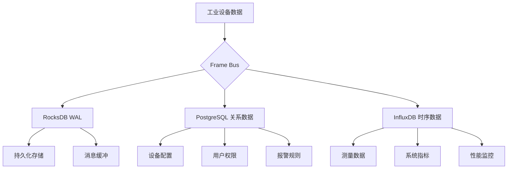

# 数据字典 - Data Dictionary

## 概述

本文档定义了Gateway_Rust工业网关系统中所有数据结构的语义和定义，包括关系数据库(PostgreSQL)、时序数据库(InfluxDB)和WAL存储(RocksDB)的数据模型。

## 数据存储架构

### 存储分层设计



| 存储层 | 数据类型 | 保留期 | 用途 |
|--------|---------|---------|------|
| **RocksDB** | WAL数据持久化 | 24小时 | 消息缓冲和恢复 |
| **PostgreSQL** | 关系数据配置 | 长期保存 | 设备配置和用户管理 |
| **InfluxDB** | 时序数据 | 6个月 | 测量数据和历史分析 |

## PostgreSQL 关系数据库

### 1. 设备表 (devices)

存储所有工业设备的基本配置信息

```sql
CREATE TABLE devices (
    id UUID PRIMARY KEY DEFAULT gen_random_uuid(),
    name VARCHAR(255) NOT NULL UNIQUE,
    protocol protocol_kind NOT NULL,
    location VARCHAR(255),
    endpoint VARCHAR(255),
    config JSONB,
    enabled BOOLEAN NOT NULL DEFAULT true,
    created_at TIMESTAMPTZ NOT NULL DEFAULT NOW(),
    updated_at TIMESTAMPTZ NOT NULL DEFAULT NOW()
);
```

| 字段 | 类型 | 约束 | 说明 |
|------|------|------|------|
| `id` | UUID | PRIMARY KEY | 设备唯一标识 |
| `name` | VARCHAR(255) | NOT NULL, UNIQUE | 设备名称（用户友好） |
| `protocol` | protocol_kind | NOT NULL | 协议类型(ModbusTcp/OpcUa/Mqtt) |
| `location` | VARCHAR(255) | NULLABLE | 物理位置信息 |
| `endpoint` | VARCHAR(255) | NULLABLE | 连接地址(IP:Port) |
| `config` | JSONB | NULLABLE | 协议特定配置参数 |
| `enabled` | BOOLEAN | NOT NULL | 是否启用(控制数据采集) |
| `created_at` | TIMESTAMPTZ | NOT NULL | 创建时间 |
| `updated_at` | TIMESTAMPTZ | NOT NULL | 最后更新时间 |

**业务规则**:
- 设备名称必须全局唯一
- 只有enabled=true的设备才会被驱动管理器加载
- config字段存储JSON格式的协议特定配置

### 2. 标签表 (tags)

存储数据点配置信息，定义具体的数据采集定义

```sql
CREATE TABLE tags (
    id UUID PRIMARY KEY DEFAULT gen_random_uuid(),
    device_id UUID NOT NULL REFERENCES devices(id) ON DELETE CASCADE,
    name VARCHAR(255) NOT NULL,
    address VARCHAR(255) NOT NULL,
    data_type tag_data_type NOT NULL,
    scaling DOUBLE PRECISION,
    tag_offset DOUBLE PRECISION,
    unit VARCHAR(50),
    description TEXT,
    enabled BOOLEAN NOT NULL DEFAULT true,
    created_at TIMESTAMPTZ NOT NULL DEFAULT NOW(),
    UNIQUE(device_id, name)
);
```

| 字段 | 类型 | 约束 | 说明 |
|------|------|------|------|
| `id` | UUID | PRIMARY KEY | 标签唯一标识 |
| `device_id` | UUID | FOREIGN KEY | 所属设备ID |
| `name` | VARCHAR(255) | NOT NULL | 标签名称（唯一） |
| `address` | VARCHAR(255) | NOT NULL | 协议地址(Modbus寄存器地址) |
| `data_type` | tag_data_type | NOT NULL | 数据类型(Float/Int/Bool/String) |
| `scaling` | DOUBLE PRECISION | NULLABLE | 缩放系数(乘法因子) |
| `tag_offset` | DOUBLE PRECISION | NULLABLE | 偏移量 |
| `unit` | VARCHAR(50) | NULLABLE | 单位(如℃、bar、m/s) |
| `description` | TEXT | NULLABLE | 标签描述 |
| `enabled` | BOOLEAN | NOT NULL | 是否启用采集 |
| `created_at` | TIMESTAMPTZ | NOT NULL | 创建时间 |

**数据转换公式**:
```
最终值 = (原始值 * scaling) + offset
```

**业务规则**:
- 标签名称在同一设备内必须唯一
- address字段格式根据协议而定(Modbus: "40001", S7: "DB1.DBW0")
- 禁用的标签不会被采集，但保留历史数据

### 3. 报警规则表 (alert_rules)

存储报警规则的定义和配置

```sql
CREATE TABLE alert_rules (
    id UUID PRIMARY KEY DEFAULT gen_random_uuid(),
    name VARCHAR(255) NOT NULL UNIQUE,
    description TEXT,
    device_id UUID REFERENCES devices(id) ON DELETE CASCADE,
    tag_id UUID REFERENCES tags(id) ON DELETE CASCADE,
    op compare_op NOT NULL,
    threshold DOUBLE PRECISION NOT NULL,
    level alert_level NOT NULL,
    eval_every INTERVAL NOT NULL DEFAULT '1 minute',
    eval_for INTERVAL,
    enabled BOOLEAN NOT NULL DEFAULT true,
    created_by VARCHAR(255),
    created_at TIMESTAMPTZ NOT NULL DEFAULT NOW(),
    updated_at TIMESTAMPTZ NOT NULL DEFAULT NOW()
);
```

| 字段 | 类型 | 约束 | 说明 |
|------|------|------|------|
| `id` | UUID | PRIMARY KEY | 规则唯一标识 |
| `name` | VARCHAR(255) | NOT NULL, UNIQUE | 规则名称 |
| `description` | TEXT | NULLABLE | 规则描述 |
| `device_id` | UUID | FOREIGN KEY | 关联设备ID（可选） |
| `tag_id` | UUID | FOREIGN KEY | 关联标签ID（可选） |
| `op` | compare_op | NOT NULL | 比较操作符(GT/LT/EQ等) |
| `threshold` | DOUBLE PRECISION | NOT NULL | 阈值 |
| `level` | alert_level | NOT NULL | 报警级别(INFO/WARN/CRIT) |
| `eval_every` | INTERVAL | NOT NULL | 评估频率 |
| `eval_for` | INTERVAL | NULLABLE | 持续时间要求 |
| `enabled` | BOOLEAN | NOT NULL | 是否启用 |
| `created_by` | VARCHAR(255) | NULLABLE | 创建者 |
| `created_at` | TIMESTAMPTZ | NOT NULL | 创建时间 |
| `updated_at` | TIMESTAMPTZ | NOT NULL | 更新时间 |

**报警逻辑**:
```
IF (tag_value op threshold) FOR eval_for THEN alert(level)
```

### 4. 报警历史表 (alert_history)

存储报警事件的历史记录

```sql
CREATE TABLE alert_history (
    id UUID PRIMARY KEY DEFAULT gen_random_uuid(),
    rule_id UUID NOT NULL REFERENCES alert_rules(id) ON DELETE CASCADE,
    device_id UUID REFERENCES devices(id),
    tag_id UUID REFERENCES tags(id),
    fired_at TIMESTAMPTZ NOT NULL DEFAULT NOW(),
    resolved_at TIMESTAMPTZ,
    value DOUBLE PRECISION,
    threshold DOUBLE PRECISION NOT NULL,
    level alert_level NOT NULL,
    message TEXT NOT NULL,
    status VARCHAR(50) NOT NULL DEFAULT 'FIRING',
    duration INTERVAL
);
```

### 5. 驱动注册表 (driver_registry)

存储已注册驱动的元数据信息

```sql
CREATE TABLE driver_registry (
    protocol protocol_kind PRIMARY KEY,
    version VARCHAR(50) NOT NULL,
    file_path TEXT NOT NULL,
    file_hash VARCHAR(64) NOT NULL,
    api_version SMALLINT NOT NULL,
    metadata JSONB,
    loaded_at TIMESTAMPTZ NOT NULL DEFAULT NOW(),
    status VARCHAR(50) NOT NULL DEFAULT 'LOADED'
);
```

### 6. 驱动配置表 (driver_configs)

存储驱动运行时配置参数

```sql
CREATE TABLE driver_configs (
    id UUID PRIMARY KEY DEFAULT gen_random_uuid(),
    name VARCHAR(255) NOT NULL UNIQUE,
    description TEXT,
    protocol VARCHAR(50) NOT NULL,
    connection_type VARCHAR(50) NOT NULL,
    enabled BOOLEAN NOT NULL DEFAULT true,
    config JSONB NOT NULL,
    -- 性能参数
    scan_interval INTEGER NOT NULL DEFAULT 1000,
    timeout INTEGER NOT NULL DEFAULT 5000,
    max_concurrent INTEGER NOT NULL DEFAULT 10,
    batch_size INTEGER NOT NULL DEFAULT 100,
    -- 重试策略
    max_retries INTEGER NOT NULL DEFAULT 3,
    retry_interval INTEGER NOT NULL DEFAULT 1000,
    exponential_backoff BOOLEAN NOT NULL DEFAULT true,
    max_retry_interval INTEGER NOT NULL DEFAULT 30000,
    -- 日志配置
    log_level VARCHAR(20) NOT NULL DEFAULT 'INFO',
    enable_request_log BOOLEAN NOT NULL DEFAULT false,
    enable_response_log BOOLEAN NOT NULL DEFAULT false,
    max_log_size INTEGER NOT NULL DEFAULT 1000000,
    -- SSL/TLS配置
    enable_ssl BOOLEAN NOT NULL DEFAULT false,
    verify_certificate BOOLEAN NOT NULL DEFAULT true,
    client_cert_path TEXT,
    client_key_path TEXT,
    created_at TIMESTAMPTZ NOT NULL DEFAULT NOW(),
    updated_at TIMESTAMPTZ NOT NULL DEFAULT NOW()
);
```

## 自定义枚举类型

### 1. 协议类型 (protocol_kind)

```sql
CREATE TYPE protocol_kind AS ENUM (
    'ModbusTcp',
    'OpcUa', 
    'Mqtt'
);
```

| 值 | 说明 | 默认端口 | 支持状态 |
|-----|------|------|----------|
| `ModbusTcp` | Modbus TCP/IP协议 | 502 | 完全支持 |
| `OpcUa` | OPC Unified Architecture | 4840 | 计划支持 |
| `Mqtt` | MQTT消息协议 | 1883/8883 | 完全支持 |

### 2. 数据类型 (tag_data_type)

```sql
CREATE TYPE tag_data_type AS ENUM (
    'Float',
    'Int',
    'Bool', 
    'String'
);
```

| 类型 | Rust类型 | 字节数 | 范围 |
|------|----------|-------|----------|
| `Float` | `f64` | 8 | IEEE 754双精度 |
| `Int` | `i64` | 8 | -2^63 ~ 2^63-1 |
| `Bool` | `bool` | 1 | true/false |
| `String` | `String` | 变长 | UTF-8 |

### 3. 比较操作符 (compare_op)

```sql
CREATE TYPE compare_op AS ENUM (
    'GT',   -- Greater Than
    'LT',   -- Less Than
    'GTE',  -- Greater Than or Equal
    'LTE',  -- Less Than or Equal
    'EQ',   -- Equal
    'NE'    -- Not Equal
);
```

### 4. 报警级别 (alert_level)

```sql
CREATE TYPE alert_level AS ENUM (
    'INFO',  -- 信息
    'WARN',  -- 警告
    'CRIT'   -- 严重
);
```

| 级别 | 优先级 | 颜色 | 说明 |
|------|--------|----------|------|
| `INFO` | 3 | 蓝色 | 信息性事件 |
| `WARN` | 2 | 黄色+橙色 | 需要关注的警告 |
| `CRIT` | 1 | 红色闪烁 | 紧急处理 |

## InfluxDB 时序数据

### 数据结构

InfluxDB使用measurement + tags + fields + timestamp的数据模型

```
# Line Protocol 格式
device_data,device_id=uuid,tag_name=temp1,protocol=ModbusTcp value=25.6,quality=1 1642780800000000000
```

### 1. 设备数据 (device_data)

**Measurement**: `device_data`

**Tags** (索引维度，不可变):
- `device_id` (string): 设备UUID
- `device_name` (string): 设备名称
- `tag_name` (string): 标签名称
- `protocol` (string): 协议类型
- `location` (string): 物理位置

**Fields** (数值存储，可变值):
- `value` (float): 数据值（已经过scaling和offset）
- `raw_value` (float): 原始值
- `quality` (integer): 数据质量(0=差,1=好)
- `error_code` (integer): 错误码(0=正常)
- `unit` (string): 单位

### 2. 系统指标 (system_metrics)

**Measurement**: `system_metrics`

**Tags**:
- `component` (string): 组件名称(frame_bus, driver_manager等)
- `instance` (string): 实例标识
- `host` (string): 主机名

**Fields**:
- `cpu_usage` (float): CPU使用率(%)
- `memory_usage` (integer): 内存使用量(bytes)
- `throughput` (integer): 吞吐量(messages/sec)
- `latency_p99` (float): 99%分位延迟(ms)
- `error_rate` (float): 错误率(%)

### 3. 报警事件 (alert_events)

**Measurement**: `alert_events`

**Tags**:
- `rule_id` (string): 规则ID
- `device_id` (string): 设备ID
- `tag_id` (string): 标签ID
- `level` (string): 报警级别
- `status` (string): 状态(FIRING/RESOLVED)

**Fields**:
- `value` (float): 触发值
- `threshold` (float): 阈值
- `duration` (integer): 持续时间(秒)
- `message` (string): 报警消息

## RocksDB WAL 数据

### 数据结构

RocksDB作为Write-Ahead Log存储Frame Bus的数据持久化

**Key格式**: `frame:{sequence_number:020}`
**Value格式**: Protobuf序列化的DataFrame

### DataFrame 结构

```protobuf
message DataFrame {
    string tag = 1;              // 标签名称（全路径）
    Value value = 2;             // 数据值
    int64 timestamp = 3;         // 时间戳(纳秒)
    Quality quality = 4;         // 数据质量
    map<string, string> metadata = 5; // 关联数据
}

message Value {
    oneof value {
        double float_val = 1;
        int64 int_val = 2;
        bool bool_val = 3;
        string string_val = 4;
    }
}

enum Quality {
    BAD = 0;
    GOOD = 1;
    UNCERTAIN = 2;
}
```

## 数据流转链路

### 1. 南向数据流

```
PLC设备 -> Modbus驱动 -> DataFrame -> Frame Bus -> [
    RocksDB WAL (持久化)
    PostgreSQL (关系数据更新) 
    InfluxDB (时序数据存储)
]
```

### 2. 北向数据流

```
Frame Bus -> 协议桥接 -> MQTT连接器 -> 云平台
```

### 3. Web API数据流

```
Web客户端 -> REST API -> [
    PostgreSQL (关系数据)
    InfluxDB (时序数据)
    Frame Bus (实时数据)
] -> JSON响应
```

## 数据一致性保证

### 1. 事务性保证

- **关系数据**: PostgreSQL关系数据的ACID保证
- **WAL持久化**: Frame Bus数据先写WAL保证持久性
- **最终一致性**: 允许各存储间的最终一致性

### 2. 数据校验

- **CRC校验**: 重要数据传输的CRC校验
- **类型校验**: 严格的类型检查和转换验证
- **范围校验**: 数据一致性和合理性检查

### 3. 错误恢复

- **WAL重放**: 系统重启时重放WAL恢复数据
- **自动重试**: PostgreSQL自动重试机制
- **降级处理**: InfluxDB暂时不可用时的降级处理

## 性能策略

### 1. 数据分区

**PostgreSQL**:
- 自动分区: 基于时间轴分区历史数据表
- 索引优化: 复合索引优化查询性能
- 连接池: 100+并发连接池支持

**InfluxDB**:
- 数据采样: 超过保留期的数据自动采样聚合
- 存储优化: 自动存储引擎优化和数据压缩
- 批量写入: 批量操作提高写入性能

### 2. 存储策略

- **热数据存储**: 近期数据保持在内存存储
- **温数据存储**: 定期数据移动到SSD存储
- **冷数据归档**: 历史数据压缩后归档存储

### 3. 数据生命周期

- **批量生命周期**: 高频数据的批量生命周期管理
- **自动清理**: 基于规则的数据自动清理
- **数据归档**: 定期备份和数据归档

---

**文档版本**: v1.0  
**最后更新**: 2025-01-17  
**数据模型版本**: Schema v0.8.0  
**维护团队**: Gateway Data Team