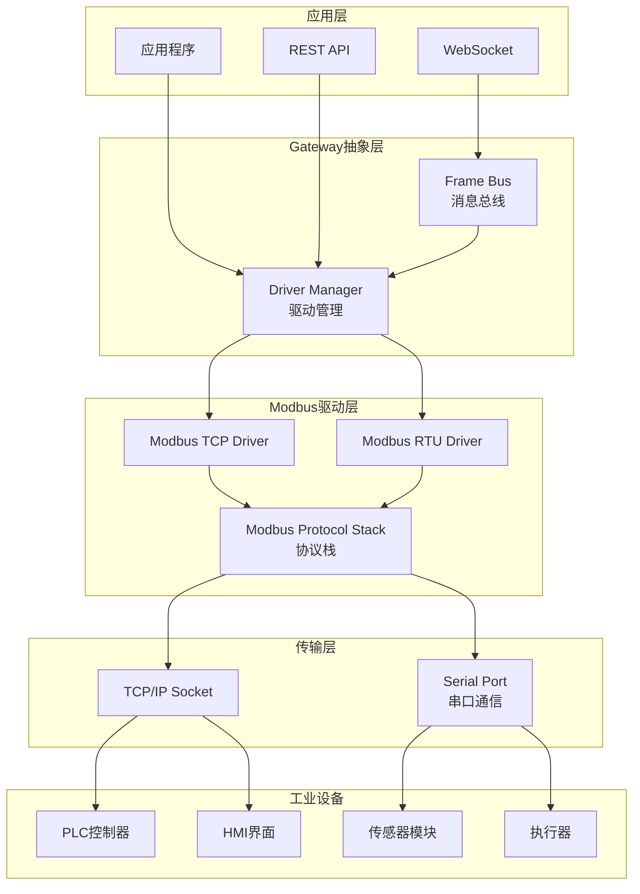

# Modbus协议实现文档

## 概述

Gateway_Rust系统实现了完整的Modbus TCP和Modbus RTU协议栈，支持工业设备的高性能数据采集和控制。本实现遵循Modbus应用协议规范V1.1b3，提供类型安全、高并发、低延迟的工业通信能力。

## Modbus协议架构



## 协议特性支持

### 1. 支持的功能码

| 功能码 | 名称 | 描述 | TCP支持 | RTU支持 | 实现状态 |
|--------|------|------|---------|---------|----------|
| **0x01** | Read Coils | 读取线圈状态 | ✅ | ✅ | 完成 |
| **0x02** | Read Discrete Inputs | 读取离散输入 | ✅ | ✅ | 完成 |
| **0x03** | Read Holding Registers | 读取保持寄存器 | ✅ | ✅ | 完成 |
| **0x04** | Read Input Registers | 读取输入寄存器 | ✅ | ✅ | 完成 |
| **0x05** | Write Single Coil | 写入单个线圈 | ✅ | ✅ | 完成 |
| **0x06** | Write Single Register | 写入单个寄存器 | ✅ | ✅ | 完成 |
| **0x0F** | Write Multiple Coils | 写入多个线圈 | ✅ | ✅ | 完成 |
| **0x10** | Write Multiple Registers | 写入多个寄存器 | ✅ | ✅ | 完成 |
| **0x16** | Mask Write Register | 掩码写寄存器 | ✅ | ✅ | 完成 |
| **0x17** | Read/Write Multiple Registers | 读写多个寄存器 | ✅ | ✅ | 完成 |

### 2. 数据类型支持

```rust
/// Modbus数据类型定义
#[derive(Debug, Clone, PartialEq)]
pub enum ModbusDataType {
    /// 布尔值 (1 bit)
    Bool,
    /// 16位有符号整数
    Int16,
    /// 16位无符号整数  
    UInt16,
    /// 32位有符号整数 (2个寄存器)
    Int32,
    /// 32位无符号整数 (2个寄存器)
    UInt32,
    /// 64位有符号整数 (4个寄存器)
    Int64,
    /// 64位无符号整数 (4个寄存器)
    UInt64,
    /// 32位浮点数 (2个寄存器)
    Float32,
    /// 64位浮点数 (4个寄存器)  
    Float64,
    /// ASCII字符串
    String { length: usize },
    /// 原始字节数组
    ByteArray { length: usize },
}

/// 字节序配置
#[derive(Debug, Clone, Copy, PartialEq)]
pub enum ByteOrder {
    /// 大端序 (网络字节序)
    BigEndian,
    /// 小端序
    LittleEndian,
}

/// 字顺序配置 (32位及以上数据类型)
#[derive(Debug, Clone, Copy, PartialEq)]
pub enum WordOrder {
    /// 高字在前 (ABCD)
    HighWordFirst,
    /// 低字在前 (CDAB)
    LowWordFirst,
}
```

## 核心实现

### 1. Modbus协议栈

```rust
use async_trait::async_trait;
use std::time::Duration;
use tokio::time::timeout;

/// Modbus协议栈主接口
#[async_trait]
pub trait ModbusProtocol: Send + Sync {
    /// 连接到Modbus设备
    async fn connect(&mut self, config: &ModbusConfig) -> ModbusResult<()>;
    
    /// 断开连接
    async fn disconnect(&mut self) -> ModbusResult<()>;
    
    /// 读取线圈状态
    async fn read_coils(
        &mut self,
        slave_id: u8,
        address: u16,
        count: u16,
    ) -> ModbusResult<Vec<bool>>;
    
    /// 读取离散输入
    async fn read_discrete_inputs(
        &mut self,
        slave_id: u8,
        address: u16,
        count: u16,
    ) -> ModbusResult<Vec<bool>>;
    
    /// 读取保持寄存器
    async fn read_holding_registers(
        &mut self,
        slave_id: u8,
        address: u16,
        count: u16,
    ) -> ModbusResult<Vec<u16>>;
    
    /// 读取输入寄存器
    async fn read_input_registers(
        &mut self,
        slave_id: u8,
        address: u16,
        count: u16,
    ) -> ModbusResult<Vec<u16>>;
    
    /// 写入单个线圈
    async fn write_single_coil(
        &mut self,
        slave_id: u8,
        address: u16,
        value: bool,
    ) -> ModbusResult<()>;
    
    /// 写入单个寄存器
    async fn write_single_register(
        &mut self,
        slave_id: u8,
        address: u16,
        value: u16,
    ) -> ModbusResult<()>;
    
    /// 写入多个线圈
    async fn write_multiple_coils(
        &mut self,
        slave_id: u8,
        address: u16,
        values: &[bool],
    ) -> ModbusResult<()>;
    
    /// 写入多个寄存器
    async fn write_multiple_registers(
        &mut self,
        slave_id: u8,
        address: u16,
        values: &[u16],
    ) -> ModbusResult<()>;
    
    /// 检查连接状态
    fn is_connected(&self) -> bool;
    
    /// 获取最后一次通信时间
    fn last_communication(&self) -> Option<std::time::Instant>;
}

/// Modbus配置
#[derive(Debug, Clone)]
pub struct ModbusConfig {
    /// 连接地址 (TCP: "192.168.1.100:502", RTU: "/dev/ttyUSB0")
    pub endpoint: String,
    /// 默认从站ID
    pub slave_id: u8,
    /// 连接超时
    pub connect_timeout: Duration,
    /// 响应超时
    pub response_timeout: Duration,
    /// 重试次数
    pub max_retries: u32,
    /// 重试间隔
    pub retry_interval: Duration,
    /// 字节序
    pub byte_order: ByteOrder,
    /// 字顺序
    pub word_order: WordOrder,
    /// TCP专用配置
    pub tcp_config: Option<ModbusTcpConfig>,
    /// RTU专用配置
    pub rtu_config: Option<ModbusRtuConfig>,
}

#[derive(Debug, Clone)]
pub struct ModbusTcpConfig {
    /// TCP保活
    pub keep_alive: bool,
    /// Nagle算法禁用
    pub no_delay: bool,
    /// 接收缓冲区大小
    pub recv_buffer_size: Option<usize>,
    /// 发送缓冲区大小
    pub send_buffer_size: Option<usize>,
}

#[derive(Debug, Clone)]
pub struct ModbusRtuConfig {
    /// 波特率
    pub baud_rate: u32,
    /// 数据位
    pub data_bits: u8,
    /// 停止位
    pub stop_bits: u8,
    /// 校验位
    pub parity: Parity,
    /// 字符间超时
    pub char_timeout: Duration,
    /// 帧间超时
    pub frame_timeout: Duration,
}

#[derive(Debug, Clone)]
pub enum Parity {
    None,
    Even,
    Odd,
    Mark,
    Space,
}
```

### 2. Modbus TCP实现

```rust
use tokio::net::TcpStream;
use tokio::io::{AsyncReadExt, AsyncWriteExt};
use std::sync::Arc;
use tokio::sync::Mutex;

pub struct ModbusTcpClient {
    stream: Option<Arc<Mutex<TcpStream>>>,
    config: ModbusConfig,
    transaction_id: Arc<Mutex<u16>>,
    last_communication: Option<std::time::Instant>,
}

impl ModbusTcpClient {
    pub fn new(config: ModbusConfig) -> Self {
        Self {
            stream: None,
            config,
            transaction_id: Arc::new(Mutex::new(1)),
            last_communication: None,
        }
    }
    
    /// 生成MBAP头部
    async fn build_mbap_header(&self, unit_id: u8, pdu_length: u16) -> [u8; 7] {
        let mut transaction_id = self.transaction_id.lock().await;
        let tid = *transaction_id;
        *transaction_id = transaction_id.wrapping_add(1);
        
        [
            (tid >> 8) as u8,      // Transaction ID高字节
            tid as u8,             // Transaction ID低字节
            0x00,                  // Protocol ID高字节 (固定0)
            0x00,                  // Protocol ID低字节 (固定0)
            (pdu_length >> 8) as u8, // Length高字节
            pdu_length as u8,      // Length低字节
            unit_id,               // Unit ID
        ]
    }
    
    /// 发送请求并接收响应
    async fn send_request(&mut self, pdu: &[u8], slave_id: u8) -> ModbusResult<Vec<u8>> {
        let stream = self.stream.as_ref()
            .ok_or(ModbusError::NotConnected)?;
        
        // 构建MBAP + PDU
        let mbap = self.build_mbap_header(slave_id, pdu.len() as u16 + 1).await;
        let mut request = Vec::with_capacity(mbap.len() + pdu.len());
        request.extend_from_slice(&mbap);
        request.extend_from_slice(pdu);
        
        // 发送请求
        {
            let mut stream_guard = stream.lock().await;
            stream_guard.write_all(&request).await
                .map_err(|e| ModbusError::Io(e))?;
        }
        
        // 接收响应
        let response = timeout(
            self.config.response_timeout,
            self.receive_response(stream)
        ).await
        .map_err(|_| ModbusError::Timeout)?;
        
        self.last_communication = Some(std::time::Instant::now());
        response
    }
    
    async fn receive_response(&self, stream: &Arc<Mutex<TcpStream>>) -> ModbusResult<Vec<u8>> {
        let mut stream_guard = stream.lock().await;
        
        // 读取MBAP头部
        let mut mbap = [0u8; 7];
        stream_guard.read_exact(&mut mbap).await
            .map_err(|e| ModbusError::Io(e))?;
        
        // 解析长度
        let length = u16::from_be_bytes([mbap[4], mbap[5]]) as usize;
        if length == 0 || length > 253 {
            return Err(ModbusError::InvalidResponse("Invalid PDU length".to_string()));
        }
        
        // 读取PDU (长度已包含Unit ID，所以减1)
        let mut pdu = vec![0u8; length - 1];
        stream_guard.read_exact(&mut pdu).await
            .map_err(|e| ModbusError::Io(e))?;
        
        // 检查异常响应
        if !pdu.is_empty() && (pdu[0] & 0x80) != 0 {
            let exception_code = if pdu.len() > 1 { pdu[1] } else { 0 };
            return Err(ModbusError::Exception(exception_code));
        }
        
        Ok(pdu)
    }
}

#[async_trait]
impl ModbusProtocol for ModbusTcpClient {
    async fn connect(&mut self, config: &ModbusConfig) -> ModbusResult<()> {
        let stream = timeout(
            config.connect_timeout,
            TcpStream::connect(&config.endpoint)
        ).await
        .map_err(|_| ModbusError::ConnectionTimeout)?
        .map_err(|e| ModbusError::Io(e))?;
        
        // 配置TCP选项
        if let Some(tcp_config) = &config.tcp_config {
            if tcp_config.keep_alive {
                let socket = socket2::Socket::from(stream);
                socket.set_keepalive(true)
                    .map_err(|e| ModbusError::Io(e))?;
            }
            
            if tcp_config.no_delay {
                stream.set_nodelay(true)
                    .map_err(|e| ModbusError::Io(e))?;
            }
        }
        
        self.stream = Some(Arc::new(Mutex::new(stream)));
        self.config = config.clone();
        
        log::info!("Connected to Modbus TCP device: {}", config.endpoint);
        Ok(())
    }
    
    async fn disconnect(&mut self) -> ModbusResult<()> {
        if let Some(stream) = self.stream.take() {
            // 优雅关闭连接
            if let Ok(mut stream_guard) = stream.try_lock() {
                let _ = stream_guard.shutdown().await;
            }
        }
        
        log::info!("Disconnected from Modbus TCP device");
        Ok(())
    }
    
    async fn read_holding_registers(
        &mut self,
        slave_id: u8,
        address: u16,
        count: u16,
    ) -> ModbusResult<Vec<u16>> {
        if count == 0 || count > 125 {
            return Err(ModbusError::InvalidParameter(
                format!("Invalid register count: {}", count)
            ));
        }
        
        // 构建PDU
        let pdu = [
            0x03,                    // 功能码
            (address >> 8) as u8,    // 起始地址高字节
            address as u8,           // 起始地址低字节
            (count >> 8) as u8,      // 数量高字节
            count as u8,             // 数量低字节
        ];
        
        let response = self.send_request(&pdu, slave_id).await?;
        
        // 解析响应
        if response.len() < 2 {
            return Err(ModbusError::InvalidResponse("Response too short".to_string()));
        }
        
        if response[0] != 0x03 {
            return Err(ModbusError::InvalidResponse(
                format!("Unexpected function code: {}", response[0])
            ));
        }
        
        let byte_count = response[1] as usize;
        if response.len() != 2 + byte_count || byte_count != count as usize * 2 {
            return Err(ModbusError::InvalidResponse("Invalid byte count".to_string()));
        }
        
        // 转换字节为16位寄存器值
        let mut registers = Vec::with_capacity(count as usize);
        for i in 0..count as usize {
            let offset = 2 + i * 2;
            let value = match self.config.byte_order {
                ByteOrder::BigEndian => u16::from_be_bytes([
                    response[offset], 
                    response[offset + 1]
                ]),
                ByteOrder::LittleEndian => u16::from_le_bytes([
                    response[offset], 
                    response[offset + 1]
                ]),
            };
            registers.push(value);
        }
        
        Ok(registers)
    }
    
    async fn write_multiple_registers(
        &mut self,
        slave_id: u8,
        address: u16,
        values: &[u16],
    ) -> ModbusResult<()> {
        if values.is_empty() || values.len() > 123 {
            return Err(ModbusError::InvalidParameter(
                format!("Invalid register count: {}", values.len())
            ));
        }
        
        let byte_count = values.len() * 2;
        let mut pdu = Vec::with_capacity(6 + byte_count);
        
        // PDU头部
        pdu.extend_from_slice(&[
            0x10,                           // 功能码
            (address >> 8) as u8,           // 起始地址高字节
            address as u8,                  // 起始地址低字节
            (values.len() >> 8) as u8,      // 数量高字节
            values.len() as u8,             // 数量低字节
            byte_count as u8,               // 字节数
        ]);
        
        // 添加寄存器数据
        for &value in values {
            match self.config.byte_order {
                ByteOrder::BigEndian => {
                    pdu.extend_from_slice(&value.to_be_bytes());
                }
                ByteOrder::LittleEndian => {
                    pdu.extend_from_slice(&value.to_le_bytes());
                }
            }
        }
        
        let response = self.send_request(&pdu, slave_id).await?;
        
        // 验证响应
        if response.len() != 5 {
            return Err(ModbusError::InvalidResponse("Invalid response length".to_string()));
        }
        
        if response[0] != 0x10 {
            return Err(ModbusError::InvalidResponse(
                format!("Unexpected function code: {}", response[0])
            ));
        }
        
        Ok(())
    }
    
    fn is_connected(&self) -> bool {
        self.stream.is_some()
    }
    
    fn last_communication(&self) -> Option<std::time::Instant> {
        self.last_communication
    }
}
```

### 3. 数据类型转换

```rust
/// 高级数据类型转换器
pub struct ModbusDataConverter {
    byte_order: ByteOrder,
    word_order: WordOrder,
}

impl ModbusDataConverter {
    pub fn new(byte_order: ByteOrder, word_order: WordOrder) -> Self {
        Self { byte_order, word_order }
    }
    
    /// 从寄存器读取32位整数
    pub fn registers_to_i32(&self, registers: &[u16]) -> ModbusResult<i32> {
        if registers.len() < 2 {
            return Err(ModbusError::InvalidParameter("Need 2 registers for i32".to_string()));
        }
        
        let (high, low) = match self.word_order {
            WordOrder::HighWordFirst => (registers[0], registers[1]),
            WordOrder::LowWordFirst => (registers[1], registers[0]),
        };
        
        let value = ((high as u32) << 16) | (low as u32);
        Ok(value as i32)
    }
    
    /// 从寄存器读取32位浮点数
    pub fn registers_to_f32(&self, registers: &[u16]) -> ModbusResult<f32> {
        let int_value = self.registers_to_i32(registers)? as u32;
        Ok(f32::from_bits(int_value))
    }
    
    /// 从寄存器读取64位浮点数
    pub fn registers_to_f64(&self, registers: &[u16]) -> ModbusResult<f64> {
        if registers.len() < 4 {
            return Err(ModbusError::InvalidParameter("Need 4 registers for f64".to_string()));
        }
        
        let words = match self.word_order {
            WordOrder::HighWordFirst => [registers[0], registers[1], registers[2], registers[3]],
            WordOrder::LowWordFirst => [registers[3], registers[2], registers[1], registers[0]],
        };
        
        let value = ((words[0] as u64) << 48) |
                   ((words[1] as u64) << 32) |
                   ((words[2] as u64) << 16) |
                   (words[3] as u64);
                   
        Ok(f64::from_bits(value))
    }
    
    /// 从寄存器读取字符串
    pub fn registers_to_string(&self, registers: &[u16]) -> ModbusResult<String> {
        let mut bytes = Vec::with_capacity(registers.len() * 2);
        
        for &reg in registers {
            match self.byte_order {
                ByteOrder::BigEndian => {
                    bytes.push((reg >> 8) as u8);
                    bytes.push(reg as u8);
                }
                ByteOrder::LittleEndian => {
                    bytes.push(reg as u8);
                    bytes.push((reg >> 8) as u8);
                }
            }
        }
        
        // 移除尾随的null字节
        while let Some(&0) = bytes.last() {
            bytes.pop();
        }
        
        String::from_utf8(bytes)
            .map_err(|e| ModbusError::DataConversion(format!("Invalid UTF-8: {}", e)))
    }
    
    /// 将32位整数转换为寄存器
    pub fn i32_to_registers(&self, value: i32) -> Vec<u16> {
        let bytes = (value as u32).to_be_bytes();
        let high = u16::from_be_bytes([bytes[0], bytes[1]]);
        let low = u16::from_be_bytes([bytes[2], bytes[3]]);
        
        match self.word_order {
            WordOrder::HighWordFirst => vec![high, low],
            WordOrder::LowWordFirst => vec![low, high],
        }
    }
    
    /// 将32位浮点数转换为寄存器
    pub fn f32_to_registers(&self, value: f32) -> Vec<u16> {
        self.i32_to_registers(value.to_bits() as i32)
    }
    
    /// 将字符串转换为寄存器
    pub fn string_to_registers(&self, s: &str, length: usize) -> Vec<u16> {
        let mut bytes = s.as_bytes().to_vec();
        
        // 填充到指定长度
        bytes.resize(length * 2, 0);
        
        let mut registers = Vec::with_capacity(length);
        for chunk in bytes.chunks(2) {
            let reg = match self.byte_order {
                ByteOrder::BigEndian => u16::from_be_bytes([chunk[0], chunk[1]]),
                ByteOrder::LittleEndian => u16::from_le_bytes([chunk[0], chunk[1]]),
            };
            registers.push(reg);
        }
        
        registers
    }
}
```

### 4. 错误处理

```rust
use thiserror::Error;

/// Modbus操作结果类型
pub type ModbusResult<T> = Result<T, ModbusError>;

/// Modbus错误类型
#[derive(Error, Debug)]
pub enum ModbusError {
    #[error("IO error: {0}")]
    Io(#[from] std::io::Error),
    
    #[error("Connection timeout")]
    ConnectionTimeout,
    
    #[error("Response timeout")]
    Timeout,
    
    #[error("Not connected to device")]
    NotConnected,
    
    #[error("Invalid parameter: {0}")]
    InvalidParameter(String),
    
    #[error("Invalid response: {0}")]
    InvalidResponse(String),
    
    #[error("Modbus exception: {0:02X} - {1}")]
    Exception(u8, String),
    
    #[error("Data conversion error: {0}")]
    DataConversion(String),
    
    #[error("Protocol error: {0}")]
    Protocol(String),
    
    #[error("Configuration error: {0}")]
    Configuration(String),
}

impl ModbusError {
    /// 根据异常码创建异常错误
    pub fn from_exception_code(code: u8) -> Self {
        let message = match code {
            0x01 => "Illegal Function",
            0x02 => "Illegal Data Address", 
            0x03 => "Illegal Data Value",
            0x04 => "Slave Device Failure",
            0x05 => "Acknowledge",
            0x06 => "Slave Device Busy",
            0x08 => "Memory Parity Error",
            0x0A => "Gateway Path Unavailable",
            0x0B => "Gateway Target Device Failed to Respond",
            _ => "Unknown Exception",
        };
        
        ModbusError::Exception(code, message.to_string())
    }
}
```

## 性能优化

### 1. 连接池管理

```rust
use std::collections::HashMap;
use std::sync::Arc;
use tokio::sync::RwLock;

/// Modbus连接池
pub struct ModbusConnectionPool {
    connections: Arc<RwLock<HashMap<String, Arc<Mutex<Box<dyn ModbusProtocol>>>>>>,
    config: PoolConfig,
}

#[derive(Debug, Clone)]
pub struct PoolConfig {
    pub max_connections: usize,
    pub min_connections: usize,
    pub connection_timeout: Duration,
    pub idle_timeout: Duration,
    pub health_check_interval: Duration,
}

impl ModbusConnectionPool {
    pub fn new(config: PoolConfig) -> Self {
        Self {
            connections: Arc::new(RwLock::new(HashMap::new())),
            config,
        }
    }
    
    /// 获取或创建连接
    pub async fn get_connection(
        &self,
        endpoint: &str,
        modbus_config: &ModbusConfig,
    ) -> ModbusResult<Arc<Mutex<Box<dyn ModbusProtocol>>>> {
        // 首先尝试获取现有连接
        {
            let connections = self.connections.read().await;
            if let Some(conn) = connections.get(endpoint) {
                let conn_guard = conn.lock().await;
                if conn_guard.is_connected() {
                    return Ok(conn.clone());
                }
            }
        }
        
        // 创建新连接
        let mut new_connection: Box<dyn ModbusProtocol> = if endpoint.contains(':') {
            Box::new(ModbusTcpClient::new(modbus_config.clone()))
        } else {
            Box::new(ModbusRtuClient::new(modbus_config.clone()))
        };
        
        new_connection.connect(modbus_config).await?;
        
        let connection = Arc::new(Mutex::new(new_connection));
        
        // 添加到连接池
        {
            let mut connections = self.connections.write().await;
            connections.insert(endpoint.to_string(), connection.clone());
        }
        
        Ok(connection)
    }
    
    /// 启动健康检查任务
    pub async fn start_health_check(&self) {
        let connections = self.connections.clone();
        let interval = self.config.health_check_interval;
        
        tokio::spawn(async move {
            let mut ticker = tokio::time::interval(interval);
            
            loop {
                ticker.tick().await;
                
                let mut to_remove = Vec::new();
                
                {
                    let connections_read = connections.read().await;
                    for (endpoint, conn) in connections_read.iter() {
                        let conn_guard = conn.lock().await;
                        if !conn_guard.is_connected() {
                            to_remove.push(endpoint.clone());
                        } else if let Some(last_comm) = conn_guard.last_communication() {
                            if last_comm.elapsed() > Duration::from_secs(300) { // 5分钟无通信
                                to_remove.push(endpoint.clone());
                            }
                        }
                    }
                }
                
                // 移除不健康的连接
                if !to_remove.is_empty() {
                    let mut connections_write = connections.write().await;
                    for endpoint in to_remove {
                        connections_write.remove(&endpoint);
                        log::warn!("Removed unhealthy connection: {}", endpoint);
                    }
                }
            }
        });
    }
}
```

### 2. 批量操作优化

```rust
/// 批量读取优化器
pub struct ModbusBatchReader {
    client: Arc<Mutex<Box<dyn ModbusProtocol>>>,
    max_registers_per_request: u16,
}

impl ModbusBatchReader {
    pub fn new(client: Arc<Mutex<Box<dyn ModbusProtocol>>>) -> Self {
        Self {
            client,
            max_registers_per_request: 125, // Modbus标准限制
        }
    }
    
    /// 智能批量读取寄存器
    pub async fn batch_read_registers(
        &self,
        slave_id: u8,
        addresses: &[u16],
    ) -> ModbusResult<HashMap<u16, u16>> {
        if addresses.is_empty() {
            return Ok(HashMap::new());
        }
        
        // 对地址进行排序和分组
        let mut sorted_addresses = addresses.to_vec();
        sorted_addresses.sort_unstable();
        
        let groups = self.group_consecutive_addresses(&sorted_addresses);
        let mut results = HashMap::new();
        
        for group in groups {
            let values = {
                let mut client = self.client.lock().await;
                client.read_holding_registers(slave_id, group.start, group.count).await?
            };
            
            for (i, value) in values.into_iter().enumerate() {
                results.insert(group.start + i as u16, value);
            }
        }
        
        Ok(results)
    }
    
    /// 将地址分组为连续的范围
    fn group_consecutive_addresses(&self, addresses: &[u16]) -> Vec<AddressGroup> {
        let mut groups = Vec::new();
        
        if addresses.is_empty() {
            return groups;
        }
        
        let mut current_start = addresses[0];
        let mut current_end = addresses[0];
        
        for &addr in &addresses[1..] {
            if addr == current_end + 1 && 
               (addr - current_start + 1) <= self.max_registers_per_request {
                current_end = addr;
            } else {
                groups.push(AddressGroup {
                    start: current_start,
                    count: current_end - current_start + 1,
                });
                current_start = addr;
                current_end = addr;
            }
        }
        
        groups.push(AddressGroup {
            start: current_start,
            count: current_end - current_start + 1,
        });
        
        groups
    }
}

#[derive(Debug, Clone)]
struct AddressGroup {
    start: u16,
    count: u16,
}
```

### 3. 异步并发优化

```rust
use tokio::sync::Semaphore;
use futures::future::join_all;

/// 并发Modbus客户端
pub struct ConcurrentModbusClient {
    pool: ModbusConnectionPool,
    semaphore: Arc<Semaphore>,
}

impl ConcurrentModbusClient {
    pub fn new(pool: ModbusConnectionPool, max_concurrent: usize) -> Self {
        Self {
            pool,
            semaphore: Arc::new(Semaphore::new(max_concurrent)),
        }
    }
    
    /// 并发读取多个设备的数据
    pub async fn concurrent_read_devices(
        &self,
        requests: Vec<ReadRequest>,
    ) -> Vec<ModbusResult<Vec<u16>>> {
        let tasks = requests.into_iter().map(|req| {
            let pool = self.pool.clone();
            let semaphore = self.semaphore.clone();
            
            async move {
                let _permit = semaphore.acquire().await.unwrap();
                
                let connection = pool.get_connection(&req.endpoint, &req.config).await?;
                let mut client = connection.lock().await;
                
                client.read_holding_registers(
                    req.slave_id,
                    req.address,
                    req.count,
                ).await
            }
        });
        
        join_all(tasks).await
    }
}

#[derive(Debug, Clone)]
pub struct ReadRequest {
    pub endpoint: String,
    pub config: ModbusConfig,
    pub slave_id: u8,
    pub address: u16,
    pub count: u16,
}
```

## 测试和验证

### 1. 单元测试

```rust
#[cfg(test)]
mod tests {
    use super::*;
    use tokio_test;
    
    #[tokio::test]
    async fn test_data_converter() {
        let converter = ModbusDataConverter::new(
            ByteOrder::BigEndian,
            WordOrder::HighWordFirst,
        );
        
        // 测试32位整数转换
        let registers = converter.i32_to_registers(0x12345678);
        assert_eq!(registers, vec![0x1234, 0x5678]);
        
        let value = converter.registers_to_i32(&registers).unwrap();
        assert_eq!(value, 0x12345678);
        
        // 测试浮点数转换
        let float_val = 3.14159f32;
        let registers = converter.f32_to_registers(float_val);
        let converted = converter.registers_to_f32(&registers).unwrap();
        assert!((float_val - converted).abs() < f32::EPSILON);
    }
    
    #[tokio::test]
    async fn test_batch_address_grouping() {
        let client = ModbusTcpClient::new(ModbusConfig::default());
        let reader = ModbusBatchReader::new(Arc::new(Mutex::new(Box::new(client))));
        
        let addresses = vec![100, 101, 102, 105, 106, 110];
        let groups = reader.group_consecutive_addresses(&addresses);
        
        assert_eq!(groups.len(), 3);
        assert_eq!(groups[0].start, 100);
        assert_eq!(groups[0].count, 3);
        assert_eq!(groups[1].start, 105);
        assert_eq!(groups[1].count, 2);
        assert_eq!(groups[2].start, 110);
        assert_eq!(groups[2].count, 1);
    }
    
    #[tokio::test]
    async fn test_error_handling() {
        let error = ModbusError::from_exception_code(0x02);
        match error {
            ModbusError::Exception(code, message) => {
                assert_eq!(code, 0x02);
                assert_eq!(message, "Illegal Data Address");
            }
            _ => panic!("Unexpected error type"),
        }
    }
}
```

### 2. 集成测试

```rust
#[cfg(test)]
mod integration_tests {
    use super::*;
    
    #[tokio::test]
    async fn test_modbus_tcp_communication() {
        // 需要运行Modbus TCP服务器进行集成测试
        let config = ModbusConfig {
            endpoint: "127.0.0.1:502".to_string(),
            slave_id: 1,
            connect_timeout: Duration::from_secs(5),
            response_timeout: Duration::from_secs(3),
            max_retries: 3,
            retry_interval: Duration::from_millis(100),
            byte_order: ByteOrder::BigEndian,
            word_order: WordOrder::HighWordFirst,
            tcp_config: Some(ModbusTcpConfig {
                keep_alive: true,
                no_delay: true,
                recv_buffer_size: None,
                send_buffer_size: None,
            }),
            rtu_config: None,
        };
        
        let mut client = ModbusTcpClient::new(config.clone());
        
        // 测试连接
        if client.connect(&config).await.is_ok() {
            // 测试读取
            let result = client.read_holding_registers(1, 0, 10).await;
            assert!(result.is_ok());
            
            // 测试写入
            let write_result = client.write_single_register(1, 0, 1234).await;
            assert!(write_result.is_ok());
            
            // 验证写入
            let read_back = client.read_holding_registers(1, 0, 1).await.unwrap();
            assert_eq!(read_back[0], 1234);
            
            // 测试断开
            client.disconnect().await.unwrap();
            assert!(!client.is_connected());
        }
    }
}
```

## 性能基准测试

### 1. 延迟测试

```rust
#[cfg(test)]
mod benchmarks {
    use super::*;
    use std::time::Instant;
    
    #[tokio::test]
    async fn benchmark_single_register_read() {
        let config = ModbusConfig::default();
        let mut client = ModbusTcpClient::new(config.clone());
        
        if client.connect(&config).await.is_ok() {
            let iterations = 1000;
            let start = Instant::now();
            
            for _ in 0..iterations {
                let _ = client.read_holding_registers(1, 0, 1).await;
            }
            
            let elapsed = start.elapsed();
            let avg_latency = elapsed / iterations;
            
            println!("Average single register read latency: {:?}", avg_latency);
            assert!(avg_latency < Duration::from_millis(10)); // 目标 <10ms
        }
    }
    
    #[tokio::test]
    async fn benchmark_batch_read() {
        let config = ModbusConfig::default();
        let mut client = ModbusTcpClient::new(config.clone());
        
        if client.connect(&config).await.is_ok() {
            let start = Instant::now();
            
            // 批量读取100个寄存器
            let result = client.read_holding_registers(1, 0, 100).await;
            
            let elapsed = start.elapsed();
            
            if result.is_ok() {
                println!("Batch read (100 registers) latency: {:?}", elapsed);
                assert!(elapsed < Duration::from_millis(50)); // 目标 <50ms
            }
        }
    }
}
```

## 配置示例

### 1. Modbus TCP配置

```yaml
# config/modbus_tcp.yaml
modbus_tcp:
  devices:
    - name: "PLC-001"
      endpoint: "192.168.1.100:502"
      slave_id: 1
      enabled: true
      config:
        connect_timeout: 5000  # ms
        response_timeout: 3000 # ms
        max_retries: 3
        retry_interval: 1000   # ms
        byte_order: "big_endian"
        word_order: "high_word_first"
        tcp:
          keep_alive: true
          no_delay: true
      tags:
        - name: "temperature_1"
          address: 40001
          data_type: "Float32"
          unit: "°C"
          scaling: 0.1
          offset: -40.0
          scan_rate: 1000  # ms
        - name: "pressure_1"
          address: 40003
          data_type: "Float32"
          unit: "bar"
          scaling: 0.01
          scan_rate: 2000  # ms
```

### 2. 驱动配置

```json
{
  "name": "modbus_tcp_driver",
  "protocol": "ModbusTcp",
  "description": "Modbus TCP Driver Configuration",
  "enabled": true,
  "config": {
    "pool": {
      "max_connections": 50,
      "min_connections": 5,
      "connection_timeout": 5000,
      "idle_timeout": 300000,
      "health_check_interval": 30000
    },
    "performance": {
      "max_concurrent_requests": 20,
      "batch_size": 100,
      "request_queue_size": 1000
    },
    "defaults": {
      "response_timeout": 3000,
      "max_retries": 3,
      "retry_interval": 1000,
      "byte_order": "big_endian",
      "word_order": "high_word_first"
    }
  }
}
```

---

**文档版本**: v1.0  
**最后更新**: 2025-01-17  
**协议版本**: Modbus Application Protocol V1.1b3  
**支持功能**: TCP/RTU, 主要功能码, 高级数据类型  
**性能目标**: <10ms单次读取, >1000次操作/秒, 99.9%可用性