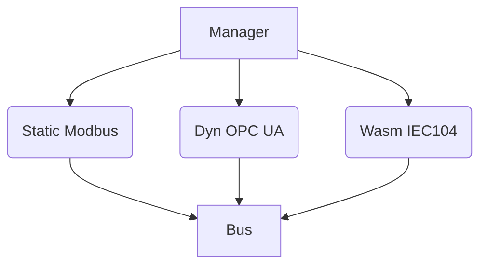
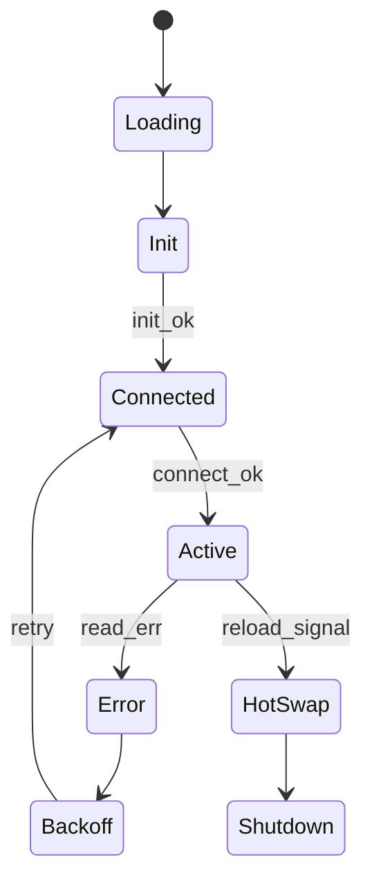

## 1 为什么要有 Driver Trait + Manager？

|痛点 (没有统一接口时)|Driver Trait + Manager 带来的好处|
|---|---|
|每个协议库风格不一（回调、阻塞、C API…）|统一成 `async trait Driver`，上层永远同一调用|
|要不停机升级/替换驱动很麻烦|Manager 让 **Static / Dyn / WASM** 同一热插流程|
|任一驱动崩溃会拖垮整进程|Supervisor-Tree 把崩溃局限在单 Task，可自愈重启|
|插件版本失配 Runtime Crash|ABI 版本字段 + 签名校验，拒载不兼容/可疑插件|

---

## 2 Driver Trait：契约设计

```rust
/// 必须稳定！ **增加默认方法 ≠ 破坏；删除/改签名 = 破坏**。
#[async_trait::async_trait]
pub trait Driver: Send + Sync {
    /// 编译期提供元信息
    fn meta(&self) -> DriverMeta;       // name, kind, api_ver, features…

    /// 初始化: 只做解析 cfg、不做 I/O
    async fn init(&mut self, cfg: &Value) -> Result<()>;

    /// 建立会话；EndpointPool 已注入
    async fn connect(&mut self, pool: EndpointHandle) -> Result<()>;

    /// 循环读取，产生 DataFrame；自行处理重试，但需 respect Pause/Resume
    async fn read_loop(&mut self, tx: FrameSender) -> Result<()>;

    /// （可选）执行写请求
    async fn write(&mut self, cmd: CmdFrame) -> Result<()> {
        Err(Unsupported.into())
    }

    /// 优雅关闭
    async fn shutdown(&mut self) -> Result<()>;
}

```

### 不可变条款

- `init / connect / read_loop / write / shutdown` 五大方法——只允许“增加带默认实现的新方法”。
    
- 参数类型 (`EndpointHandle`, `FrameSender`, `CmdFrame`) 受 Core 控制，向后兼容。
    

---

## 3 三种实现形态

|形态|入口函数（C ABI / WASI）|语言/工具链|使用场景|
|---|---|---|---|
|**StaticDriver**|Rust `inventory::submit!(MyDrv)`|同仓 Rust|核心协议、极致性能|
|**DynDriver** (`.so/.dll`)|`extern "C" fn register_driver() -> *mut dyn Driver`|Rust cdylib / C / C++|二方/三方闭源驱动，需要热插拔|
|**WasmDriver** (`.wasm`)|WASI Import `edge-driver/0.2:driver_register()`|Rust (`wasm32-wasi`), Go TinyGo, AssemblyScript|多语言生态、沙箱隔离、多架构复用|

_统一元数据_：每驱动导出 `const DRIVER_API_VERSION: u16 = 1;`

---

## 4 Driver Manager：生命周期 & 热插拔

### 4.1 Supervisor-Tree



- 每个驱动 Task 包装 `tokio_supervisor::restart()`；
    
- 崩溃 ↦ 重启 Backoff：1s→2s→4s… 最大 60 s；
    
- 驱动超过 N 次崩溃 → Manager 标记 `Fault` 并报警，但不影响其他驱动。
    

### 4.2 状态机




### 4.3 热插拔流程（Dyn & WASM）

1. **WebConsole 上传** `driver_modbus.so` + `.toml` + `.sig`
    
2. REST 服务存到 `plugins/drivers/` → 发送 `Reload(driver_id)`
    
3. Manager：`pause` old Driver → wait `shutdown()` → `dlclose()`
    
4. 校验签名 & API 版本 → `dlopen` 新库 → `init()+connect()`
    

_停机窗口_ = 连接池 keepalive 时长（典型 < 1 s）。

---

## 5 版本治理与兼容

|项|策略|
|---|---|
|**API Version**|Core 当前 = **1**；插件声明 `min=1,max=1`；将来 Core 扩展为 2 时仍兼容 1|
|**Cargo feature**|`driver-api-v1` compile guard；`driver-api-v2` 开新 Trait with default impl|
|**Deprecation**|旧 API 停留 12 个月 LTS；文档标 “deprecated”|
|**Checksum & Sig**|SHA-256 + Developer ed25519 公钥；Manager 本地 `authorized_keys` 列表|

---

## 6 插件模板 & 开发流程

```bash
# 1. 脚手架
cargo generate --git https://github.com/edge/template-driver \
    --name driver_modbus

# 2. 实现 read_loop / write
vim src/lib.rs

# 3. 构建
cargo build --release --lib

# 4. 签名
edge sign target/release/libdriver_modbus.so mykey.pem

```

生成目录：

```pgsql
driver_modbus/
 ├─ src/lib.rs
 ├─ driver.toml        # name, api=1, schema, checksum
 └─ driver.schema.json # Config schema (unit_id, polling…)

```

---

## 7 单元 & 集成测试

### 7.1 驱动 Mock 测试

```rust
#[tokio::test]
async fn modbus_read_ok() {
   let plc = plc_sim::spawn("127.0.0.1:1502").await;
   let drv = ModbusDriver::default();
   drv.init(cfg).await.unwrap();
   drv.connect(endpoint).await.unwrap();
   // read first frame
   assert_eq!(bus_rx.recv().await.unwrap().value, 123);
}

```

### 7.2 Manager 热替换测试

```bash
edgectl load driver_modbus.so
sleep 1
edgectl hot-swap driver_modbus_v2.so
edgectl status driver_modbus   # should be Active, version=2

```

---

## 8 性能基线

|协议驱动|读取通道 fps|CPU 单核|备注|
|---|---|---|---|
|Static Modbus|20 k|9 %|1 K 寄存器批读|
|Dyn OPC UA|15 k|12 %|open62541 subscription|
|Wasm IEC-104|8 k|15 %|TinyGo 编译|

_开销差异_：WASM > Dyn > Static, 但均 <1 ms/frame。