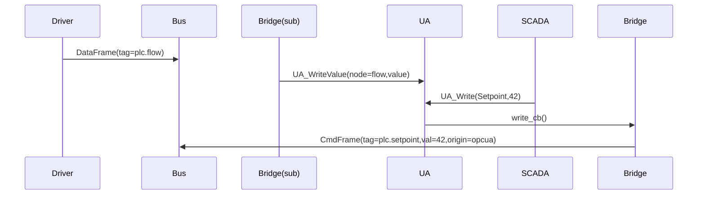

## 1　使命与范畴

|目标|不做|
|---|---|
|现场已有 **SCADA / BMS / PLC** 继续用原协议读写数据|不解析南向现场协议（Driver 层已做）|
|把 FrameBus 数据 **回放成 Server 端协议**|不负责云连接|
|把旧系统的写操作 **翻译成 CmdFrame**|不直接写现场设备（由 SinkDriver 执行）|

---

## 2　“BridgeDriver” = Sink + Source

```rust
pub trait Bridge: Driver + Send + Sync {
    /// expose server interface (listen)
    async fn listen(&mut self, cfg: &BridgeCfg) -> Result<()>;
}

```

- 订阅 `FrameBus` → **回放**
    
- 监听旧协议（OPC UA / Modbus-Slave …）→ **写请求 → CmdFrame**
    

---

## 3　OPC UA Server Bridge — 核心参考实现

### 3.1 技术栈

|组件|选型|理由|
|---|---|---|
|OPC UA SDK|**open62541 (C)** wrapped via DynDriver|轻量、GPL+static linking 友好|
|Rust FFI|`open62541_sys` + `ffi-support`|零拷贝 NodeId/String|
|可选 WASM|中期再引入，用 wasi-nn 对接||

### 3.2 地址空间生成策略

|策略|适用|生成规则|
|---|---|---|
|**硬编码**|MVP-3|`bridge_tags.yml` 手写节点树|
|**Auto-Map**|>50 Tag、统一命名|扫 `variables.yml` where `expose_opcua=true`；Tag `plantA.press_bar` → `Objects/plantA/press_bar`|

_每节点属性_ `AccessLevel` 由 `access` 字段 (R/W/RW) 推断。

### 3.3 Data Flow 时序



_回放频率_ : 按 Bus 发布即更新 `UA_WriteValue`；若频繁可 1s 去抖。

### 3.4 写权限与安全

|机制|说明|
|---|---|
|OPC UA UserToken|Anonymous / Username / X509 configurable|
|Node AccessLevel|UA `CurrentWrite` flag 来源于 `access=W/RW`|
|CmdRateLimit|Bridge 内部可设置 `max 10 cmd/s` 防洪|

---

## 4　Modbus-Slave Bridge（简版）

|需求|实现|
|---|---|
|旧 HMI 只认 Holding Register|Map Tag ↔ reg addr/len；|
|DataFrame→`modbus_set_holding_reg`||
|旧 HMI 写寄存器|`WriteSingle` 回调→ CmdFrame|
|串口 vs TCP|EndpointKit 装饰器复用|

---

## 5　Bridge 配置示例

```yaml
bridges:
  opcua_srv1:
    kind: dyn
    path: bridges/libopcua_srv.so
    listen: opc.tcp://0.0.0.0:4840
    security: None
    mapping:
      - tag: plantA.flow_m3h
        node: "ns=2;s=Flow"
      - tag: plantA.setpoint
        node: "ns=2;s=Setpoint"
        access: RW

```

- **listen** 支持多网卡 `"opc.tcp://192.168.1.5:4840"`
    
- 未列 `mapping` 时用自动生成策略。
    

---

## 6　监控指标

|Metric|说明|
|---|---|
|`bridge_srv_subs_total`|UA 订阅客户端数|
|`bridge_write_req_total{result}`|SCADA 写成功/失败计数|
|`bridge_backlog_frames`|Bridge 本地缓冲（突发场景）|

---

## 7　测试矩阵

|场景|工具|期望|
|---|---|---|
|UA Browse & Read 100 tags|UaExpert|更新频率=Bus 推送|
|UA Write Setpoint|UaExpert|CmdFrame 进 Bus；SinkDriver 执行|
|Lost connection → Reconnect|kill -SIGSTOP bridge 2s|Client不断线；恢复后重传|
|Tag Auto-mapping 5k|mock vars|AddressSpace 生成 <3 s|

---

## 8　实施路线

|周数|任务|
|---|---|
|**Week 1**|FFI scaffold, open62541 server up|
|**Week 2**|Sub Bus → UA write; config mapping yaml|
|**Week 3**|UA write → CmdFrame; metrics; unit tests|
|**Week 4**|Auto mapping prototype + docs|

_硬编码 10 Tag_ MVP-3 仅需前两周。

---

## 9　未来扩展

|特性|触发需求|
|---|---|
|**Historical Access**|需要 UA HDA：拉 WAL 数据|
|**PubSub over UDP**|当 UA Client 支持 PubSub|
|**SecurityPolicy Basic256Sha256**|高安全段站场|
|**IEC-104 Server Bridge**|电力行业纳入|

---

> 这样 L5 Bridge 层就有清晰的 **接口（Driver trait 扩展）**、**最小实现（OPC UA Srv 10 Tag）**、**升级通道（自动映射 / 安全 / 新协议）**。