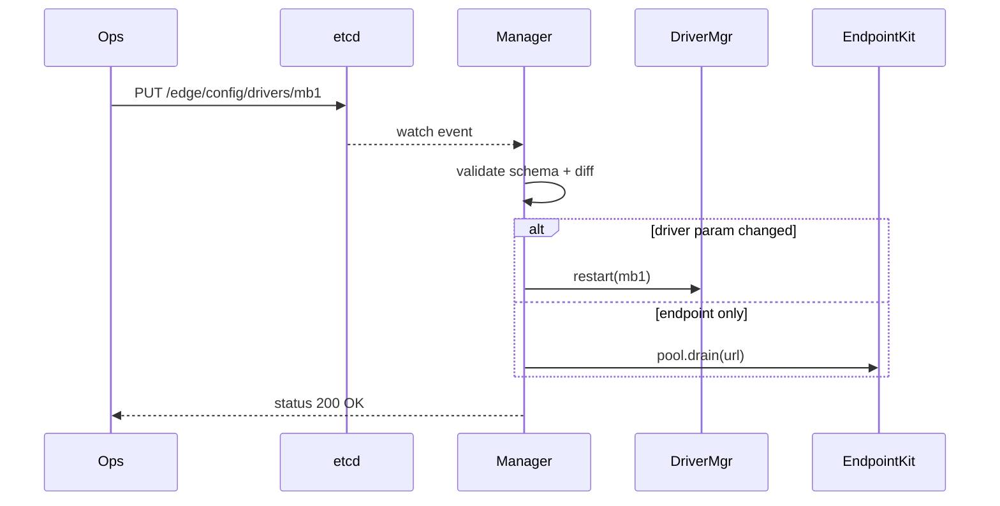

## 1 使命与边界

|目标|不做|
|---|---|
|**集中声明**：Endpoint / Driver / Variable 三张表统一源|不写业务逻辑（Mapper/Rule）|
|**热变更**：改配置不重编译、不停网关|不承担云侧 CI/CD（另有 DevOps）|
|**版本安全**：Schema 校验、回滚|不做权限管理（交给 etcd ACL 或 k8s RBAC）|

---

## 2 三张表 & 目录结构

```bash
/config
 ├─ endpoints.yml   # 连接目录
 ├─ drivers.yml     # 驱动实例+协议参数
 ├─ variables.yml   # 点表（全局 Tag 主键）
 └─ versions/       # 历史快照+签名

```

### 2.1 endpoints.yml 📡 **“怎么连”**

```yaml
# ------------ 现场 PLC A（Modbus-TCP + TLS） ------------
plc_modbus_tls:
  scheme: tls+tcp                 # TLS over TCP
  host: 192.168.10.5
  port: 502
  opts:
    timeout: 1s
    rate: 200pps
    ca: /certs/plant_ca.pem
    client_cert: /certs/edge.crt
    client_key: /certs/edge.key

# ------------ OPC UA 服务器（油气 SCADA） ------------
plc_opcua:
  scheme: opc.tcp                 # 明文 opc.tcp
  host: 192.168.11.20
  port: 4840
  opts:
    security_policy: None
    timeout: 2s

# ------------ 西门子 S7-1200 ------------
plc_s7:
  scheme: tcp
  host: 192.168.12.30
  port: 102
  opts:
    keepalive: true
    timeout: 1s

```

### 2.2 drivers.yml ⚙️ **“用什么协议、怎么读写”**

```yaml
# ---- Modbus-TCP 驱动（静态编译） ----
modbus_tcp1:
  kind: static
  endpoint_id: plc_modbus_tls
  proto: modbus
  cfg:
    unit_id: 1
    polling: 1s
    endian: big
    retry: 3

# ---- OPC UA Client 驱动（动态 .so） ----
opcua_client1:
  kind: dyn
  path: drivers/libopcua_client.so        # 动态库
  endpoint_id: plc_opcua
  proto: opcua
  cfg:
    session_timeout: 5m
    subscriptions:
      - { node: "ns=2;s=Temp",   sample: 100ms }
      - { node: "ns=2;s=Press",  sample: 200ms }

# ---- S7 Snap7 驱动（动态 .so） ----
s7_1200:
  kind: dyn
  path: drivers/libsnap7.so
  endpoint_id: plc_s7
  proto: s7
  cfg:
    rack: 0
    slot: 1
    polling: 500ms
    areas:
      - { db: 1, start: 0, size: 4, datatype: REAL }   # Level
      - { db: 1, start: 4, size: 4, datatype: REAL }   # Flow

```

### 2.3 variables.yml 🏷️ **“全局唯一 Tag → 物理地址”**

```yaml
# ========== Modbus-TCP (R) ==========
- tag: plantA.flow_m3h_raw
  driver_id: modbus_tcp1
  access: R
  address: { type: holding, addr: 40001, len: 2 }
  datatype: uint16
  scale: "value / 10.0"
  unit: m3_h

- tag: plantA.press_bar_raw
  driver_id: modbus_tcp1
  access: R
  address: { type: holding, addr: 40011, len: 2 }
  datatype: uint16
  scale: "value / 100.0"
  unit: bar


# ========== OPC UA Client (RW) ==========
- tag: plantA.temp_c
  driver_id: opcua_client1
  access: R
  address: { node: "ns=2;s=Temp" }
  datatype: float
  unit: °C

- tag: plantA.setpoint
  driver_id: opcua_client1
  access: RW
  address: { node: "ns=2;s=Setpoint" }
  datatype: float
  unit: °C


# ========== Siemens S7 (R) ==========
- tag: plantA.level_pct
  driver_id: s7_1200
  access: R
  address:
    area: DB
    db: 1
    start: 0
    size: 4
    datatype: REAL
  scale: "value * 100"
  unit: "%"

- tag: plantA.flow_m3h_calc
  driver_id: s7_1200
  access: R
  address:
    area: DB
    db: 1
    start: 4
    size: 4
    datatype: REAL
  unit: m3_h

```

> **核心保证**：`tag` 字段 _全局唯一_，系统启动即校验。

---

## 3 Schema 验证

|文件|Schema 位置|校验库|
|---|---|---|
|endpoints.yml|`/schema/endpoint.schema.json`|`jsonschema-rs`|
|drivers.yml|`/schema/driver.core.json` + 每驱动 `driver.schema.json`|同上|
|variables.yml|`/schema/variable.schema.json`|同上|

- 驱动动态库可携带专属 Schema；Manager 合并校验。
    
- CI 阶段跑 `edge-cfg lint /config`.
    

---

## 4 存储与发布流水线

### 4.1 阶段 0：本地 YAML + inotify

1. 运维改文件 → `CAPSULE_ATOMIC` 写临时文件
    
2. Manager `inotify` 触发 → 读取 → Schema 校验
    
3. 差异化计算 (hash) → 发布 Reload 事件
    

### 4.2 阶段 1：etcd 中心化

```bash
/edge/config/
   endpoints/{id}   -> json
   drivers/{id}     -> json
   variables/v1     -> json-array

```

- **edge-cfg CLI**：  
    `edge-cfg set drivers/mb1 drivers.yml` → etcd PUT
    
- Manager 使用 **watch**：
    
    - 变动 → 依赖图 diff → 仅重启影响驱动/Mapper
        
- 版本回滚：  
    `edge-cfg rollback variables 3` (跳到历史版本 3)
    

### 4.3 签名与审批

```bash
edge-cfg sign drivers.yml mykey.pem   # 生成 .sig
edge-cfg push drivers.yml drivers.sig

```

Manager 校验 ed25519 公钥白名单后再应用。

---

## 5 热更新流程时序



- 未涉及的驱动 **无感知**。
    
- 配置错误 → Manager 发送 `ConfigError` Frame，拒绝加载。
    

---

## 6 CLI & Web UI

### 6.1 CLI（edge-cfg）

|命令|功能|
|---|---|
|`edge-cfg list`|列出 endpoints / drivers / vars|
|`edge-cfg get drivers/mb1`|查看当前 JSON|
|`edge-cfg set ...`|上传并校验|
|`edge-cfg diff`|与运行中对比|
|`edge-cfg rollback variables 2`|微信号回滚|

### 6.2 Web UI 原型

- React/Svelte 生成表单——字段来自 JSON-Schema → 自动渲染
    
- “Dry-Run” 按钮：提交到 `/validate` 只校验不生效
    
- 版本旁边显示 `SHA256` 与 “已签名/未签名”。
    

---

## 7 错误与恢复

|场景|行为|
|---|---|
|Schema 校验失败|拒载此版本；发 `Frame{tag=sys.cfg_error, value=json}`|
|驱动重启失败|回滚上一版本 config；Driver 标记 Fault|
|etcd 不可用|使用最后一次缓存；进入只读模式，并报警|

---

## 8 测试矩阵

|测试|验证点|
|---|---|
|`lint_ok`|所有 yaml 符合 Schema|
|`partial_reload`|改 variables of driver X 只重启 X|
|`bad_yaml`|管理器拒载，旧版继续运行|
|`rollback`|恢复旧版本后指标恢复正常|

---

## 9 路线图

|版本|新功能|
|---|---|
|**0.1**|本地 YAML + inotify reload|
|**0.2**|etcd backend + CLI|
|**0.3**|Web UI + Schema-driven form|
|**0.4**|签名校验 + RBAC|
|**1.0**|多租户隔离 / GitOps sync|

---

### 总结

- 首版（0.1）只需 **YAML+inotify** —— 运维手动 scp 也能改配置并热生效。
    
- 随站点增多，再切 **etcd+CLI**，配置中心即可集中；核心 API 不改。