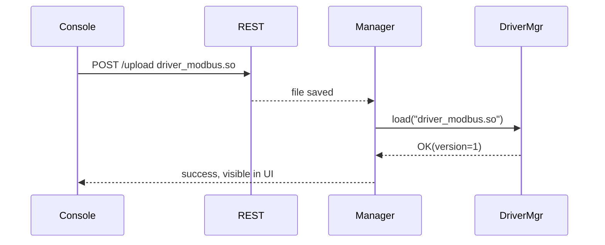

# 工业物联网通用平台（Rust 栈）  
*––长期个人项目的 20 年路线图 & 功能蓝图––*  
> **作者**：你（单兵 + 社区协作者）   
> **初稿**：2025-07-12   
> **目的**：把“读数据→做决策→写控制→协议互转” 全链到一张可迭代的蓝图，  
> 让任何阶段都能 **停下来落地**，又能 **随时继续长高**。

---

## 0. Executive Summary  
### 0.1 设计信条（Why This Architecture）

|信条|释义 & 背后推理|
|---|---|
|**数据先行**|先把一切现场数据转成“**Canonical Frame**”并写入 **Frame Bus**；任何业务（云上传、报警、互转、写控制）都只需订阅/发布 Frame。→ **把复杂度压缩到单点**；数据即 API。|
|**增量可停**|每迭代里程碑（MVP-0/1/2/…）都能在生产落地、产生价值；任何时候停下也不是半成品。→ 个人项目的生存法则。|
|**插件生态**|协议驱动、桥接服务器、云连接器、规则脚本都以 **Dyn/WASM 插件** 形态存在；内核只关心加载与调度。→ 功能可外包，社区可参与，商业闭源插件也可并存。|
|**技术半衰期 ≥ 10 年**|内核依赖 Rust / Protobuf / RocksDB / Tokio：这些技术栈已在企业级生产验证且更新节奏温和；可避免 3-5 年即被淘汰。|

---

### 0.2 三条价值曲线（How It Pays Off）

|曲线|0-2 年|3-5 年|6-10 年|
|---|---|---|---|
|**个人技能 & 影响力**|发布 MVP-0 开源；博客 & 演讲 → 行业可见度|维护社区；受邀培训/咨询|核心 Maintainer / 项目“BDFL”|
|**商业化机会**|定制集成（一人公司外包）|插件市场抽佣；付费桥接驱动|SaaS（AI 预测 / 能耗优化）订阅|
|**行业价值**|低成本现场数据上云解决方案|Legacy 系统平滑升级路径|开源工业物联网“事实标准”|

---

### 0.3 核心里程碑一览（What Gets Built）

|里程碑|功能覆盖|个人投入（周末人月）|退出点价值|
|---|---|---|---|
|**MVP-0**|多协议只读 → MQTT 上云|≈3 月|可商用边缘采集网关|
|**MVP-1**|DynDriver 热插拔|+1 月|插件生态雏形|
|**MVP-2**|CmdFrame + 云写 PLC|+1 月|远程调度 / 设定值|
|**MVP-3**|单向协议桥 (OPC UA Server)|+1.5 月|旧 SCADA 无缝迁移|
|**MVP-4**|Mapping DSL + 双向桥|+2 月|真正多协议互转 + 本地告警|

> **任意 MVP 完成即可停更**——项目仍能在生产用，个人也得到可展示成果。

---

### 0.4 风险与对策（What Can Go Wrong → Mitigation）

|风险点|触发条件|缓解策略|
|---|---|---|
|**时间碎片**|正职/生活占用|路线按 4-6 周粒度交付；每周至少“Commit + 博客” 可见进展|
|**功能膨胀**|客户临时要新协议|坚持“插件贡献”原则；核心只做加载|
|**技术替换**|新潮总线/云协议出现|保持 Canonical Frame 不变 → 写新 Connector 插件即可|
|**单点崩溃**|个人不可抗意外|GitHub MIT 开源；文档完备；鼓励社区 PR|

---

### 0.5 成功定义（Definition of Done 10-Year）

- **技术**：100 + 工业协议驱动、20 + 云连接器、主干 CI 绿灯。
    
- **社区**：≥ 500 star、≥ 50 外部 PR、≥ 5 公司在生产使用。
    
- **商业**：插件市场年 GMV ≥ ￥5 0 万；或 SaaS MRR ≥ ￥2 万。
    
- **个人**：成为“工业协议 + Rust 边缘网关” 领域公认专家，讲师 / 书籍 / 咨询皆可。

## 1. 分层视图（L0–L7）
**阅读指北**

- 先看 “一句话画像” 抓住定位
    
- 再看 “核心接口 / 数据结构” 直接可编码
    
- “首版最小实现” 帮你评估工作量
    
- “扩展想象” 让 5-10 年后也有升级空间
    
- “自测清单” 确保每层可独立验收
### **L0 EndpointKit —「连得上」**

|项|说明 & 建议|
|---|---|
|**一句话画像**|现场所有物理 / 传输 / 加密链路的一站式抽象与重用|
|**核心接口**|`EndpointFactory::from_url(&str) -> EndpointPool`  <br>`EndpointPool::acquire() -> PooledConn` (AsyncRead + AsyncWrite)|
|**关键数据结构**|`EndpointUrl { scheme, host, port, query<HashMap>, cred<Option> }`|
|**首版最小实现**|• `tcp` / `serial` / `tls+tcp` 三种  <br>• 连接池基于 `bb8`，max = 8|
|**扩展想象**|+ `dtls+udp`、`quic`、`prp+tcp`、`tsn+tcp`；限速装饰器；证书自动轮换|
|**自测试清单**|① 同 URL 复用连接数 ≤1  <br>② TLS 握手失败自动降级重连  <br>③ 串口半双工下 1 s 读写无卡顿|

---

### **L1 Driver Runtime —「听得懂」**

|项|说明|
|---|---|
|**一句话画像**|把第三方协议库封装成统一 `Driver` trait，可静态、动态、WASM 三种形态加载|
|**Driver Trait**|`rust\nasync trait Driver {\n fn meta(&self)->DriverMeta;\n async fn connect(&mut self, pool:&EndpointPool, cfg:Value)->Result<()>;\n async fn read_loop(&mut self, tx:FrameSender);\n async fn write(&mut self, cmd:CmdFrame)->Result<()>;\n}\n`|
|**加载器**|- Static：`inventory` 收集  <br>- Dyn `.so`：`libloading`, 约定 `register_driver()`  <br>- WASM：`wasmtime` + WASI `edge-driver/0.2`|
|**生命周期**|`Loading → Init → Connected → Active (+Write) → Error/Backoff → Shutdown`|
|**首版最小实现**|Static Modbus Reader + Dyn OPC UA Reader（写=未实现）|
|**扩展想象**|- 热升级 `.so` 秒级替换  <br>- 第三方用 Go → wasm32-wasi|
|**自测试清单**|① Driver panic 不影响其它  <br>② `.so` ABI 版本不匹配拒载  <br>③ WASM 沙箱越界 trap 不崩主程|

---

### **L2 Canonical Frame Bus —「流得起」**

|项|说明|
|---|---|
|**一句话画像**|站场数据/命令的唯一事件总线 + 持久 WAL|
|**Frame Struct**|`DataFrame` & `CmdFrame` (见 0 章)|
|**实现**|`tokio::sync::broadcast`(ring=256 k) + RocksDB CF `frames`|
|**背压策略**|Ring > 80 % → Pause 信号; <60 % → Resume|
|**首版最小实现**|内存 ring=8 k；WAL 写入但不回放|
|**扩展想象**|- 替换为 NATS JetStream；  <br>- Arrow Flight 分布式|
|**自测试清单**|① 50 k fps 压测无丢帧  <br>② 断网 1 h 后 WAL 重放正确顺序|

---

### **L3 Mapper / Rule —「看得懂」**

|项|说明|
|---|---|
|**一句话画像**|把原始 Tag → 业务 Tag + 单位换算 / 窗口计算 / 告警|
|**DSL**|YAML `variables.yml` + `expr` (Lua)；`when: data|
|**执行**|解析 → AST → LuaJIT / Wasmtime  <br>冷热双表切换保证零丢帧|
|**首版最小实现**|仅 `scale` 表达式 + Tag rename|
|**扩展想象**|- ONNX 推理  <br>- MLFlow 模型热加载|
|**自测试清单**|① 热加载 10 k 条映射 <300 ms  <br>② 表达式异常时 Tag 跳过并报警|

---

### **L4 Northbound Connector —「送上去」**

|协议插件|要点|
|---|---|
|MQTT 5|QoS2, Retain, Batch 32, zstd|
|gRPC-stream|Prost, 1 MiB/batch or 1 s flush|
|REST Batch|`POST /frames?range=seq`|
|_首版_|仅 MQTT 5 + TLS|
|_扩展_|Kafka, Arrow Flight, Influx Line Proto|
|_测试_|云断开→离线缓存 100 MB 后无 OOM，重连全补发|

---

### **L5 Protocol Bridge —「旧友能用」**

|模块|功能|首版|
|---|---|---|
|OPC UA Server|把 Frame → UA Node；UA Write → CmdFrame|硬编码 10 Node|
|Modbus-Slave|Map Tag ↔ Reg；WriteSingle → Cmd|-|
|_扩展_|IEC-104 Server, BACnet|-|
|_测试_|UA Browse + Read + Write E2E diff Tag||

---

### **L6 Config / Orchestration**

|部件|内容|
|---|---|
|三表|`endpoints.yml`, `drivers.yml`, `variables.yml`|
|配置中心|etcd/Consul；CLI `edge-cfg set driver/mb1 <file>`|
|热更新流程|etcd watch → diff → Reload subset|
|JSON-Schema|每驱动附 `driver.schema.json`|
|首版|本地 YAML + inotify 热加载|

---

### **L7 Observability & Ops**

| 类别          | 实现                               | MVP 指标                                  |
| ----------- | -------------------------------- | --------------------------------------- |
| Metrics     | `prometheus_exporter`            | `edge_frame_latency_ms`, `edge_bus_lag` |
| Logs        | `tracing_json` → Loki            | 带 `driver_id`                           |
| Web Console | Upload `.so/.wasm`; view metrics | 后台 REST→前端 Svelte                       |
| OTA         | Ansible playbook / Helm chart    | 单站升级 <1 min                             |
### 路线提示

- **MVP-0** 只要 L0/L1(Static)/L2/L4(MQTT) + YAML Endpoint/Driver/Var 三表，其他层留空。
    
- 每晋级一层只在“上一层已有产物”上**加代码文件**，不改接口，确保节奏不崩。
    
## 2. 三大功能域 & 典型流向
> 采集上云 (F-A) │ 云写现场 (F-B) │ 现场协议互转 (F-C)  
> 多数站场 **80 / 15 / 5** 的需求占比；先吃 F-A，后按需插 B & C。
### 2.1 F-A 现场采集 → 云端消费（**读取主流**）

|维度|详细说明|
|---|---|
|**参与者**|**SourceDriver** → **Frame Bus** → **NorthConnector** → Cloud Broker/DB|
|**典型时序**|`mermaid\nsequenceDiagram\n SourceDrv->>PLC: Read PDU\n SourceDrv-->>Bus: DataFrame(tag,val,ts)\n NorthConn-->>Bus: subscribe()\n NorthConn->>Cloud: MQTT PUBLISH (batch)\n`|
|**API / 结构**|`DataFrame{tag,value,ts,qos}` → MQTT topic `/tenant/device/tag` (JSON)|
|**首版最小实现**|Modbus Reader + MQTT 5 Connector；frame rate ≥ 5 k/s|
|**可选扩展**|+ OPC UA Reader；+ Kafka Connector；Influx Line Proto|
|**测试清单**|① 断网 1 h → WAL 补发 = 100 %  <br>② 50 k tags/s 压测 CPU < 50 %|

---

### 2.2 F-B 云侧写入 → 现场执行（**少量设定值 / 命令**）

|维度|详细说明|
|---|---|
|**参与者**|Cloud App → **Cmd API (NorthConnector)** → **Frame Bus** → **SinkDriver** → 设备|
|**数据模型**|`CmdFrame{tag, value, origin}`  <br>`origin="north"` or UA server|
|**写接口选项**|_REST_ `PUT /tags/{tag}` JSON  <br>_MQTT_ `cmd/{tag}` payload Frame JSON|
|**现场执行**|SinkDriver 查 `tag → address` 表 → 构造协议写 PDU|
|**ACK 流向**|成功后 SinkDriver 生成 `CmdAckFrame` → Bus → 云侧订阅者|
|**首版最小实现**|REST PUT → Modbus WriteSingleRegister|
|**安全/鉴权**|JWT token _tenant + scope=write_；Cmd API 验证 `access ∈ {W,RW}`|
|**监控**|metric `edge_write_error_total{tag}`；Loki 日志含 `origin`|

---

### 2.3 F-C 现场 ↔ 现场 协议互转（**长尾个性化**）

|类型|流向|适用场景|技术要点|
|---|---|---|---|
|**单向·只读桥**|Modbus → UA-Server|让旧 SCADA 继续读新 PLC|BridgeDriver 仅订 `DataFrame`；UA 浏览树硬编码 / 映射生成|
|**双向·读写桥**|OPC UA Server ‹—› Modbus|SCADA 写设定 → PLC|UA Write 事件 → `CmdFrame` → SinkDriver|
|**多协议 Hub**|Modbus + S7 → BACnet → BMS|大楼系统需要 BACnet|多 BridgeDriver 实例订同一 Bus|
|**实现形态**|BridgeDriver = _特殊_ Sink+Source|使用同一 `Driver` trait；Type=Bridge||
|**首版最小实现**|10 Tag UA Server，硬编码映射|||
|**扩展**|自动扫描 `variables.yml` **access=R** → 生成 Address Space；或脚本 DSL|||

---

### 2.4 功能域交互矩阵

|触发源|产物|被谁消费|典型链路|
|---|---|---|---|
|SourceDriver|**DataFrame**|Cloud DB (F-A)，Bridge Srv (F-C)|Read→Bus→MQTT + UA Srv|
|Cloud CmdAPI|**CmdFrame**|SinkDriver (F-B)，Bridge Srv (写回)|PUT→Bus→ModbusWrite|
|Bridge UA-Write|**CmdFrame**|SinkDriver (F-B)|UA Write→Cmd→Bus→WriteReg|
|Local Rule (alarm)|**DataFrame**|MQTT + SMS|Rule→Bus→MQTT|

---

### 2.5 路线优先级 vs 工作量 (个人视角)

|阶段|完成域|累计人月|可交付|
|---|---|---|---|
|MVP-0|F-A|3|云侧可视化|
|MVP-2|F-A + 写最小闭环|5|远程调参|
|MVP-3|+ 单向桥 (F-C 读)|6.5|旧 SCADA 读新 PLC|
|MVP-4|+ 双向桥|8.5|旧 SCADA 写设定|

---

> **决策指南**
> 
> - 如果 90 % 站场只需 “读→云”，**停在 F-A**。写用手动 HMI 即可。
>     
> - 若偶发设置值、比例小 → **REST + CmdFrame**，不做桥，简单写回即可。
>     
> - 只有在 “必须不改旧系统” 且 写流量可控 时，再投 F-C，且先做 **单向读桥**，看价值再做双向。
>

## 3. 迭代路线（单人 / 业余）

> 假设：平均每周 8-10 h 投入（周末 + 零散晚间）。  
> 每一里程碑都 **独立可部署**、附 **验收脚本**、**博客记录**。  
> “💡Skill”＝本阶段你能向外宣传的新技能/成果；“⏰风控”＝若超时可删减的次要任务。

|里程碑|核心目标|日历预估|任务拆解|交付物 / 验收|💡Skill|⏰风控|
|---|---|---|---|---|---|---|
|**MVP-0**  <br>“会读、会上云”|单 Modbus 采集 → MQTT 5 TLS 上云|**0-12 周**|1. endpoint-kit(tcp/serial)  <br>2. static-modbus driver  <br>3. protobuf Frame + ring Bus  <br>4. MQTT5 connector  <br>5. docker-compose: PLC-sim + EMQX|• Git Tag v0.1 + Docker image  <br>• k6 压测 5 k fps OK  <br>• 博客：《Rust 写工业采集》|Rust async IO, MQTT5, Prom metrics|推迟 TLS（先明文）|
|**MVP-1**  <br>“多协议热插”|DynDriver + OPC UA Client 读取|**13-16 周**|1. libloading/abi_stable loader  <br>2. driver-manager  <br>3. OPC UA `.so` build (open62541)  <br>4. bullets: inotify watch `.so`|• 热插拔演示 Video  <br>• v0.2 release note|Rust FFI, dlopen, UA basics|UA 只读单节点|
|**MVP-2**  <br>“云写 PLC”|CmdFrame + REST PUT|**17-24 周**|1. CmdFrame struct  <br>2. REST (warp) `PUT /tags/{tag}`  <br>3. Modbus write impl  <br>4. WAL offset ack / retry  <br>5. JWT middleware|• Postman 脚本一键写阀门  <br>• GitHub CI e2e test|REST + Auth, RockDB WAL|暂不实现 MQTT Cmd 通道|
|**MVP-3**  <br>“旧 SCADA 继续读”|OPC UA Server 单向桥|**25-32 周**|1. BridgeDriver trait  <br>2. UA Server (open62541) expose 10 Tags  <br>3. address-gen yaml  <br>4. SCADA demo (UaExpert)|• 旧 SCADA 读新 PLC 温度  <br>• 视频+博客|OPC UA AddressSpace, bridge patterns|Tag 硬编码 10 个|
|**MVP-4**  <br>“可映射 / 双向桥”|Mapping DSL + 双向写|**33-44 周**|1. variables.yml + access字段  <br>2. Lua eval engine  <br>3. Rule: UA Write→CmdFrame  <br>4. BridgeDriver write path  <br>5. Grafana dashboard latency|• 100 Tag 自动映射成功  <br>• Unit test 100% pass  <br>• v0.4 release|LuaJIT, DSL parsing, Grafana|可推迟 Lua→Lua-to-WASM|
|**MVP-5**  <br>“生态雏形”|WASM Driver + 插件签名|**45-56 周**|1. Wasmtime runtime + wasi preview2  <br>2. Go sample driver (IEC-104) → wasm32  <br>3. SHA-256 + ed25519 verify  <br>4. WebConsole upload页面|• 市场页面上传驱动并跑通  <br>• v0.5 tag|WASI, Supply-chain security, SvelteKit|如果卡，先行 WASM 只读|

---

### 每周 Sprint 模板

|周末 Slot|活动|
|---|---|
|**Sat AM**|阅读标准/库源码 & 设计接口|
|**Sat PM**|Coding / 单元测试|
|**Sun AM**|集成测试 (docker-compose)|
|**Sun PM**|写周记博客 + 提交 PR + Tag|

---

### 验收脚本（示例 MVP-0）

bash

复制编辑

`# 1. 启动 PLC 模拟 + Gateway + MQTT docker-compose up -d plc-sim edge mqtt  # 2. 生成 1000 点压测 python tools/flood_modbus.py --pps 500  # 3. 订阅 MQTT 统计 mosquitto_sub -h localhost -t "gas/#" -C 10000  # 4. Check Prom metrics curl http://edge:9100/metrics | grep frame_latency`

---

### 技能栈累计路线

1. **Rust async** → **FFI + C libs** → **WASM ABI**
    
2. **Tokio / RocksDB internals**
    
3. **Industrial protocols** (Modbus/OPC UA/S7/IEC-104…)
    
4. **Cloud funnels** (MQTT5/Kafka/gRPC-stream)
    
5. **Edge DevOps** (docker-compose → k8s Helm → OTA)
    

---

> **小结**  
> 这条路线保证：
> 
> - 3-4 月内就有可演示产品；
>     
> - 每 1-2 月都有新技能输出；
>     
> - 任何里程碑皆可“收尾交付”——不怕时间被现实切断。
>

## 4. 核心路线（长期稳定件）

1. **数据契约**：Protobuf `Frame` v1.x 只增字段不删改。  
2. **总线协议**：Tokio broadcast in-proc；可平滑迁移到 NATS JetStream → 外部分布式。  
3. **配置三表**：永保后向兼容；附 JSON-Schema 使 UI 自动化。  
4. **插件 ABI**：Dyn = `driver_api_version=1`; WASI = `edge-driver/0.2`; 未来只增版本不破坏。

---

## 5. 插件 / 定制的协作模式
> 目标：一眼看清 **“什么是平台内核（Core）—绝不碎片化”**，  
> 以及 **“什么是插件（Extension）—任何人都能增删”**；  
> 还要说明 **目录结构、ABI、加载流程、签名校验、版本兼容** 等落地细节。
---
### 5.1 角色分层总览

```mermaid
flowchart TB
    subgraph CORE
        EK[EndpointKit]
        DM[DriverManager]
        FB[Frame Bus & WAL]
        MAP[Mapper / Rule Engine]
        CFG[Config Center]
        OBS[Observability Kernel]
    end
    subgraph PLUGIN
        drvStatic[StaticDriver (built-in)]
        drvDyn[DynDriver (.so)]
        drvWasm[WasmDriver (.wasm)]
        bridge[BridgeDrv (OPC UA Srv)]
        connMQTT[Connector-MQTT]
        connKafka[Connector-Kafka]
        ruleLua[Ruleset-Lua]
    end
    EK --> DM
    DM --> FB
    FB --> connMQTT
    FB --> connKafka
    FB --> bridge
    FB --> ruleLua
    CFG --> DM
    CFG --> MAP
    CFG --> connMQTT
    OBS --> EVERYTHING

```

|层|**核心 (必须有)**|**插件 (按需装)**|
|---|---|---|
|**连接层**|EndpointKit|新链路装饰器 (e.g. `TsnDecorator`)|
|**协议层**|DriverManager (空壳)|`.so` / `.wasm` / static drivers|
|**数据总线**|FrameBus + RocksDB WAL|N/A（实现替换可选：NATS）|
|**转换/逻辑**|Mapper + Rule 引擎|规则脚本 / ONNX 模型|
|**北向/桥**|“空” Connector & Bridge Host|MQTT/Kafka/UA-Server 等插件|
|**配置/运维**|YAML loader + etcd watcher|WebConsole Plugin-UI Pane|
|**可观测**|Metric registry + Log core|Grafana Dashboards (json)|

---

### 5.2 核心组件——“平台 DNA”

|核心|不可拆缘由|代码目录|发布粒度|
|---|---|---|---|
|**endpoint-kit**|一旦拆散，TLS/TSN/池逻辑重复|`core/endpoint`|Crate + 单元测|
|**frame-bus**|全系统单一数据公交线|`core/framebus`|Crate|
|**driver-manager**|保证生命周期一致性 / 自愈|`core/driver_mgr`|Crate|
|**mapper-core**|Mapping DSL 解析 + 热加载|`core/mapper`|Crate|
|**config-core**|JSON-Schema 校验 + etcd diff|`core/config`|Crate|
|**obs-core**|metrics/log hook，插件共用|`core/obs`|Crate|

> **原则**：核心只依赖 _Tokio + RocksDB + Prost + serde_，无外部 C 依赖，  
> 让交叉编译 & 长期维护最小化成本。

---

### 5.3 插件类型与交互规范

|类型|交互接口|封装格式|版本约定|典型示例|
|---|---|---|---|---|
|**Driver**|`trait Driver` (Rust) / WASI `edge-driver/0.2`|`libxxx.so` / `xxx.wasm` / static|`driver_api=1` symbol / wasm Interface Hash|`driver_modbus.so`, `iec104.wasm`|
|**Bridge**|`trait Bridge: Driver+ServerIfc`|`.so` / `.wasm`|同上 + `listen=opc.tcp://…`|`bridge_opcua.so`|
|**Connector**|`trait Connector::start(rx)`|`.so` / `.wasm`|`connector_api=1`|`connector_mqtt.so`|
|**RuleSet**|Lua / Wasm func `(frame)->Option<frame>`|`.lua` / `.wasm`|显式 `version: x` header|`alarm_temp.lua`|
|**Decorators**|implement `EndpointDecorator`|Rust crate feature|SemVer|`tsn-decorator`|

#### 插件清单 & 元数据

```toml
# drivers/driver_modbus/driver.toml
name   = "modbus"
kind   = "driver"
api    = 1
arch   = "x86_64-linux"
version= "0.1.3"
checksum = "sha256:abcd..."
schema = "driver.schema.json"

```

Manager 在加载时：

1. 校验 checksum / 签名 → 可信性
    
2. 检查 `api` 与运行时匹配 → 兼容性
    
3. 解析 `schema` → 生成 WebUI 表单
    

---

### 5.4 目录 & 热插拔流程

```bash
/opt/edge/
 ├─ core                               (固定二进制/库)
 ├─ plugins/
 │    ├─ drivers/driver_modbus.so
 │    ├─ bridges/opcua_srv.so
 │    └─ connectors/mqtt5.so
 ├─ rules/
 │    └─ alarm_high.lua
 └─ config/
      ├─ endpoints.yml
      ├─ drivers.yml
      └─ variables.yml

```

**热加载事件序列**



---

### 5.5 安全与版本治理

|需求|机制|
|---|---|
|**隔离**|Dyn 插件同进程；WASM 插件沙箱（CPU/内存限额）；Bridge Server 可单独容器|
|**签名**|`.sig` 文件 (ed25519)；`edge verify plugin.so`|
|**兼容**|Core 增 `driver_api=2` 时仍保留 v1 shim；插件声明 min/max 版本|
|**回滚**|Manager 维护 `plugins/.trash/2025-07-…`；失败自动回滚旧文件|

---

### 5.6 插件开发者旅程

1. `cargo generate --git https://... driver-template`
    
2. 实现 `read_loop(...)` & `write(...)`
    
3. `cargo build --release --lib` → 得到 `target/release/libmydrv.so`
    
4. `edge publish --sign <key>` 生成 `.sig` + `toml`
    
5. 运维拖进 WebConsole，热插即可

## 6. 从个人 10-20 年视角的里程碑
> **假设前提**
> 
> - 你保持业余 8-10 h／周持续投入；可在局部阶段拉 1-2 名协作者。
>     
> - 不追风口频繁转向——始终围绕 _工业现场数据价值链_。
>     
> - “里程碑＝阶段性北极星”——到达即可停滞、收割或转轨。
>     

|时间窗|技术里程碑 (平台成熟度)|商业 & 影响力里程碑|个人成长目标|关键风险 & 缓解|
|---|---|---|---|---|
|**0-2 年**<br/>(2025-2027)|• 核心内核 L0-L4 稳定<br/>• 插件热插拔 (Dyn) 与 CmdFrame<br/>• 20+ 协议驱动（80 % 市场覆盖）|• 首批站场 PoC → 收费维护<br/>• GitHub ★ > 200；博客系列完结<br/>• 3 家 SI（系统集成商）使用|• Rust async / FFI 垂直专家<br/>• “工业网关” 主题大会演讲 2 次|• _Burnout_：<br/>→ 里程碑制 + 公开周报<br/>• _技术深度不足_：<br/>→ 参加 OPC UA、IEC 会议|
|**2-5 年**<br/>(2027-2030)|• WASM 驱动生态 + 插件签名<br/>• Frame Bus 可切换 NATS (分布式) <br/>• L5 WebConsole、L6 Config Center k8s-native|• 插件市集 GMV ￥50-100 万/年<br/>• 合作伙伴出 “私有插件” ≥ 30 个<br/>• 社区活跃贡献者 20+|• 出版《Rust Edge Gateway》<br/>• 个人顾问/培训年收入与本职持平|• _维护负荷爆炸_：<br/>→ 执行 “Core vs Plugin” 治理<br/>• _资金不足_：<br/>→ 插件抽佣 + 咨询输血|
|**5-10 年**<br/>(2030-2035)|• AI/ONNX Rule 插件 & 预测服务<br/>• 双活站场集群；北向 SaaS 选配<br/>• Cloud/Edge 混合 DevOps (OTA, 灰度)|• SaaS 订阅 MRR ≥ ￥20 万<br/>• 公有/私有部署总站场 > 500<br/>• 与 3 家硬件厂商预装合作|• 转型为“架构总监 + 社区领袖”<br/>• 核心贡献度 < 50 % (更多来自社区)|• _生态分叉_：<br/>→ 基于插件签名 & 稳定 API 管理<br/>• _法律/安全合规_：<br/>→ 安排渗透测试、SBOM、SOC2|
|**10-20 年**<br/>(2035-2045)|• 内核进入“维护模式” (v3.x LTS)<br/>• 可热插 AI-Agent 驱动 (LLM-edge)<br/>• 替换 RocksDB → Cloud-native log (Arrow Flight / DeltaLake) 但 Frame 契约不变|• 成为 **事实标准**：被工业协会引用<br/>• 年度社区大会 3000+ 参会<br/>• 可能的商业出口：<br/> · 被大型工业软件公司收购<br/> · 基金会运作（Linux Found.）|• 个人可选择：<br/> 1) 完全转管理 / 投资<br/> 2) 深耕 AI-Edge 子方向|• _技术陈旧_：<br/>→ 内核小而稳；外围可替换<br/>• _个人角色错位_：<br/>→ 提前建设社区治理与授权|

---

### 6.1 “里程碑完成 → 可停靠” 判定表

|触发条件|建议动作|
|---|---|
|**PoC 商业化但无额外资源**|停在 MVP-2；继续收维护费即可|
|**社区外部 PR 持续 > 内部提交**|剥离“Core 委员会”，培养 Maintainer|
|**SaaS 收益 > 咨询/定制收益 3×**|加大云侧投入，降低本地插件开发|
|**个人时间碎片化无法持续**|公布路线图 + 书面治理章程；交由社区驱动|

---

### 6.2 关键事件时间轴（示例）

mermaid

复制编辑

`timeline     title Long-run Milestones     2025-07  MVP-0 完成     2026-01  GitHub 100★     2026-04  MVP-2 上线首站     2027-07  插件签名市场 v1     2028-11  社区贡献>50%     2030-03  SaaS MRR 20w     2032-06  Edge AI Rule 插件     2035-12  v3 LTS.freeze()`

---

### 6.3 个人技能演进 “T 形图”

- **竖**：工业协议解析 / Edge IoT / Rust 深度
    
- **横**：DevOps → Cyber-security → BizDev → Community Gov.
    

每完成一级里程碑，就把竖向再深挖一点、横向再加一格；避免过早做宽、丢掉深度招牌。

---

> **结论**  
> 这条 20 年路线把“个人—技术—社区—商业” 四条曲线放在 **同一坐标系**：
> 
> 1. 任一阶段都能“产学研” 三赢；
>     
> 2. 核心契约 (Frame) + 插件治理 保证可演进；
>     
> 3. 个人始终有 **可退出 / 转型 / 升级** 的节点。
>

