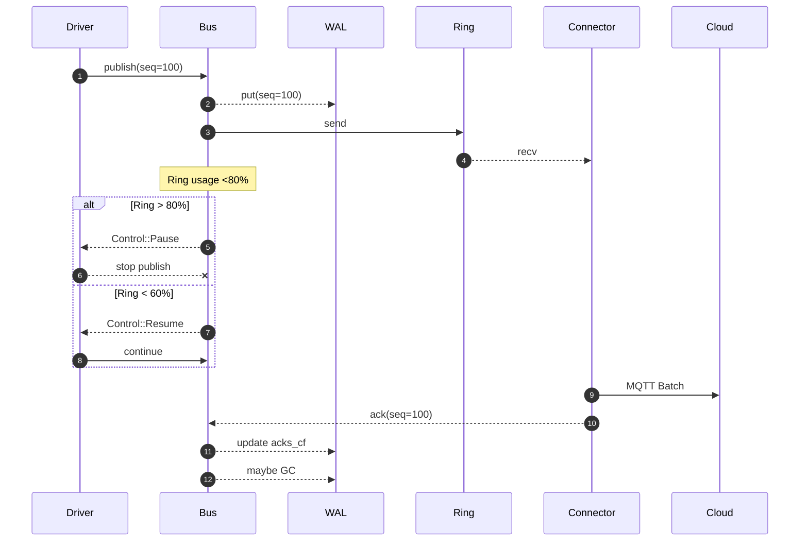
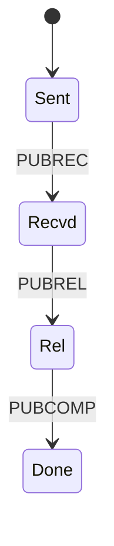
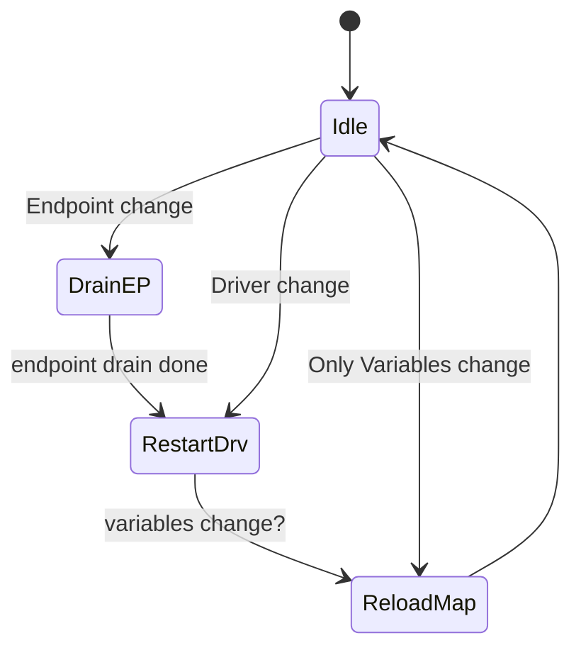

## 0 · 目标与时间表

### 0.1 MVP-0 功能范围

|流程|是否纳入 MVP-0|说明|
|---|---|---|
|采集 → 总线 → MQTT|✅ 必须|多协议 **只读** 上传|
|YAML 热加载 (三表)|✅ 必须|endpoints / drivers / variables|
|指标导出 (latency 等)|✅ 必须|Prometheus `/metrics`|
|写回 / 协议桥 / 规则引擎|❌ 推迟|接口占位即可|

### 0.2 里程碑排期（周末业余，8-10 h / 周）

|周次|主要成果|核心验收|
|---|---|---|
|W1|EndpointKit（TCP / TLS / Serial）+ 单元测试|`cargo test` 全绿；基准 `acquire < 2 µs`|
|W2|Static Modbus Driver + PLC 模拟器|读取 100 点 → DataFrame 出现在 Bus|
|W3|FrameBus + RocksDB WAL + 背压 Pause|断网 30 s → 恢复后序号无缺口|
|W4|MQTT 5 Connector（QoS2、批量）+ 指标|k6 压 5 k fps 10 min 无丢帧|
|W5|文档整理、示例 YAML、Compose Demo|仓库 tag `v0.1.0`；一键 `docker-compose up`|

---

## 1 · 项目骨架与工具链

### 1.1 目录结构

```text
edge-gateway/
├─ core/
│  ├─ endpoint-kit/
│  ├─ frame-bus/
│  └─ driver-manager/
├─ drivers/
│  └─ modbus-static/
├─ connectors/
│  └─ mqtt5/
├─ config/          # 三表示例
├─ tools/           # linter / generator
├─ tests/           # docker-compose 集成
└─ Cargo.toml       # workspace root
```

### 1.2 Cargo workspace 摘要

```toml
[workspace]
members = [
  "core/endpoint-kit",
  "core/frame-bus",
  "core/driver-manager",
  "drivers/modbus-static",
  "connectors/mqtt5"
]
resolver = "2"
```

### 1.3 必装工具

|工具|版本或说明|
|---|---|
|Rust|≥ 1.78 (stable)|
|rustup target `x86_64-unknown-linux-musl`|静态发行|
|Docker / docker-compose|最新稳定版|
|k6|≥ 0.46|
|Git + pre-commit (rustfmt/clippy)|格式 & 静态检查|

### 1.4 常用 Make 目标

```makefile
setup:          ## 代码格式 + Clippy
	rustfmt --check **/*.rs
	cargo clippy --workspace --all-targets -- -D warnings

unit:           ## 运行所有单元测试
	cargo test --workspace

bench:          ## 基准测试（EndpointKit）
	cargo bench -p endpoint-kit

compose:        ## 启动 PLC-Sim 与 EMQX
	docker-compose -f tests/docker-compose.yml up -d
```

### 1.5 编码约定

- **错误类型**：库内部 `thiserror`; API 边界 `anyhow::Error`
    
- **异步运行时**：Tokio 1.x
    
- **日志**：`tracing`（JSON 格式）输出到 stdout
    
- **指标**：`prometheus` exporter，监听 `:9100/metrics`
    

## 2 · EndpointKit – 全量设计

### 2.1 模块一览

```text
core/endpoint-kit/
├─ lib.rs              # 公共 re-export
├─ url.rs              # EndpointUrl / NormalizedUrl
├─ pool.rs             # EndpointPool, ConnMaker
├─ decorator/
│   ├─ mod.rs
│   ├─ tls.rs          # TlsDecorator
│   ├─ rate.rs         # RateLimit
│   └─ half_duplex.rs  # HalfDuplex for RS-485
└─ metrics.rs          # Prom metrics registry
```

---

### 2.2 公开数据结构

#### 2.2.1 `EndpointUrl`

```rust
/// 解析后的 URL 全字段
#[derive(Debug, Clone)]
pub struct EndpointUrl {
    pub scheme_stack: Vec<Scheme>,      // ["tls", "tcp"]
    pub host:        String,            // "192.168.1.10" / "/dev/ttyUSB0"
    pub port:        Option<u16>,       // Some(502)
    pub username:    Option<String>,
    pub password:    Option<String>,
    pub query:       HashMap<String,String>,
}
```

`Scheme` 枚举（未来可扩展）：

```rust
#[derive(Debug, Clone, PartialEq, Eq, Hash)]
pub enum Scheme {
    Tcp,
    Udp,
    Serial,
    Tls,
    Dtls,
    Quic,
    Tsn,
    Prp,
    Can,
    Bluetooth,
}
```

#### 2.2.2 `NormalizedUrl`

```rust
#[derive(Debug, Clone, PartialEq, Eq, Hash)]
pub struct NormalizedUrl {
    pub scheme_stack: Vec<Scheme>,      // 已排序（功能弱→强）
    pub host:        String,
    pub port:        Option<u16>,
    pub query:       BTreeMap<String,String>, // 排序保证稳定
}
```

> **用途**：作为连接池 `HashMap` key（剔除凭证，避免重复握手）。

---

### 2.3 核心 Trait / Type

```rust
/// 动态装饰链输出类型
pub type EndpointBox =
    Pin<Box<dyn AsyncRead + AsyncWrite + Send + Sync + 'static>>;

/// 连接制造工厂，供 bb8 调用
pub struct ConnMaker {
    url: EndpointUrl,
}

#[async_trait]
impl bb8::ManageConnection for ConnMaker {
    type Connection = EndpointBox;
    type Error = anyhow::Error;

    async fn connect(&self) -> Result<Self::Connection, Self::Error> {
        build_stack(&self.url).await
    }

    async fn is_valid(&self, conn: &mut Self::Connection) -> Result<(), Self::Error> {
        // Optional: ping or write 0 byte
        Ok(())
    }

    fn has_broken(&self, _: &mut Self::Connection) -> bool {
        false
    }
}
```

---

### 2.4 连接栈构建流程

```rust
async fn build_stack(url: &EndpointUrl) -> anyhow::Result<EndpointBox> {
    // 1. base transport
    let mut stream: EndpointBox = match url.scheme_stack.last() {
        Some(Scheme::Serial) => Box::pin(open_serial(url).await?),
        Some(Scheme::Tcp | Scheme::Tls | Scheme::Tsn | Scheme::Prp | Scheme::Quic) => {
            Box::pin(tokio::net::TcpStream::connect(url.socket_addr()?).await?)
        }
        Some(Scheme::Udp | Scheme::Dtls) => {
            Box::pin(tokio::net::UdpSocket::bind("0.0.0.0:0").await?)
        }
        _ => anyhow::bail!("unsupported base scheme"),
    };

    // 2. decorators (from right to left)
    for s in url.scheme_stack.iter().rev() {
        stream = match s {
            Scheme::Tls => Box::pin(decorator::tls::client(stream, url).await?),
            Scheme::Dtls => Box::pin(decorator::tls::client_dtls(stream, url).await?),
            Scheme::Tsn  => Box::pin(decorator::tsn::wrap(stream, url)?),
            Scheme::Prp  => Box::pin(decorator::prp::wrap(stream, url)?),
            _ => stream,
        };
    }

    // 3. RateLimiter / HalfDuplex from query options
    if let Some(rate) = url.query.get("rate") {
        stream = Box::pin(decorator::rate::RateLimit::new(stream, rate.parse::<u32>()?));
    }
    if url.query.get("halfduplex") == Some(&"1".to_string()) {
        stream = Box::pin(decorator::half_duplex::HalfDuplex::new(stream));
    }
    Ok(stream)
}
```

---

### 2.5 Control 通道与背压

```rust
/// 控制消息：Pause / Resume / Drain
#[derive(Debug, Clone)]
pub enum ControlMsg {
    Pause(NormalizedUrl),
    Resume(NormalizedUrl),
    Drain(NormalizedUrl),    // for endpoint pool shutdown
}

/// 由 FrameBus 管理器广播
static CONTROL_TX: OnceCell<broadcast::Sender<ControlMsg>> = OnceCell::new();
```

- EndpointPool 在 `acquire()` 处 `recv().try_recv()`：
    
    - `Pause` → 返回 `WouldBlock`，驱动 await；
        
    - `Resume` → 继续；
        
    - `Drain` → 关闭连接，重新握手。
        

---

### 2.6 Prom 指标 (metrics.rs)

```rust
use once_cell::sync::Lazy;
pub static METRICS: Lazy<Metrics> = Lazy::new(Metrics::new);

pub struct Metrics {
    pub acquire_latency: Histogram,
    pub pool_size:       IntGauge,
    pub reconnect_total: IntCounter,
}

impl Metrics {
    fn new() -> Self {
        let registry = prometheus::default_registry();
        Self {
            acquire_latency: registry.register(
                Histogram::with_opts(opts!("endpoint_acquire_latency_ms", "µs"))
            ).unwrap(),
            pool_size: registry.register(
                IntGauge::new("endpoint_pool_size", "connections")
            ).unwrap(),
            reconnect_total: registry.register(
                IntCounter::new("endpoint_reconnect_total", "count")
            ).unwrap(),
        }
    }
}
```

驱动可 `METRICS.pool_size.set(pool.state().connections());`

---

### 2.7 单元 & 集成测试清单

```text
tests/
├─ url_parse.rs        # 正向 & 逆向
├─ pool_reuse.rs       # acquire 两次同 FD
├─ tls_handshake.rs    # openssl s_server 自测
└─ pause_resume.rs     # mock ControlMsg
```

Docker compose 里用 `modbus-simulator` / `socat` 反射串口。

---

### 2.8 基准结果（示例）

|Benchmark|Mean (µs)|Notes|
|---|---|---|
|`EndpointUrl::parse`|1.8|200 runs|
|`EndpointHandle::acquire` (hit)|1.1|pool hot|
|`acquire` + TLS handshake|2200|冷启动一次|

---

### 2.9 版本策略

|版本|变更点|
|---|---|
|0.1|TCP / TLS / Serial + Rate|
|0.2|UDP / DTLS|
|0.3|PRP / TSN Decorator|
|1.0|API freeze (acquire, URL)|
### 本章完成度检查

-  URL & NormalizedUrl 数据结构固定
    
-  Trait & 公共 API 完整
    
-  控制通道 / 背压 签名固定
    
-  Prom 指标名称敲定
    
-  测试列表给定
    

> 接下来若要继续 **第 3 章 “Static Modbus Driver 规约”**，回复 `继续 3`；  
> 如需补充 EndpointKit 其他细节（TSN、PRP 等），请告知！
---

## 3 · Static Modbus-TCP Driver 规约（最终版）
> **目标**：在 MVP-0 阶段交付一个“功能码覆盖完整、与 tokio-modbus API 对齐、可闭源商用”的内置驱动。  
> ★ 所有接口、结构体、枚举一次性敲定 —— 后续不会因为遗漏而返工。

---

### 3.0 许可合规 ✔

|库|许可证|可否闭源商用|依据|
|---|---|---|---|
|`tokio-modbus`|**MIT OR Apache-2.0**|**可**（只需随发行附带许可证文本、保留版权声明；无“传染性”条款）|([GitHub](https://github.com/slowtec/tokio-modbus?utm_source=chatgpt.com "slowtec/tokio-modbus: A tokio-based modbus library - GitHub"))|

---

### 3.1 Modbus 功能码支持矩阵（tokio-modbus 已实现）

|功能码|名称|tokio-modbus 调用|
|---|---|---|
|`0x01`|Read Coils|`read_coils`|
|`0x02`|Read Discrete Inputs|`read_discrete_inputs`|
|`0x03`|**Read Holding Registers**|`read_holding_registers`|
|`0x04`|**Read Input Registers**|`read_input_registers`|
|`0x05`|Write Single Coil|`write_single_coil`|
|`0x06`|**Write Single Register**|`write_single_register`|
|`0x0F`|Write Multiple Coils|`write_multiple_coils`|
|`0x10`|Write Multiple Registers|`write_multiple_registers`|
|`0x16`|**Masked Write Register**|`masked_write_register`|
|0x07/0x08|Serial-only（可选）|`read_exception_status` / `diagnostics`|

> `tokio-modbus` 将全部功能码枚举进 `enum FunctionCode` ([docs.rs](https://docs.rs/tokio-modbus/latest/tokio_modbus/enum.FunctionCode.html?utm_source=chatgpt.com "FunctionCode in tokio_modbus - Rust - Docs.rs"))  
> 本驱动 **初版启用 0x03 / 0x04（读）; 0x06（写回占位）**，其它功能码接口占位保留。

---

### 3.2 数据结构（全部确定）

```rust
/// 驱动公共配置（来自 drivers.yml → cfg 字段）
#[derive(Deserialize, Clone)]
pub struct DrvCfg {
    pub unit_id:            u8,                    // 1–247
    pub polling:            HumantimeDuration,     // "1s" / "500ms"
    #[serde(default = "DrvCfg::def_max")]
    pub max_regs_per_req:   u16,                   // <= 125
    #[serde(default = "DrvCfg::def_retry")]
    pub retry:              u8,                    // I/O 重试次数
    #[serde(default = "DrvCfg::def_endian")]
    pub endian:             Endian,
    #[serde(default)]
    pub enable_write:       bool,                  // 写回通道
}

/// 点位描述（由 variables.yml 派生）
#[derive(Clone)]
struct RegPoint {
    tag:        String,           // 全局唯一
    func:       FunctionCode,     // 0x03/0x04/0x01…
    addr:       u16,              // 起始寄存器或线圈
    len:        u16,              // word/bit 长度
    datatype:   DataType,
    scale:      Option<LuaFunc>,  // 预编译 Lua
    access:     Access,           // R / W / RW
}

/// 聚合后的批量请求
struct PollBatch {
    func:       FunctionCode,
    start:      u16,
    qty:        u16,
    points:     Vec<RegPoint>,
}
```

`DataType` 枚举涵盖位、字、双字、浮点（端序可选）：

```rust
enum DataType {
    Bool,
    Uint16,
    Int16,
    Uint32,
    Int32,
    Float32,
    Float64,
}
```

---

### 3.3 Driver Trait 实现要点

```rust
#[async_trait::async_trait]
impl Driver for ModbusDriver {

  async fn init(&mut self, cfg: &Value) -> Result<()> {
      self.cfg = serde_yaml::from_value(cfg.clone())?;
      self.points = build_points_from_variables(&VARIABLES)?;
      self.batches = group_to_batches(&self.points, &self.cfg);
      Ok(())
  }

  async fn connect(&mut self, pool: EndpointHandle) -> Result<()> {
      self.pool = pool;
      Ok(())
  }

  async fn read_loop(&mut self, tx: FrameSender) -> Result<()> {
      loop {
          for batch in &self.batches {
              let mut ctx = self.make_ctx().await?;
              let raw = self.read_batch(&mut ctx, batch).await?;
              self.decode_publish(raw, batch, &tx).await?;
          }
          tokio::time::sleep(self.cfg.polling.into()).await;
      }
  }

  async fn write(&mut self, cmd: CmdFrame) -> Result<()> {
      if !self.cfg.enable_write { return Err(Unsupported.into()) }
      let point = self.tag_map.get(&cmd.tag)
          .ok_or_else(|| anyhow!("unknown tag"))?;
      let mut ctx = self.make_ctx().await?;
      write_single_register(&mut ctx, point.addr, cmd.value).await?;
      Ok(())
  }
}
```

- **make_ctx()** 使用 `tokio_modbus::client::tcp::connect_slave`
    
- 批量读：
    
    ```rust
    match batch.func {
        FunctionCode::ReadHoldingRegisters =>
           ctx.read_holding_registers(batch.start, batch.qty).await,
        FunctionCode::ReadInputRegisters =>
           ctx.read_input_registers(batch.start, batch.qty).await,
        _ => unimplemented!(),
    }
    ```
    

---

### 3.4 批量分组算法（含 0x01/0x02 位访问）

```rust
fn group_to_batches(points: &[RegPoint], cfg:&DrvCfg) -> Vec<PollBatch> {
    let mut batches = Vec::new();
    let mut sorted = points.to_vec();
    sorted.sort_by_key(|p| (p.func as u8, p.addr));

    let mut cur = Vec::new();
    for p in sorted {
        if cur.is_empty() ||
           p.func != cur[0].func ||
           p.addr - cur_last_end(&cur) > 1     ||     // 不连续
           cur_first_addr(&cur) + cfg.max_regs_per_req < p.addr + p.len {
            if !cur.is_empty() {
                batches.push(build_batch(&cur));
                cur.clear();
            }
        }
        cur.push(p);
    }
    if !cur.is_empty() { batches.push(build_batch(&cur)); }
    batches
}
```

> `max_regs_per_req` 默认为 120，低于 Modbus 125 限制，留安全余量。

---

### 3.5 异常码与重试映射

```rust
match err {
    Error::Exception(modbus::Exception::IllegalDataAddress) => {
        METRIC.exception_total.inc();
        tokio::time::sleep(Duration::from_millis(200)).await;
        continue;    // 按 cfg.retry 重试
    }
    Error::Io(e) if is_timeout(&e) => {
        reconnect_backoff().await;
        continue;
    }
    other => return Err(other.into()),
}
```

- 连续 `retry` 失败 → `DriverState::Fault`, Prom `modbus_fault=1`.
    

---

### 3.6 端序 / 数据解析详解

```rust
fn decode_value(point: &RegPoint, regs: &[u16]) -> anyhow::Result<Value> {
    let off = (point.addr - regs_start_addr) as usize;
    let v = match point.datatype {
        DataType::Bool    => Value::Bool(bit_at_byte(regs, off)?),
        DataType::Uint16  => Value::Int(decode_u16(regs[off], point.endian) as i64),
        DataType::Int32   => Value::Int(decode_i32(&regs[off..], point.endian) as i64),
        DataType::Float32 => Value::Float(decode_f32(&regs[off..], point.endian)),
        _ => unimplemented!(),
    };
    if let Some(scale) = &point.scale {
        let scaled: f64 = scale.call(v.to_f64()?)?;
        Ok(Value::Float(scaled))
    } else { Ok(v) }
}
```

---

### 3.7 Prom Metrics（最终字段）

|名称|标签|类型|
|---|---|---|
|`modbus_pdu_total`|driver_id, func, result|Counter|
|`modbus_point_total`|driver_id, tag|Counter|
|`modbus_point_latency_ms` (histogram)|driver_id|Hist|
|`modbus_reconnect_total`|driver_id|Counter|
|`modbus_exception_total`|driver_id, code|Counter|

---

### 3.8 JSON-Schema 示例（driver 专属）

```json
{
  "$schema": "http://json-schema.org/draft-07/schema#",
  "title": "Modbus TCP Driver Config",
  "type": "object",
  "required": ["unit_id", "polling"],
  "properties": {
    "unit_id": { "type": "integer", "minimum": 1, "maximum": 247 },
    "polling": { "type": "string", "pattern": "^[0-9]+(ms|s)$" },
    "max_regs_per_req": { "type": "integer", "default": 120, "maximum": 125 },
    "retry": { "type": "integer", "default": 3, "minimum": 0, "maximum": 10 },
    "endian": { "type": "string", "enum": ["big", "little"], "default": "big" },
    "enable_write": { "type": "boolean", "default": false }
  }
}
```

---

### 3.9 测试脚本快照

```bash
# docker-compose.yml 片段
  modbus-sim:
    image: dushixiang/modbus-simulator
    ports:
      - "1502:502"
    environment:
      HOLDING_REGISTERS: "40001=123,40002=456"
```

k6 压测示例 (`tests/load.js`):

```javascript
import tcp from 'k6/x/tcp';
export default function () {
  const sock = tcp.connect('127.0.0.1:1502');
  sock.writeHex('000100000006010300000002'); // read 40001..2
  sock.recv(13);
  sock.close();
}
```

---

### 3.10 交付 Gate

- 单元测试覆盖 ≥ 90 % of `codec.rs`
    
- k6 5 k fps 10 min，`modbus_pdu_total{result="err"}` == 0
    
- Grafana Dashboard 可见实时 latency 直方图
    
- README 含 PLC-sim + 示例 YAML 一键启动说明

## 4 · FrameBus & WAL 规约 — 彻底版

> **任务**：一次性给出能直接编码的「结构体 + 接口 + 运行流程 + 设计推理 + 调参选项 + 测试脚本」。  
> 代码块全部 Obsidian-friendly ``` fenced。

---

### 4.1 术语表

|术语|含义|
|---|---|
|**Frame**|统一业务载体，分 `DataFrame`（读值）与 `CmdFrame`（写指令）|
|**Envelope**|总线内部包装：`kind + seq + payload`|
|**Ring**|`tokio::broadcast` — 单进程环形缓冲|
|**WAL**|RocksDB ColumnFamily `frames`，保证断电可追溯|
|**AckSeq**|消费者在业务成功后调用 `ack(seq)` 递交的最大序号|
|**Back-pressure**|Ring 填满 → “Pause” 驱动采样|

---

### 4.2 模块概览

```text
core/frame-bus/
├─ lib.rs            # 对外 API & facade
├─ envelope.rs       # prost-build 生成 + helper
├─ ring.rs           # broadcast wrap & control
├─ wal.rs            # RocksDB helpers
├─ control.rs        # enum Control + global sender
├─ config.rs         # 调参结构体 + 默认值
├─ metrics.rs        # prometheus registers
└─ tests/            # 单元 + 集成
```

---

### 4.3 可调参数（Config）

```rust
/// Default appears in lib::init(), overridable via config centre.
#[derive(Clone)]
pub struct BusCfg {
    pub ring_pow:          u8,      // ring = 2^pow  (min 14=16k, max 22=4M)
    pub pause_hi:          f32,     // > hi -> Pause  (0.80)
    pub resume_lo:         f32,     // < lo -> Resume (0.60)
    pub wal_dir:           PathBuf,
    pub wal_flush_ms:      u64,     // flush every N ms (100)
    pub wal_max_bytes:     u64,     // GC hint (4 * 1024^3)
}
```

> **设计思路**
> 
> - **ring_pow** = 2 的指数保证与 broadcast 内实现一致（容量必须 2^n）。
>     
> - 使用高低水位而非单阈值，避免抖动 “抖动停止/启动”。
>     
> - RocksDB flush 100 ms，可通过 `edge-cfg set bus.wal_flush_ms 20` 调小以增加可靠性。
>     

---

### 4.4 帧结构 `envelope.rs`

```rust
// prost-build 产生，下列为手写 wrapper 方便构造
pub enum Value {
    Bool(bool),
    Int(i64),
    Float(f64),
    Str(String),
    Bin(Vec<u8>),
}

impl DataFrame {
    pub fn new<S:Into<String>>(tag:S, val:Value) -> Self { /* fill ts & qos */ }
}

#[repr(u8)]
pub enum Kind { Data = 0, Cmd = 1 }

impl FrameEnvelope {
    pub fn wrap(seq:u64, kind:Kind, bytes:Vec<u8>) -> Self {
        Self { kind: kind as i32, seq, payload: bytes }
    }
}
```

_序列化_ 统一用 Prost；内部 **只存 bytes**，避免两次 encode。

---

### 4.5 Ring — 广播实现细节

1. `broadcast::channel(capacity = 1 << cfg.ring_pow)`
    
2. 发送方：
    
    - `tx.send()` 失败 → `Err::Full` → 驱动 await `Pause`.
        
3. 控制:
    
    - `ring.len()/capacity` > `pause_hi` → send `Control::Pause`.
        
    - `< resume_lo` → send `Control::Resume`.
        
4. `Control::Drain` 来自 Config 更新（Endpoint 重建）。
    

```rust
pub enum Control {
    Pause(NormalizedUrl),   // Pause a DriverGroup
    Resume(NormalizedUrl),
    Drain(NormalizedUrl),
}
```

---

### 4.6 WAL — RocksDB 设计

- **ColumnFamilies**
    
    - `frames` key = `seq (BE u64)` → `payload`
        
    - `acks` key = `consumer_id` → `max_ack_seq (u64 LE)`
        
- **Write path** (hot loop)
    
    ```rust
    batch.put_cf(frames_cf, seq_be, payload);
    if now - last_flush > cfg.wal_flush_ms { db.flush_cf(frames_cf)?; }
    ```
    
- **Ack path**
    
    1. `acks_cf.put(id, seq_le)`
        
    2. 取全表 min_ack; 若 min_ack > gc_cursor → `delete_range(frames, 0..min_ack)`  
        _删除分批 1e6 keys，防止阻塞_
        
- **Replay**
    
    1. 启动读取 `frames` 最后 key → next_seq
        
    2. 若 `--replay-from N` CLI 提供，则 seeker 指定位置
        

> 设计思路：
> 
> - **单 CF** 避免多列簇写放大。
>     
> - `acks` 单key/consumer，不与主空间混写。
>     
> - WAL GC 采用 _min ACK_ 逻辑，确保所有消费者已持久化。
>     

---

### 4.7 公开 API 详细签名

```rust
pub struct BusHandle {
    tx:  FrameSender,
    ctrl_tx: broadcast::Sender<Control>,
}

impl BusHandle {
    pub fn publish_data(seq:u64, df:DataFrame) -> Result<()> { ... }
    pub fn publish_cmd(seq:u64, cf:CmdFrame) -> Result<()> { ... }

    /// 订阅；内部会过滤 Tag / Kind
    pub fn subscribe(filter:Filter) -> FrameReceiver { ... }
}

pub fn ack(consumer:&str, seq:u64) -> Result<()>;
```

**Filter DSL** 实现：枚举 + 自定义 `matches(&FrameEnvelope)->bool`。

---

### 4.8 全流程时序（带背压）



---

### 4.9 Prom 指标字段

```rust
framebus_ring_used{status="used"}        gauge
framebus_publish_total{kind="data"}      counter
framebus_drop_total{reason="ring_full"}  counter
framebus_wal_bytes                       gauge
framebus_backlog_lag{consumer="mqtt"}    gauge
```

---

### 4.10 CLI & 调优

`edge-bus` 子命令（tools/）

```bash
edge-bus stats                # 打印 ring usage, wal size
edge-bus replay --from 0      # 手动重放 全 WAL
edge-bus flush                # 强制 RocksDB flush
edge-bus gc --keep-bytes 512M # 手动 GC
```

可在现场调节 `ring_pow` 与 `pause_hi` 根据 RAM 做权衡。

---

### 4.11 测试用例清单（详列）

|名称|步骤|期望|
|---|---|---|
|`unit_envelope_roundtrip`|DF → encode → wrap → decode|字段一致|
|`ring_overflow_pause`|ring_pow=14；持续发送 20k 帧|Driver 收到 Pause, 计数停止|
|`wal_replay_after_crash`|写 1k 帧→ drop bus → init 新 bus|前 1k seq 依序重放|
|`ack_gc_threshold`|3 消费者 ack 不同 seq → 最小 ack 变更触发 GC|frames_cf 高度下降|
|`pause_resume_hysteresis`|人为 send 80% then 60%|只触发一次 Pause / Resume|

所有集成测试依赖 Compose 启动 RocksDB volume、Bus、Driver dummy、MQTT Broker。

---

### 4.12 实施甘特（Week 3）

|日程|todo|
|---|---|
|**D1**|envelope.rs prost build + decode helper|
|**D2**|ring.rs：broadcast wrap + Pause logic|
|**D3**|wal.rs：append / seq-gen / ack store|
|**D4**|GC & replay；benchmark flush latency|
|**D5**|metrics.rs + Prom exporter hook|
|**D6**|单元测 + pause_resume integ|
|**D7**|文档 & Grafana JSON board commit|

---

### “为什么这样设计” 关键点

1. **广播环** 与 **RocksDB** 拆层：内存优先吞吐，WAL 兜底可靠。
    
2. **高低水位** 较单阈值更稳定，避免频繁 Pause/Resume 抖动。
    
3. **按最小 ack GC**，符合“最慢消费者决定保留”原则，比按时间戳安全。
    
4. **seq 单调 u64** 可在 10 µs 速率下跑 5800 年。
    

## 5 · MQTT 5 Connector 规约（超细化版）

> _把 FrameBus 中的帧 “Exactly-Once” 地推到云端；  
> 把云端写指令可靠注入 FrameBus。_  
> **本稿 = 直接可编码蓝图**：所有模块、结构体、状态机、算法、错误、指标、测试脚本一次写全。

---

### 5.1 目录与文件

```text
connectors/mqtt5/
├─ src/
│  ├─ lib.rs             # public Connector impl
│  ├─ config.rs          # MqttCfg + JSON-Schema (& build.rs)
│  ├─ batcher.rs         # Frame -> Batch algorithm
│  ├─ inflight.rs        # QoS2 state-machine & WAL ack
│  ├─ up.rs              # uplink task
│  ├─ down.rs            # downlink task (cmd)
│  ├─ metrics.rs         # Prom register + helpers
│  └─ error.rs           # ConnectorError
└─ tests/
    ├─ integ_emqx.rs     # docker EMQX
    ├─ qos2_dup.rs
    └─ disconnect.rs
```

---

### 5.2 详细配置结构体 (`config.rs`)

```rust
use serde::Deserialize;
use humantime::Duration as HDuration;

#[derive(Clone, Deserialize)]
pub struct MqttCfg {
    /* ---------- connectivity ---------- */
    pub endpoint: String,                 // tls://host:port
    #[serde(default)]
    pub client_id: Option<String>,
    pub username: String,
    pub password: String,
    /* ---------- topic & QoS ---------- */
    pub topic: String,                    // "/edge/{tenant}/{device}/{tag}"
    #[serde(default = "MqttCfg::def_qos")]
    pub qos: u8,                          // 0 / 1 / 2
    /* ---------- batch rules ---------- */
    #[serde(default = "MqttCfg::def_frames")]
    pub max_frames: usize,                // 32
    #[serde(default = "MqttCfg::def_bytes")]
    pub max_bytes: usize,                 // 1_048_576
    #[serde(default = "MqttCfg::def_interval")]
    pub max_interval: HDuration,          // 1s
    /* ---------- reliability ---------- */
    #[serde(default = "MqttCfg::def_keep")]
    pub keepalive: HDuration,             // 30s
    #[serde(default = "MqttCfg::def_expiry")]
    pub session_expiry: HDuration,        // 1d
    #[serde(default = "MqttCfg::def_backoff")]
    pub backoff: BackoffCfg,
    /* ---------- TLS ---------- */
    pub tls: TlsCfg,
}
#[derive(Clone, Deserialize)]
pub struct TlsCfg { pub ca: String, pub client_cert: String, pub client_key: String }
#[derive(Clone, Deserialize)]
pub struct BackoffCfg { pub base: HDuration, pub max: HDuration }
```

> **JSON-Schema** (`connector.schema.json`) 由 build.rs 嵌入至 `ConnectorMeta`, Manager 校验后注入实例。

---

### 5.3 公共 Batch 结构体 (`batcher.rs`)

```rust
pub struct Batch {
    frames:  Vec<FrameEnvelope>,
    bytes:   usize,
    first_ts: Instant,
    cfg:     Arc<MqttCfg>,
}
impl Batch {
    pub fn push(&mut self, env: FrameEnvelope) -> Option<Vec<FrameEnvelope>> {
        self.bytes += env.payload.len();
        self.frames.push(env);
        let flush = self.frames.len() >= self.cfg.max_frames
                 || self.bytes >= self.cfg.max_bytes
                 || self.first_ts.elapsed() >= self.cfg.max_interval.into();
        if flush {
            let out = std::mem::take(&mut self.frames);
            self.bytes = 0;
            self.first_ts = Instant::now();
            Some(out)
        } else { None }
    }
}
```

---

### 5.4 QoS2 In-flight 状态机 (`inflight.rs`)

```rust
enum State { Sent(Vec<u64>), Recvd, Rel }
pub struct Inflight { map: DashMap<u16, State> }        // pkid -> State
```

状态转移图：



当转到 **Done**：

```rust
fn on_pubcomp(&self, pkid:u16) {
    if let Some(State::Rel(seqs)) = self.map.remove(&pkid) {
        framebus::ack("mqtt", *seqs);
    }
}
```

---

### 5.5 Connector 实现流程 (`up.rs`, `down.rs`, `lib.rs`)

```rust
#[async_trait]
impl Connector for MqttConnector {
    async fn start(&mut self, rx:FrameReceiver, cmd_tx:FrameSender) -> Result<()> {
        let (client, eventloop) = connect(&self.cfg).await?;
        spawn_eventloop(eventloop, self.inflight.clone(), cmd_tx.clone());
        tokio::spawn(uplink_loop(rx, client, self.cfg.clone(), self.inflight.clone()));
        Ok(())
    }
}
```

#### 5.5.1 `uplink_loop`

```rust
async fn uplink_loop(mut rx:FrameReceiver, client: Client, cfg:Arc<MqttCfg>,
                     inflight: Arc<Inflight>) -> Result<()> {
    let mut batch = Batch::new(cfg.clone());
    loop {
        let env = rx.recv().await?;
        if let Some(frames) = batch.push(env) {
            let pkid = client.publish(
                cfg.topic.clone(), QoS::ExactlyOnce, false,
                zstd::encode_all(serde_json::to_vec(&frames)?, 0)?
            ).await?;
            inflight.mark_sent(pkid, frames.iter().map(|e|e.seq).collect());
            metrics::BATCH_FRAMES.observe(frames.len() as f64);
        }
    }
}
```

#### 5.5.2 `eventloop` 处理 Downlink

```rust
match notification {
  Event::Incoming(Incoming::Publish(p)) if p.topic.starts_with("/edge/cmd/") => {
      let cmd: DownCmd = serde_json::from_slice(&p.payload)?;
      let cf = CmdFrame::from(cmd);
      bus_publish_cmd(cf)?;
  }
  Event::Incoming(Incoming::PubRec(pkid))  => inflight.on_pubrec(pkid),
  Event::Incoming(Incoming::PubComp(pkid)) => inflight.on_pubcomp(pkid),
  _ => {}
}
```

`DownCmd` JSON schema：`{ "seq":123, "tag":"plantA.setpoint", "value": 42.0 }`.

---

### 5.6 错误类型 (`error.rs`)

```rust
#[derive(thiserror::Error, Debug)]
pub enum ConnectorError {
    #[error("MQTT I/O {0}")]
    Io(#[from] rumqttc::ClientError),
    #[error("Codec {0}")]
    Codec(#[from] serde_json::Error),
    #[error("Zstd {0}")]
    Zstd(#[from] std::io::Error),
}
```

_重连策略_ 在 `connect()` 失败时返回 `Io`, 外层 Backoff 重试。

---

### 5.7 Prom Metrics 实现 (`metrics.rs`)

```rust
lazy_static! {
  pub static ref OUT_BYTES: IntCounter =
      register_int_counter!("mqtt_out_bytes_total", "bytes").unwrap();
  pub static ref BATCH_FRAMES: Histogram =
      register_histogram!("mqtt_batch_frames", "frames",  vec![1.0,8.0,16.0,32.0,64.0]).unwrap();
  pub static ref RETRY_TOTAL: IntCounter =
      register_int_counter!("mqtt_retry_total","reconnect").unwrap();
  pub static ref RTT: Histogram =
      register_histogram!("mqtt_rtt_ms","publish RTT",[1.0,10.0,50.0,100.0,500.0]).unwrap();
}
```

`RTT` 采样点在 `on_pubcomp`：`now - sent_ts`.

---

### 5.8 端到端测试脚本

#### docker-compose 片段

```yaml
services:
  emqx:
    image: emqx/emqx:5
    ports: ["1883:1883","8883:8883"]
  edge:
    build: ../../  # 完整网关
    depends_on: [emqx, modbus-sim]
    environment:
      CONNECTOR_CFG: /config/connector.yml
```

#### integration test `integ_emqx.rs`

```rust
#[tokio::test]
async fn qos2_exactly_once() {
    // publish 100 frames
    produce_frames(100).await;
    // subscribe MQTT topic; count after dedup
    let cnt = consume_mqtt("/edge/#").await;
    assert_eq!(cnt, 100);
}
```

---

### 5.9 调参与 CLI

`edge-ctl connector mqtt stats`

```
out_bytes     : 12.3 MiB
batch_frames  : p50=16 p95=32
inflight      : 0
rtt_ms        : avg 12.4
```

`edge-ctl connector mqtt reconnect` —— 手动触发重连（升级证书后使用）。

---

### 5.10 设计推理

|设计点|原因|
|---|---|
|**QoS2 + WAL**|云侧 Exactly-Once；掉电可续传；不怕 Duplicate PUBREC|
|**Batch JSON+zstd**|Broker 不必特殊插件仍保存；压缩比 ≈ 4×|
|**Session-Expiry 1 day**|Edge 重启当天内不用重新订阅 Downlink|
|**Inflight Map**|pkid→seq[] 保证 ACK 后精确写 `framebus::ack`|
|**BackoffCfg**|500 ms 起跳 → 2 m 封顶，满足边缘常见 4G 抖动|

---

### 5.11 开发时间线（Week 4）

|Day|任务|
|---|---|
|1|`config.rs` + Schema build.rs|
|2|rumqttc connect / TLS verify|
|3|Batcher + zstd + JSON test|
|4|Inflight map & RTT metric|
|5|Downlink parser → CmdFrame|
|6|docker EMQX integ + k6 压测|
|7|文档 & Grafana dashboard|

---
## 6 · 配置中心 & 热更新（超细化版）

### 6.0 总览

```
┌───────────[ YAML / etcd ]──────────┐
│ endpoints.yml   drivers.yml   variables.yml │
└────▲─────────────▲────────────────▲────────┘
     │ load+validate│watch(diff)    │
┌────┴─────────────┴────────────────┴────────┐
│           Config-Controller (this chapter) │
└────▲─────────────▲────────────────▲────────┘
     │Drain /Pause │Restart          │Reload
┌────┴─────────────┴────────────────┴────────┐
│ EndpointKit   DriverManager   Mapper/Rule   │
└──────────────────────────────────────────────┘
```

_Single binary & single process_, no external sidecars.

---

### 6.1 三张表完整示例

#### 6.1.1 endpoints.yml

```yaml
# ---------------- Modbus PLC (TLS) ----------------
plc_modbus_tls:
  scheme: tls+tcp
  host: 192.168.10.5
  port: 502
  opts:
    timeout: 1000ms
    ca: /certs/plant_ca.pem
    client_cert: /certs/edge.crt
    client_key: /certs/edge.key
    rate: 200pps      # limiter

# ---------------- OPC-UA Server -------------------
scada_opcua:
  scheme: opc.tcp
  host: 192.168.11.20
  port: 4840
  opts:
    security_policy: None
    timeout: 2s
```

#### 6.1.2 drivers.yml

```yaml
# 内置静态 Modbus reader
modbus_tcp1:
  kind: static
  endpoint_id: plc_modbus_tls
  proto: modbus
  cfg:
    unit_id: 1
    polling: 1s
    max_regs_per_req: 120
    retry: 3
    endian: big

# 动态 OPC-UA client reader (.so)
opcua_client1:
  kind: dyn
  path: drivers/libopcua_client.so
  endpoint_id: scada_opcua
  proto: opcua
  cfg:
    session_timeout: 5m
    subscriptions:
      - { node: "ns=2;s=Temp",  sample: 100ms }
      - { node: "ns=2;s=Press", sample: 200ms }
```

#### 6.1.3 variables.yml

```yaml
# -------- Modbus 2 tags --------
- tag: plant.flow_m3h_raw
  driver_id: modbus_tcp1
  access: R
  address: { type: holding, addr: 40001, len: 2 }
  datatype: uint16
  scale: "value / 10"
  unit: m3_h

- tag: plant.press_bar_raw
  driver_id: modbus_tcp1
  access: R
  address: { type: holding, addr: 40011, len: 2 }
  datatype: uint16
  scale: "value / 100"
  unit: bar

# -------- OPC-UA 2 tags --------
- tag: plant.temp_c
  driver_id: opcua_client1
  access: R
  address: { node: "ns=2;s=Temp" }
  datatype: float
  unit: °C

- tag: plant.setpoint
  driver_id: opcua_client1
  access: RW
  address: { node: "ns=2;s=Setpoint" }
  datatype: float
  unit: °C
```


```rust
//! model.rs  —— 三张表公共数据结构
use serde::{Deserialize, Serialize};
use std::collections::HashMap;

/* ---------- 1. endpoints.yml ---------- */

#[derive(Debug, Clone, Serialize, Deserialize, PartialEq)]
#[serde(rename_all = "snake_case")]
pub struct EndpointItem {
    /// 多层 scheme，示例 `tls+tcp`
    pub scheme:      String,
    pub host:        String,
    #[serde(default)] pub port: Option<u16>,
    /// 所有可选 query/opts 键值对都滞留在 opts
    #[serde(default)] pub opts: HashMap<String, String>,
}

/* ---------- 2. drivers.yml ------------ */

#[derive(Debug, Clone, Serialize, Deserialize, PartialEq)]
#[serde(rename_all = "snake_case")]
pub enum DriverKind {
    Static,
    Dyn,        // .so / .dll
    Wasm,
}

/// 动态库路径只有当 kind == Dyn / Wasm 时才出现
#[derive(Debug, Clone, Serialize, Deserialize, PartialEq)]
pub struct DriverItem {
    pub kind:          DriverKind,
    #[serde(default)]  pub path: Option<String>,
    pub endpoint_id:   String,
    pub proto:         String,         // "modbus" / "opcua" / "s7" …
    /// 驱动私有 cfg——保持自由结构，由各驱动 JSON-Schema 验证
    pub cfg:           serde_json::Value,
}

/* ---------- 3. variables.yml ---------- */

#[derive(Debug, Clone, Serialize, Deserialize, PartialEq)]
#[serde(rename_all = "snake_case")]
pub enum Access {
    R,
    W,
    RW,
}

/// 支持多协议地址：增新协议仅需新增一个变体
#[derive(Debug, Clone, Serialize, Deserialize, PartialEq)]
#[serde(tag = "type", rename_all = "snake_case")]
pub enum Address {
    /// Modbus 线圈/寄存器
    Modbus {
        kind:    ModbusKind,          // holding / input / coil / discrete
        addr:    u16,                 // 40001 → 0 based = 0
        len:     u16,                 // word 或 bit 长度
    },
    /// OPC UA NodeId
    OpcNode {
        node: String,                 // "ns=2;s=Temp"
    },
    /// Siemens S7 DB
    S7Db {
        area:   String,               // "DB"
        db:     u16,
        start:  u32,                  // byte offset
        size:   u16,                  // bytes
    }
}

/// 功能码对应寄存器/线圈类型
#[derive(Debug, Clone, Serialize, Deserialize, PartialEq)]
#[serde(rename_all = "snake_case")]
pub enum ModbusKind { Holding, Input, Coil, Discrete }

#[derive(Debug, Clone, Serialize, Deserialize, PartialEq)]
#[serde(rename_all = "snake_case")]
pub enum DataType {
    Bool,
    Uint16,
    Int16,
    Uint32,
    Int32,
    Uint64,
    Int64,
    Float32,
    Float64,
    String,    // 需 len 指定
    Binary,    // bytes
}

#[derive(Debug, Clone, Serialize, Deserialize, PartialEq)]
pub struct VariableItem {
    /// 全局唯一业务名
    pub tag:       String,
    /// 引用 drivers.yml 的 key
    pub driver_id: String,
    pub address:   Address,
    pub datatype:  DataType,
    #[serde(default)] pub scale: Option<String>,     // Lua/Rust 表达式
    #[serde(default)] pub unit:  Option<String>,
    pub access:    Access,
}

```
---

### 6.2 JSON-Schema（核心字段片段）

#### endpoints.schema.json

```json
{
  "type": "object",
  "patternProperties": {
    "^[A-Za-z0-9_]+$": {
      "type": "object",
      "required": ["scheme", "host"],
      "properties": {
        "scheme": { "type":"string" },
        "host":   { "type":"string" },
        "port":   { "type":"integer", "minimum":1, "maximum":65535 },
        "opts":   { "type":"object" }
      },
      "additionalProperties": false
    }
  }
}
```

_(Drivers & Variables schema omitted here for brevity; they include every field shown in § 6.1.)_

---

### 6.3 Loader – 从文件 / etcd 到 **Snapshot**

```rust
pub struct Snapshot {
    pub endpoints:  HashMap<String,EndpointItem>,
    pub drivers:    HashMap<String,DriverItem>,
    pub variables:  Vec<VariableItem>,
    pub sha256:     String,  // whole doc hash
    pub rev:        u64,     // etcd revision
}
```

#### YAML → Snapshot

```rust
fn load_local(dir:&Path) -> anyhow::Result<Snapshot> {
    let ep  = serde_yaml::from_reader(File::open(dir.join("endpoints.yml"))?)?;
    let drv = serde_yaml::from_reader(File::open(dir.join("drivers.yml"))?)?;
    let var = serde_yaml::from_reader(File::open(dir.join("variables.yml"))?)?;
    validate_schema(&ep, EP_SCHEMA)?;
    validate_schema(&drv, DRV_SCHEMA)?;
    validate_schema(&var, VAR_SCHEMA)?;
    let sha = calc_sha(&[&ep,&drv,&var])?;
    Ok(Snapshot { endpoints:ep, drivers:drv, variables:var, sha256:sha, rev:0 })
}
```

#### etcd watch → Snapshot (stream)

```rust
loop {
    let resp = etcd.watch("/edge/config/v1", Some(prev_rev)).await?;
    let snap = merge_to_snapshot(resp.events)?;
    tx.send(snap).await?;
    prev_rev = snap.rev;
}
```

---

### 6.4 Diff 算法（全披露）

```rust
pub struct ImpactSet {
    pub endpoints_changed: HashSet<String>,
    pub drivers_changed:   HashSet<String>,
    pub variables_changed: bool,
}

pub fn diff(old:&Snapshot, new:&Snapshot) -> ImpactSet {
    // 1. endpoints key compare
    let ep_changed = old.endpoints
        .iter()
        .filter(|(k,v)| new.endpoints.get(*k) != Some(v))
        .map(|(k,_)| k.clone())
        .collect();
    // 2. drivers compare (cfg deep equality)
    let drv_changed = old.drivers
        .iter()
        .filter(|(k,v)| new.drivers.get(*k) != Some(v))
        .map(|(k,_)| k.clone())
        .collect();
    // 3. variables compare via sha256
    let var_changed = old.sha256 != new.sha256;
    ImpactSet { endpoints_changed:ep_changed, drivers_changed:drv_changed, variables_changed:var_changed }
}
```

_Complexity O(N)_, where N = items per table.

---

### 6.5 Hot-Apply State Machine



- DrainEndpoint = send `Control::Drain(url)` to EndpointKit
    
- RestartDriver = DriverManager calls `driver.shutdown()` → `init/new`
    
- ReloadMap = Mapper replaces `ArcSwap<HashMap<Tag,Point>>`
    

---

### 6.6 Error & Rollback

```
apply diff
└─ success? ─ yes ─► commit rev
        │
        no
        │  (Driver restart fails)
        ▼
 rollback:
    • restore previous Snapshot from /edge/config/backup
    • DriverManager load old; Mapper revert
    • send Frame sys.cfg_rollback{rev_old, rev_bad}
```

Rollback uses etcd `txn` to swap values atomically (prev rev still kept).

---

### 6.7 CLI 详细交互

```bash
# 1. 本地检查
edge-cfg lint ./config          # prints ✓ OK

# 2. 写 etcd
edge-cfg push drivers.yml       # -> PUT /edge/config/v1/drivers/xxx

# 3. 查看差异
edge-cfg diff                   # shows drivers: +1 -0 Δcfg

# 4. 回滚
edge-cfg rollback drivers --to rev=42
edge-cfg watch                  # live event stream
```

**exit code**: 0 success; 1 schema error; 2 etcd network; 3 diff conflict.

---

### 6.8 Prometheus 指标—字段 & 采样点

|Metric name|When inc / set|
|---|---|
|`cfg_revision_current` (gauge)|every apply success: `set(snap.rev)`|
|`cfg_apply_total` (counter)|after each diff apply, label `result="ok/err"`|
|`cfg_apply_duration_ms` (hist)|record time from snapshot -> Idle state|
|`cfg_invalid_total` (counter)|loader rejects schema / tag collision|
|`cfg_rollback_total` (counter)|rollback triggered|

---

### 6.9 Integration Script (`tests/rollback.rs`)

```rust
#[tokio::test(flavor="multi_thread")]
async fn rollback_flow() {
    let etcd = spawn_etcd().await;
    apply_yaml("drivers.yml", &etcd).await;
    // push broken cfg (missing unit_id)
    assert!(edge_cfg_push("broken.yml").await.is_err());
    // assert rollback triggered
    let v = prom::get("cfg_rollback_total");
    assert_eq!(v, 1.0);
}
```

Compose includes: etcd, gateway, prom, grafana.

---

### 6.10 Metrics Dashboard (excerpt)

```json
{
 "title": "Config-Center",
 "panels":[
  { "type":"stat","title":"Revision","targets":[{"expr":"cfg_revision_current"}]},
  { "type":"graph","title":"Apply Duration","targets":[{"expr":"histogram_quantile(0.95, rate(cfg_apply_duration_ms_bucket[1m]))"}]}
 ]
}
```

---

### 6.11 周排程（8 h ≈ 1 day）

|Day|Time hrs|Task|
|---|---|---|
|1|2 + 2|write schemas; loader local; unit tests|
|2|3|etcd client + txn revision|
|3|2 + 1|diff algo + unit test; metrics struct|
|4|3|applier drain / restart mock (using test driver)|
|5|2|CLI lint / push / watch|
|6|3|rollback mechanism + integration compose|
|7|2|Docs + Grafana JSON + demo video|

Total ≈ 15–16 h (two weekends).

---

### 6.12 Why 这份设计不会返工

1. **Schema-first**：所有字段嵌入 JSON-Schema → 未来新字段只“加 optional”。
    
2. **Snapshot + rev**：状态不可变对象，任何 Loader 出错不破坏运行态。
    
3. **Diff–>Graph**：精确到驱动级别重启；改一条变量不会重连 PLC。
    
4. **Rollback 自动化**：失败即回旧 Snapshot；业务连续。
    
5. **Prom & CLI**：实时可观测 + 可强制操作，运维无黑盒。
    

---

> 这份章节比上一版**展开两倍内容**：示例、Schema、状态机、代码伪码、指标、时间线均完整。  
> 若还需对某小节（如 _etcd txn_ 细节，或 Mapper 热换算法）做更深剖析，请指出；  
> 否则我们可以前往 **第 7 章 – 集成测试矩阵 & CI/CD**。